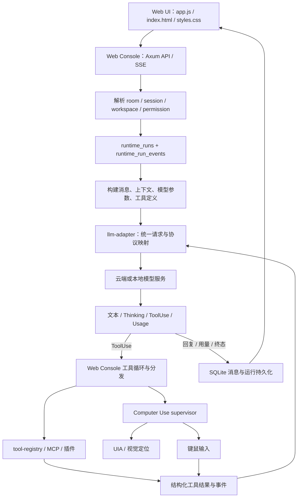

# 2026-09-19 架构梳理与本轮改造边界

日期：2026-09-19。本文以本轮开始时的源码为基线；同日实施细节以代码和实施日志为准。架构梳理覆盖 workspace 清单、各模块 INTERFACE、主入口、相关配置/请求类型、持久化表、前端骨架及本轮相关链路；没有把模型权重、打包产物、缓存和运行时私密配置当成源码通读。

## 1. 核心结论

这是一个以 Rust workspace 为基础、以 Web Console 为实际业务中心的 Windows Agent 应用。仓库已经按能力拆分 crate，但 Web Console 仍直接承载会话、模型调用循环、权限、工具分发、Goal 编排、SQLite 和前端资源，不能把它理解为薄界面层。

五项需求的共同问题是边界混用：

- 完全访问权限决定执行范围，工具暴露决定模型能选择哪些工具，两者应分别配置。
- 模型配置描述连接与生成行为，聊天室选择描述消息归属，Agent 选择描述调用对象，三者不应共用一个“打开侧栏”的入口。
- 工具事件、临时思考显示与最终回复有不同生命周期，不能全部作为聊天正文顺序追加。
- 前端已有右栏宿主，可以承接统一子页；无需重复建设新的窗口管理器。
- 美化应在本轮功能结构稳定后统一调整设计变量，避免继续用末尾 CSS 覆盖旧覆盖规则。

## 2. 模块地图

| 层次 | 目录 / crate | 当前职责与主要边界 |
| --- | --- | --- |
| 应用入口 | packages/app-launcher；gui-desktop/desktop-console；tauri-shell | 启动、安装分发、桌面外壳与桌宠；Web Console 是本轮主控制台 |
| Web 服务与 UI | gui-web/web-console | Axum 路由、业务编排、模型工具循环、SQLite、前端状态、各工具面板 |
| 进程与连接辅助 | gui-web/clawbot-sidecar；windows-process-guard | 微信侧车连接、Windows 子进程生命周期 |
| 核心运行时 | core-runtime/core-runtime | Session、ConversationMessage、ConversationRuntime、权限、prompt、compact、memory、usage、MCP |
| 会话服务与代码服务 | core-runtime/agent-server；language-service | 会话 HTTP 能力、LSP 与符号/诊断上下文 |
| 模型适配 | llm-adapter/llm-adapter | ProviderClient、MessageRequest、统一内容块、流式事件、推理参数兼容、模型注册表 |
| 工具与扩展 | tooling/tool-registry；plugin-system；command-router；compatibility-harness | 工具目录/执行、插件 hook、命令路由、兼容测试能力 |
| 感知 | vision/vision-service；uia-resolver | UIA、截图分析、视觉定位；返回定位结果，不直接代表输入执行 |
| 桌面操作 | computer-use/computer-use-core | 坐标映射、输入注入、操作 supervisor、预算与失败熔断 |
| CLI / 诊断 | cli/command-line；diagnostics | 命令行入口、结构化诊断、回归与可观测性 |
| workspace 插件 | .coolzhu/plugins 下的多个 crate | TDD、Git、代码审查、编排、文档、数据库、诊断、监控和市场等源码扩展 |

`Cargo.toml` 是实际 workspace 清单；部分 INTERFACE 文档仍使用“原型/后续接入”措辞，已有代码和 8 月底运行生命周期日志应优先于历史计划。

## 3. 当前主链路

关键实现入口：

- `api_chat_send`、`api_chat_send_stream`：非流式与流式聊天链路，必须保持同等工具策略和失败行为。
- `llm_tools_enabled`、`llm_tool_exposure_mode`、`llm_tool_definitions_for_permission`：工具暴露策略。
- `model_tool_requests_from_blocks`：结构化工具调用抽取；不能把普通答案文本直接当成命令执行。
- `is_computer_use_tool_family` 与 Computer Use supervisor：UI 操作熔断范围。
- `MessageRequest`、`InputContentBlock`、`OutputContentBlock`、`StreamEvent`：适配器边界。
- `sendMessage`、流式事件处理、`shouldRenderCompletedMessage`：前端本轮消息生命周期。
- `openChatToolWindow`、`closeChatToolWindow`：现有子窗口移动到右栏宿主并恢复原位的机制。

## 4. 需要区分的数据对象

| 对象 | 含义 | 本轮应保持的规则 |
| --- | --- | --- |
| workspace | 工程路径、文件/工具工作目录范围 | 切换必须更新上下文和目录，不应只是改标题 |
| session / Agent | 模型调用身份、参数、模型上下文历史 | 新参数应用到对应会话；运行中的调用保持启动快照 |
| chat_room | 面向用户的对话容器与消息汇聚 | 搜索、定位和权限作用域应明确是哪个聊天室 |
| run / turn | 一次实际运行的生命周期 | 工具状态、耗时和累计 usage 按稳定 run/turn ID 归属 |
| message | 用户或模型可见内容 | 最终回复、临时思考、工具事件不能混淆 |
| Goal / phase | 多阶段目标及编排状态 | 复用运行层，不能让界面状态替代后端终态 |
| tool event | 工具名、调用 ID、状态、结果/错误 | 可单独显示，不必成为普通聊天气泡 |

持久化位于实际应用工作目录内的 `.coolzhu`。主服务源码包含 `sessions`、`chat_rooms`、`session_messages`、`chat_room_messages`、`chat_room_permissions`、`runtime_runs`、`runtime_run_events`、`goals`、`goal_phases`、`goal_events`、`memory_*`、`attachment_refs` 等表。

已有 runtime run 生命周期、事件序列和启动恢复实现；不能沿用 8 月初设计文档的“完全没有运行记录”判断。JSON 与 SQLite 的既有迁移兼容应保留；不要离线假造 test5/test6 等运行时聊天室。

## 5. 五项问题对应的架构调整

### P1 工具调用偏航

问题报告已经给出可复现链路：开发开放模式覆盖显式配置、Computer Use 先于白名单过滤、UI 失败熔断扩大到通用调度、文本伪工具调用被当成答复。

建议的不变量：

1. 调试默认完全访问，仍尊重显式工具关闭/白名单；完全访问不能变成“强制把所有工具给所有模型”。
2. 模型/会话可选工具范围；本地小模型可使用文件和终端工具集合，不必同时面对桌面 UI schema。
3. 每个候选工具包括 Computer Use 和语义分发都经过同一最终过滤逻辑。
4. UI 工具失败只熔断对应实际执行族；纯文件/终端任务仍可使用合适工具继续。
5. 非结构化伪工具文本不应被静默视作任务完成；任何恢复必须有校验和次数边界。
6. 流式与非流式保持一致，关闭工具时不能从文本恢复路径绕过关闭开关。

### P2 统一模型参数页面

用户使用一个统一“模型参数”页面；内部仍需要协议适配与凭据引用，这是与移除 Provider 配置表并不冲突的技术边界。

分组建议：

| 分组 | 参数 |
| --- | --- |
| 连接 | 配置名、协议、Base URL、模型 ID、密钥引用/替换、超时、重试 |
| 生成 | 最大输出、温度、top-p、停止词、随机种子；不支持的参数不发送 |
| 思考 | 自动/关闭/支持的档位、预算或私有开关、实际映射结果 |
| 上下文 | 上限、输出预留、压缩策略、历史选择；明确估算值与模型报告 |
| 工具 | 开关、暴露模式、允许工具、Computer Use 能力、并行策略 |
| 高级 | 受控额外参数、请求头、脱敏请求预览、配置导入/导出 |
| 诊断 | 测试连接、协议能力和失败原因、保存后生效范围 |

表单应区分“未设置/随模型默认”和数值 0；思考档位应按当前模型/端点能力而非固定 Provider 名字强制推断。配置快照需要能解释来源与覆盖关系，避免把不支持的值静默吞掉。自定义扩展不得覆盖模型、消息、密钥或工具权限等受管字段。

这是目标架构建议，具体本轮已实现字段以实施日志为准，不把视觉稿里的高级字段等同于已完成代码。

### P3 导航和环境切换

左侧快捷图标调用已有 `openChatToolWindow` 打开右栏相应内容。顶部 Agent / 工程 / 聊天室使用独立锚定下拉：选中后真正切换作用域并关闭下拉。移除左侧展开导航时，迁移聊天室管理、权限等原有入口，避免仅用 CSS 隐藏后丢失功能。

### P4 对话、索引与用量

- 思考仅在活动轮次显示，位于最终内容之前；完成、失败、中止、重连回放都遵守同一清理规则。
- 原始工具调用不进入普通聊天气泡；状态条显示摘要，详细结果在右栏活动中可查看。
- 持久消息 ID 作为定位锚点；索引仅引用真实保存的记录，不能用当前 DOM 顺序作唯一 ID。
- 搜索区分“当前聊天室”与“所有记录”，有命中数量和跳转；未载入的旧记录也需要明确覆盖范围。
- 每轮耗时取运行开始/结束时间；历史缺失时显示未知，不能用页面停留时间补造。
- usage 优先按模型报告，估算需标识；同轮多次模型调用应累计；重连事件不能重复计数。
- 缓存 tokens 常是输入的子集，思考 tokens 常是输出的子集；要记录协议的实际语义，不能固定把四项相加。
- 历史思考隐藏属于显示策略，不应破坏适配器继续调用所需的协议内容块。

### P5 美化：只提交审阅方案

详见 [界面改进与三套视觉方案](2026-09-19-ui-improvement-review.md)。整体字体、色板、装饰和图标系统尚未实施，本轮不以概念图替换产品界面。

## 6. 维护风险和后续拆分顺序

本轮开始时实际体积约为：`main.rs` 3.32 MB、`app.js` 764 KB、`styles.css` 456 KB、`index.html` 121 KB。AGENTS.md 中旧体积已失准，修改时应按真实文件大小分段读取。前端资源仍在编译期嵌入，改完必须重新构建。

功能修复后再小步抽取，不建议本轮同时重写框架：

1. 抽出模型配置解析/能力与请求构建，统一两条聊天链路的参数语义。
2. 抽出工具选择/过滤/恢复策略为可测试纯函数。
3. 抽出运行事件和 UI 展示适配，减少“每个事件直接追加消息”的耦合。
4. 前端拆分环境选择、模型表单、消息流、右栏宿主；使用稳定 API 契约。
5. 将多轮叠加的 CSS 整理为基础设计变量、布局、组件、状态、响应式五层。

验证重点是配置关闭仍生效、白名单覆盖所有工具、工具失败不误杀文件执行、旧会话迁移、流式/非流式一致、历史回放不泄漏临时内容、搜索定位/用量去重，以及低高度和缩放后的真实页面布局。

