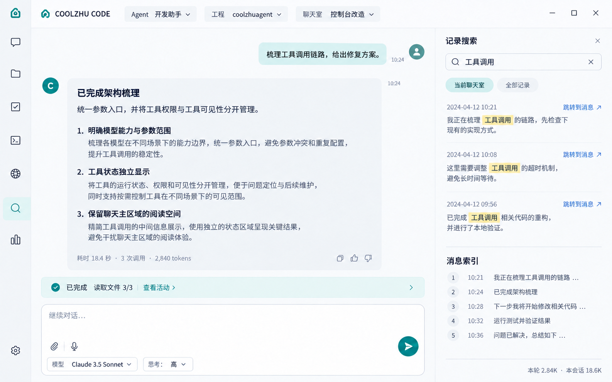
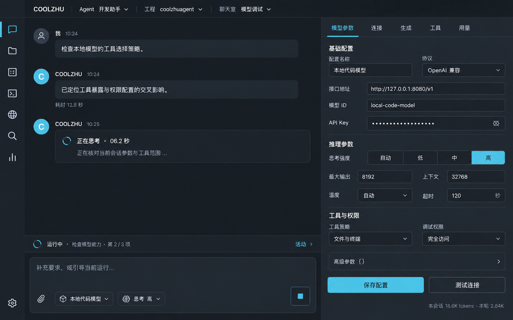
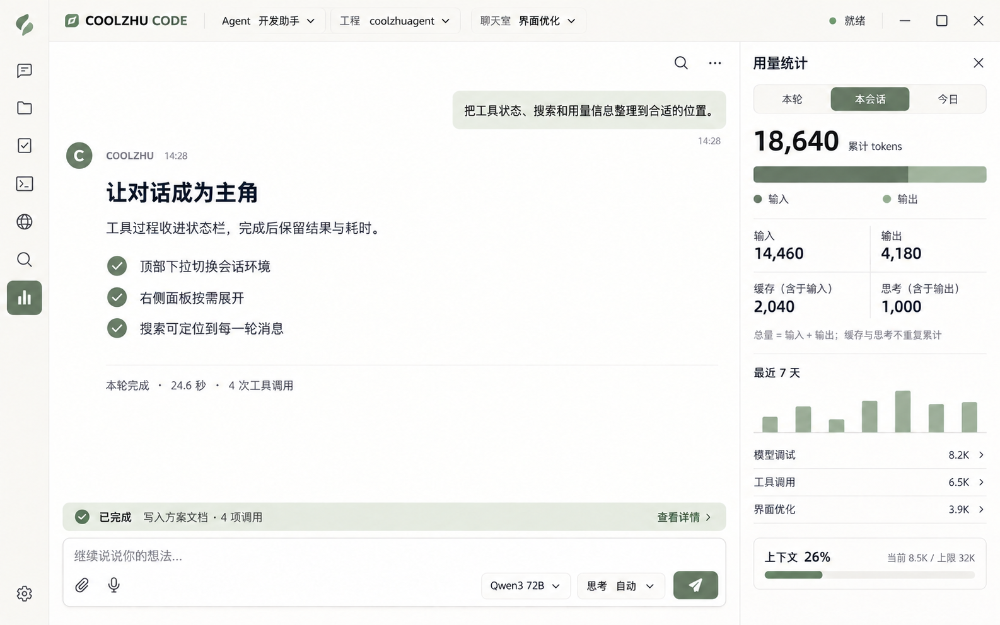

# 2026-09-19 界面改进清单与三套视觉方案

日期：2026-09-19。状态：**第五优先级设计审阅稿，未实施整体美化**。前三类布局/交互约束来自用户明确要求，风格、字体、细部密度等待审阅。第一至第四优先级的功能实施由对应代码和实施日志单独记录。

本稿依据：当前 `index.html`、`app.js`、`styles.css` 的分段审计、已有三栏设计文档、模型配置和消息链路。没有将概念图当成当前界面的真实截图，也未声称做过本轮产品页面视觉回归。

## 1. 先固定的信息架构

```text
┌ 品牌 ─ Agent [当前对象⌄] ─ 工程 [当前目录⌄] ─ 聊天室 [当前房间⌄] ─ 状态 ┐
│ 图标 │                                                     │            │
│ 轨道 │              对话与最终结果                          │ 右侧扩展栏 │
│      │                                                     │            │
│      │              当轮工具状态条                          │ 所选页面   │
│ 设置 │              输入区                                  │            │
└──────┴─────────────────────────────────────────────────────┴────────────┘
```

- 左侧只保留快捷图标；去除展开的聊天导航列。
- 图标选择打开右栏相应页面，再次选择相同图标可聚焦/切换关闭，行为全局一致。
- 顶部三项是真正的下拉选择器，不是打开右栏的替身。选项多时下拉内部搜索；长路径只显示最后目录，悬停或详情可见完整路径。
- 中间始终是聊天主区域；新结果不因为打开文件、参数或用量面板而消失。
- 右栏同一时刻只显示一个主页面；页面内部只保留必要的页签或分组。
- 执行中显示简短思考/进度；完成后正文只留回复。工具调用使用状态条和右栏活动明细。
- 搜索、消息索引、每轮耗时与 token 统计是功能层要求，三套视觉方案都保留。

## 2. 现状问题与改进清单

“源码证据”引用稳定选择器或函数名，不依赖本轮并行修改后可能变化的行号。

| 编号 | 现状/证据 | 用户影响 | 建议 | 阶段 |
| --- | --- | --- | --- | --- |
| UI-01 | `.brand-banner`、`.overview-card`、`.top-chat-context` 是三个独立顶层块 | 标题、头像和状态竞争空间，低高度窗口浪费明显 | 一个 48–56 px 顶栏，标签和值横排；品牌缩小 | P3 结构；P5 视觉 |
| UI-02 | Agent 与聊天室按钮文案明确指向“打开聊天导航” | 看似切换菜单，点击却离开操作位置 | 锚定原按钮的真实下拉；键盘可选；切换后更新真实环境 | P3 |
| UI-03 | 工程名按钮复制路径，旁边齿轮打开配置 | 与用户希望直接切换工程不符 | 工程名打开近期目录下拉，复制路径归入菜单次级动作 | P3 |
| UI-04 | `#chat-left-rail` 与快捷图标轨道并存 | 多一层横向分区，导航与顶栏重复 | 移除展开导航；聊天室管理置于聊天室下拉/右栏管理页 | P3 |
| UI-05 | 当前右栏头同时含头像、kicker、标题、返回、关闭及页签 | 小面板首屏被标题挤占 | 单行图标+标题+关闭，子级只在需要返回时显示返回 | P5 |
| UI-06 | 就绪、灯笼、警示三个状态图示同时存在 | 相同系统状态被多套符号表达 | 顶栏单个“就绪/运行中/等待/异常”状态，警示仅有异常时出现 | P5 |
| UI-07 | `.chat-atmosphere` 内有水印、两侧灯笼、印章、光扫 | 长文本和代码阅读时背景干扰 | 主消息区使用纯色；品牌图只留空状态或设置页 | P5 |
| UI-08 | SVG 细图标与 ImageGen PNG 控制图混用 | 小尺寸笔画、视觉重量、边界不一致 | 一个 18/20 px SVG 图标体系；按钮热区统一 36–40 px | P5 |
| UI-09 | CSS 具有多个字体族、Impact/黑体、楷体、不同代码字体与局部 10 px 控件 | 字体风格冲突，小面板难读 | 正文 15–16 px 中文无衬线；辅助最小 12 px；代码独立等宽 | P5 |
| UI-10 | `.chat-tool-host-content` 为多个原始窗口追加特殊布局覆盖 | 同一信息随宿主位置发生大幅堆叠，维护困难 | 每个面板按宿主宽度使用统一容器规则；面板级布局各自明确 | P5 |
| UI-11 | 完成消息筛选与即时流式消息路径分散 | 思考可能在完成后保留或回放出现，工具伪装成回复 | 单一消息显示策略按生命周期处理；工具走状态/活动数据 | P4 |
| UI-12 | 当前聊天室列表搜索主要定位聊天室名称 | 无法定位某一轮实际内容 | 内容搜索+命中片段+消息定位；索引显示轮次、摘要、时间 | P4 |
| UI-13 | 既有工具条偏“工具目录状态”语义 | 不一定对应当前 run 的实际调用结果 | 聊天底部状态条显示当轮累计，右栏可追溯调用 ID、结果与错误 | P4 |
| UI-14 | 参数入口和 Provider 概念耦合；已有推理选项分散 | 新模型/私有部署迭代时配置难理解 | 单一模型参数页，按连接/生成/思考/工具组织；协议保留为字段 | P2 |
| UI-15 | 会话列表、Agent、工作区、权限名词交错 | 用户难判断改动影响当前房间还是其他会话 | 表单页头标明当前对象与“保存后应用到下次调用” | P2/P3 |
| UI-16 | 多个“刷新”“关闭”“返回”“专注”入口叠加 | 图标占空间但用途接近 | 保留一个主关闭入口；刷新只在明确支持手动同步处保留 | P5 |
| UI-17 | 授权说明存在“重启恢复”与“重启失效”并列的历史文案 | 真实权限范围不明 | 文案从实际后端授权状态统一生成；本次调试默认完全访问 | P1/P3 |
| UI-18 | 缺少稳定可见的搜索/索引与用量入口 | 必须靠低频设置寻找高频信息 | 快捷图标补搜索与用量；消息工具栏有跳到最新/定位 | P4 |
| UI-19 | 各面板滚动边界、sticky 操作区与表格密度不统一 | 小窗口出现双滚动与底部操作找不到 | 页面只一个主滚动容器，保存/停止等操作保持可达 | P5 |
| UI-20 | 旧布局状态持久化可重新展开左栏 | 更新后出现“旧导航复活” | 新布局版本迁移，丢弃旧左轨宽度与展开状态 | P3 |

这些是有证据的布局和入口问题，不等同于“所有相关按钮没有实现”。删除一个图标之前要验证它对应的动作是否仍有独立用途。

## 3. 图标处理方案

| 分类 | 图标/入口 | 处理 |
| --- | --- | --- |
| 保留主入口 | 聊天、工程文件、任务、终端、浏览器 | 统一线条、尺寸、选中底板；点击在右栏承接内容 |
| 补充主入口 | 记录搜索、token 用量 | 搜索含当前聊天室消息定位；用量含本轮/会话/时间范围 |
| 固定底部 | 设置 | 不藏在“更多”中；打开统一设置与模型参数入口 |
| 次级更多 | 记忆/知识、微信连接、视觉实验、诊断 | 收入“更多”或允许自定义固定；保留真实功能 |
| 移除重复导航 | 左聊天导航开关及其 resizer | 用户已要求移除展开左栏 |
| 合并候选 | “专注”与右栏关闭、“协作”与任务/活动入口 | 只在行为确有差异时保留，避免两个图标做同一件事 |
| 非按钮状态 | 就绪灯、灯笼、警示 | 合并为一个带文字的系统状态；不能显示得像可点击按钮 |
| 悬停动作 | 重命名、分叉、归档、删除 | 在记录/会话条目的更多菜单中；键盘焦点时同样可达 |

所有图标按钮应具备 Tooltip、aria-label、焦点框、禁用原因。缩小图形不等于缩小点击热区。对实时语音、视觉能力不可用的状态应解释原因，不能因本机环境暂时不可用而删除整个功能。

## 4. 每个子页面如何组织

| 右栏页面 | 建议布局 | 宽度/高度原则 |
| --- | --- | --- |
| 模型参数 | 单行页头；配置选择；连接/生成/工具等分组；底部测试连接+保存 | 360–520 px；宽于 420 时短字段双列，低高度标签和值横排 |
| 工程文件 | 顶部搜索；目录/文件列表；选择后预览；次级操作菜单 | 目录与预览在窄栏用页签，宽栏横向分割；避免 9 个小按钮铺满 |
| 任务/协作 | 当前 run 摘要；Goal 阶段；参与 Agent；队列/移交次级页签 | 状态与操作同排；阶段详情按需展开 |
| 工具活动 | 当前轮次工具摘要；按调用的时间线；错误可展开 | 默认只显示名称、状态、耗时；原始参数/输出折叠 |
| 终端 | 紧凑工具栏；输出主区；输入行与状态 | 使用等宽字体；输出占主要高度；长命令不挤坏外层 |
| 浏览器 | 地址/导航同一行；页面主区；桥接状态在底部 | 连接配置折叠，避免多个状态卡挤占内容 |
| 搜索/索引 | 搜索框；范围/类型筛选；命中片段；消息索引页签 | 结果点击跳转并短暂高亮；返回结果位置不丢 |
| token 统计 | 本轮/本会话/时间范围；输入输出；缓存/思考明细；按模型细分 | 当前上下文占用和累计消耗分开；无数据显示“未报告” |
| 记忆/知识 | 搜索与过滤；条目列表；详情/编辑 | 条目内容优先；标明属于哪个会话/工作区 |
| 语音/微信/视觉 | 连接状态；主要操作；高级诊断 | 一次只突出一个主要动作；日志默认折叠 |
| 设置 | 模型参数、权限、外观、连接、诊断分类 | 一列清晰目录或顶部页签；不另开一套全屏导航 |

P5 审阅不重新发明前四项行为。任何新增高级参数必须后端确实接入才允许在产品中显示为可用，概念图字段不构成功能承诺。

## 5. 尺寸、排版与响应式建议

推荐的基础变量：

| 属性 | 标准 | 紧凑 |
| --- | --- | --- |
| 顶栏高度 | 56 px | 48 px |
| 左轨宽度 | 56 px | 48–52 px |
| 右栏默认宽度 | 400 px | 360 px |
| 消息最大正文宽度 | 800–880 px | 随剩余空间缩小 |
| 正文字号/行高 | 16 px / 1.65 | 15 px / 1.55 |
| UI 标签 | 13–14 px | 12–13 px |
| 代码 | 13–14 px 等宽 | 13 px 等宽 |
| 按钮热区 | 36–40 px | 不低于 32 px |
| 组件圆角 | 8–10 px | 6–8 px |
| 常用间距 | 4/8/12/16/24 px | 使用同一间距体系 |

中文优先考虑系统可用的 `Microsoft YaHei UI` / `Microsoft YaHei` / `PingFang SC` / sans-serif；代码使用 Cascadia Code / Consolas / monospace。正文不采用楷体、Impact 或装饰字体。

响应式以“剩余可读宽度”决策：宽度充足时右栏停靠，聊天正文保持至少约 520 px；不足时右栏覆盖或进入可关闭单页，但始终能返回对话。低高度时压缩页头和装饰，不缩小正文至 10 px。长路径省略、下拉边界钳制、100%/125%/150% 缩放都应验收。

## 6. 三套概念图

三套均由内置 image_gen 生成并检查；图中模型名、日期、消息、额度和统计值为占位数据。用量 C 已将缓存/思考明确标为子集，避免示意图重复累计。它们是色彩、密度和层级参考，不是可运行产品截图；精确字形、数值、图标和控件实现以最终规格为准。

### A · 浅色冷静工作台（建议默认）

- 场景：阅读长回复、普通办公、搜索定位。
- 色彩：冷白、淡蓝灰边界、青绿色主操作。
- 优点：阅读清晰，面板层级容易理解；适合作为标准密度。
- 待审阅：消息是否保留轻底板，右栏默认 380 还是 420 px。



### B · 深色高密度工作台

- 场景：开发调试、模型参数调整、长期终端工作。
- 色彩：石墨灰、冷灰文字、青蓝选中态。
- 优点：低高度下信息集中；统一参数页可以在同一视野查看连接、思考与工具策略。
- 待审阅：是否作为独立深色主题；普通状态保留较强文字对比，避免过暗。



### C · 温暖轻量工作台

- 场景：以写作、方案讨论和轻量开发为主。
- 色彩：暖象牙白、墨色文字、灰绿主操作。
- 优点：最接近文档阅读感，消息底板更少，用量页更轻。
- 待审阅：是否保留较大的呼吸空间；高频调试可套用 B 的紧凑密度。



可以组合：A 的结构与搜索、B 的参数密度、C 的弱边界；建议先确定一个默认主题，再提供标准/紧凑密度，不维护三套独立布局代码。

## 7. 外部参考核对

2026-09-19 检索到的主要参考为 Z.ai 的 ZCode 官方文档。它可确认模型选择器进入配置、兼容协议接入及每模型高级设置。英文配置文档目前还列出了按模型支持的思考档位，也写明第三方部署的档位和私有参数可能不同；因此本项目不应以“ZCode 完全没有思考层级”为设计前提。我们吸收其配置入口的易发现性，同时保持用户要求的统一参数页，不照搬供应商列表。[ZCode 连接模型](https://zcode.z.ai/cn/docs/configuration)，[ZCode 高级模型与思考设置](https://zcode.z.ai/en/docs/configuration)

OpenAI 官方“项目和聊天”文档确认项目、聊天、搜索/重新打开记录是不同任务；这支持把“环境切换”和“搜索历史”分开处理。本稿的左图标/右扩展栏以及完成后隐藏思考规则来自用户要求和本项目设计判断；官方资料没有证明 ChatGPT 所有版本都采用完全相同布局，本稿不作这种归因。[OpenAI 项目和聊天](https://learn.chatgpt.com/zh-Hans/docs/projects?surface=app)

## 8. 审阅后的实施与验收

视觉方向确定后再实施：

1. 建立色板、字体、间距、圆角、状态和图标变量。
2. 替换顶部装饰和重复状态，按统一规格梳理右栏头。
3. 逐面板调整布局，先模型参数、搜索、用量，再工程/任务/终端/浏览器。
4. 清理失效 CSS 覆盖与确无用途的图标，保留兼容入口与键盘操作。
5. 重新构建后以真实页面验证，不能只看静态概念图。

验收视口至少包含 1440×900、1280×720、1024×640 和 150% 缩放；检查长工程名、长模型名、右栏开关、空/加载/失败、执行中/完成/中止、上百条记录、工具错误、长代码和无 usage 的模型。确认键盘可以完整切换环境、关闭面板、搜索和定位，且消息滚动锚点不会跳动。

本次审阅只需决定默认视觉方向及标准/紧凑密度；前四项已明确的功能行为不因审阅美化而停止推进。

