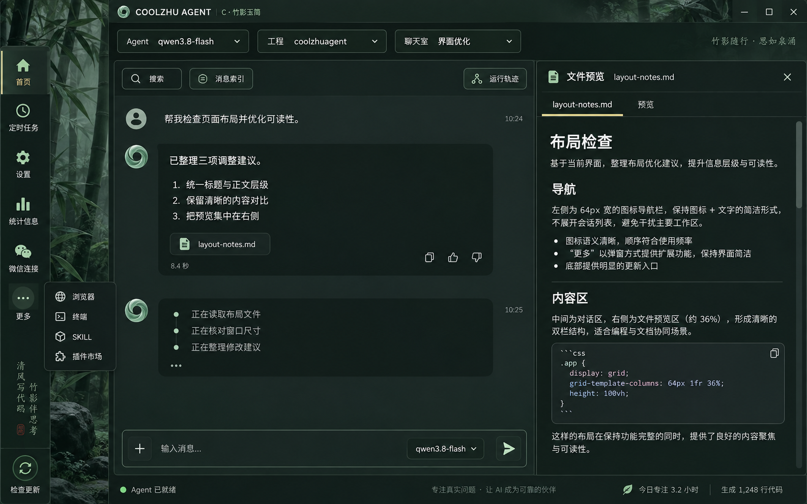
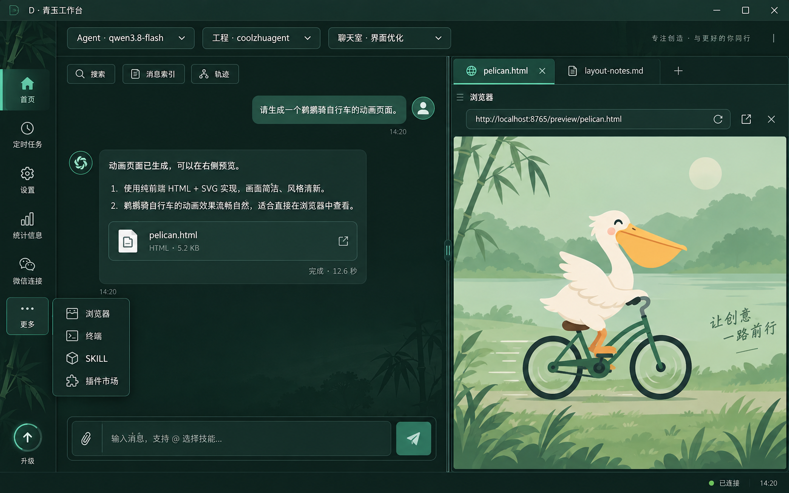

# 聊天界面视觉方案 C / D

最新补充：用户提供[原始卷轴界面稿](assets/original-scroll-ui-user-reference.png)，要求恢复中央字标与原稿竹林。新 [COOLZHU 字标](assets/coolzhu-jade-wordmark-v1.png)、[竹林底图](assets/original-bamboo-background-v1.png) 已按参考分别生成；提示词、尺寸与来源见 [生产素材记录](production-asset-prompts.md)。它们是独立图层素材，实际接入与窗口验收尚在进行；下方 C/D 为历史探索，不能覆盖用户原稿决定。

2026-09-27，使用内置 imagegen 生成。最新决定：用户选择 **B 启动动画 + 原 GPT6 Pro 卷轴工作区外观，内部保留玉石竹林风格**；详见 [确认方向与实施规格](accepted-direction.md)。C/D 保留为探索稿，未接入产品资源；不是安装截图或功能验收证据。完整生成提示词见同目录 `prompts.md`。

此前 A/B 是玉轴、标志和角色动作的开机动画概念，不能当作完整聊天布局稿。本次 C/D 补齐该缺项。

## C · 竹影玉简

竹林氛围较浓、右栏展示 Markdown 文件。图中左轨后方留白过宽，需要实施时收窄；思考区应进一步去掉独立消息卡片外观，维持 1–5 行临时状态，结束移入轨迹。统计数字及文案为生成示意，不能作为功能承诺。

## D · 青玉工作台（主会话建议）

更紧凑的左右结构、清晰面板边界、较强正文对比。右栏用鹈鹕骑车网页概念说明浏览器预览位置，图中地址和画面不是已运行页面。建议采用该布局后适度增强玉石控件质感，避免变成单纯扁平绿色按钮。

## 两版共同约束

- 左侧仅快捷图标：五个主入口、更多和底部更新；更多包含浏览器、终端、SKILL、插件市场。
- 顶部 Agent、工程、聊天室标签和值同一行，原位下拉选择。
- 中间聊天，右侧可调整宽度的文件/图片/视频/浏览器等内容区；不恢复展开式左聊天列表。
- 正文采用清晰无衬线字体；背景竹林只做低对比氛围，文本区域增加实色遮罩。
- 完成后聊天仅保留回复与耗时，过程移入轨迹；不把模型或工具过程做永久聊天卡片。
- 不因效果图而新增点赞、虚构统计、宣传口号或承诺未实现的功能。实现仍依据已授权功能清单。

视觉方向已确认，按独立卷轴外框与原有业务组件复用推进；语言服务修复、原生终端/低窗等技术验收继续。
