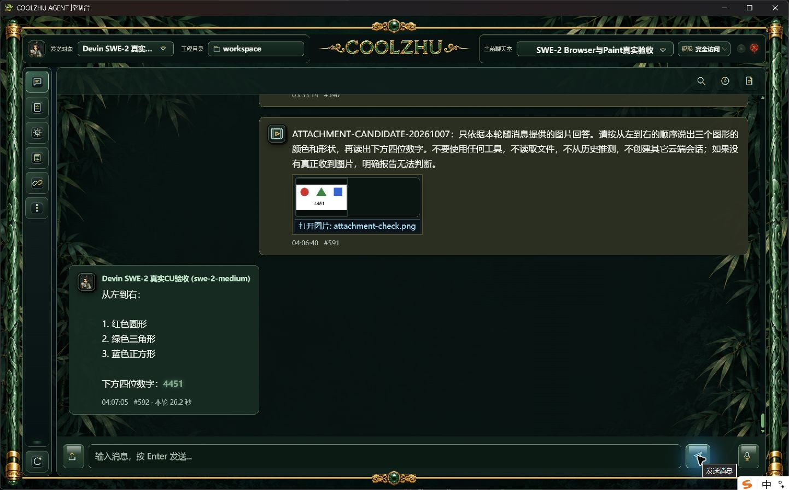
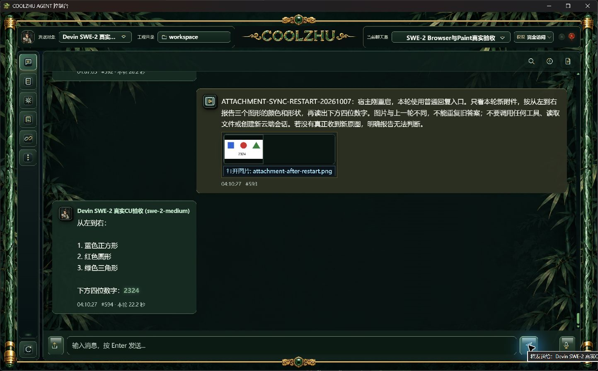

# Devin 聊天图片附件修复与候选验收

普通聊天室的 Devin 入口仍硬拒绝所有附件；普通回复路径未传 `image_urls`，流式路径另外拒绝图片。仅删除上传限制会使普通入口静默丢图。本轮补齐两条路径，当前已通过候选真实模型验收，尚不能当作0.2.91正式安装版已有能力。

## 实现职责

- 聊天入口保持单目标，仅开放图片附件；其它文件明确报未接入，Goal、接力和子 Agent 保持原限制。
- 两种回复入口复用 `multimodal_input`：显式支持图片时直传，否则使用系统配置的默认视觉模型转述；预算裁剪不得静默丢图。发生视觉请求前先验证当前根会话及停止状态。
- `devin_acp/image_input.rs` 只负责标准 ACP 图片块转换，聊天附件和既有 CU 同会话原图共用，不创建会话或执行工具。支持受控 PNG/JPEG/WebP 数据；GIF和远程图片URL明确拒绝，未擅自转码。
- 增量上下文将本轮图片从文本 JSON 中分离，仅保留图片顺序标记；原图经 `session/prompt` 图片块发送。附件元数据纳入消息摘要，空附件沿用原摘要格式。既有会话、消息、记忆与未知回合记录保留。
- 会话设置开放“支持图片直传”，不覆盖其它模型默认参数、工具权限或 API Key。连接握手未声明图片能力时仍拒绝发送，目录中的模型名称不当作多模态已验证证据。设置页、模型发现说明同步更新，未新增前端调试信息。

## 真实候选验证

使用原 `session-1791131217833` / `room-1791131523339` / SWE-2-medium / 唯一 `island-kayak`，主会话独立执行，没有子代理、Qwen或Opus测试。

| 场景 | 结果 | 证据 |
| --- | --- | --- |
| 原生窗口选择图片并正常发送，流式入口 | 正确识别红圆/绿三角/蓝方块及随机数字4451；26.2秒 | `run-chat-b86a49bebc8db7f267903ba56b63be0102328460afedf6c6` |
| 按完整身份正常停止并重启宿主，普通 `/api/chat/send` 上传另一张图 | 正确识别蓝方块/红圆/绿三角及新随机数字2324；22.2秒；刷新原生聊天室可见真实回复 | `run-chat-70e4af2b3665d1ee4abf1d7d0530975661787927d381b909` |

两轮均为一个 ACP attempt、`end_turn`、`process_drained=1`；握手 `prompt_image=true`，实际 `prompt_payload.image_count=1`，未调用工具。文本提示没有给出随机数字或图形答案。第二轮改变图形顺序和随机数字，避免旧历史答案造成假阳性。内部规划绑定仍为空，未新增云端测试会话。

实际 offline build 通过；控制台1400通过/0失败/6忽略，联动8通过、独立1通过；前端16通过。新增检查验证图片块顺序、正文无base64以及不支持的来源拒绝。修正既有前端测试脚本遗漏 `querySelectorAll` 及过期保存文案断言；未使用模型回复夹具替代上述真实验收。最后仅同步无工具模式的附件说明，正式发布链会重新编译最终源码。

完整原图、回执及日志见[证据清单](evidence/manifest.json)。候选后台配正式091原生Shell，不等于新正式安装版；后续正常出包、安装文件摘要与真实图片复验另记。

## 使用及针对性测试

在设置中选择 Devin 会话，保留精确模型变体；将“图片输入能力”设为“支持图片直传”并保存，再通过聊天附件按钮选择PNG/JPEG/WebP。界面仍将会话用途保留为“对话/代码”，避免被当作专用视觉 Agent 从发送对象中移除。纯文本选项沿用系统默认视觉 Agent 配置；本轮未额外调用另一视觉模型，不宣称该降级链已重新实测。

后续模型可据此设计：两入口图片直传、重启续接不重复导入历史、模型/连接不支持图片时明确失败、预算不足不丢图、其它附件及群发拒绝。每项核对实际图片数量、模型生效值、云端绑定、正常终态和原生软件截图。Goal/Relay附件、账号过期、模型切换及四项总体复核保持开放；Paint不再测试，微信不改不测。
