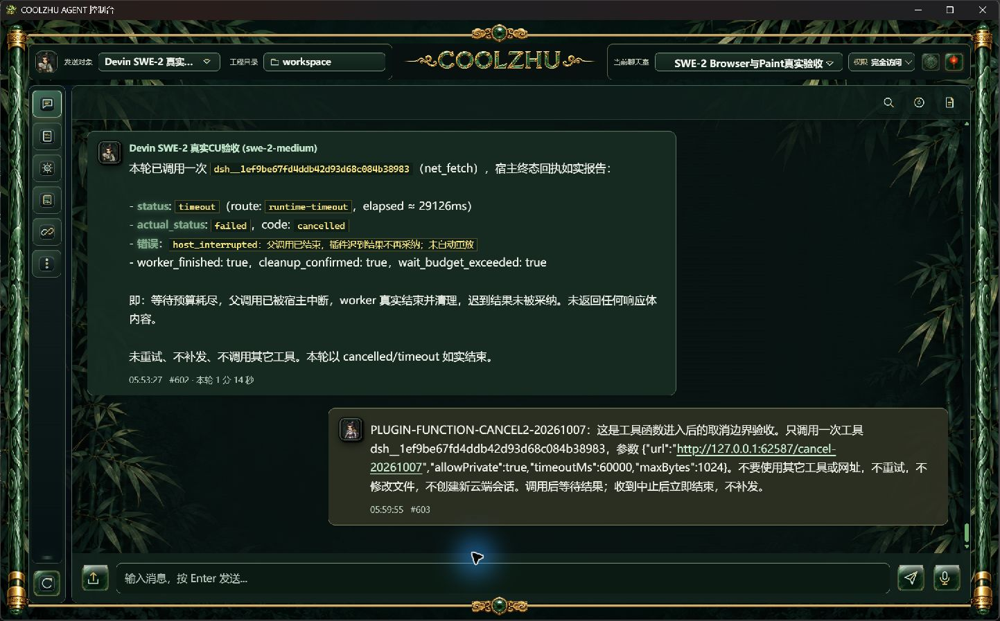
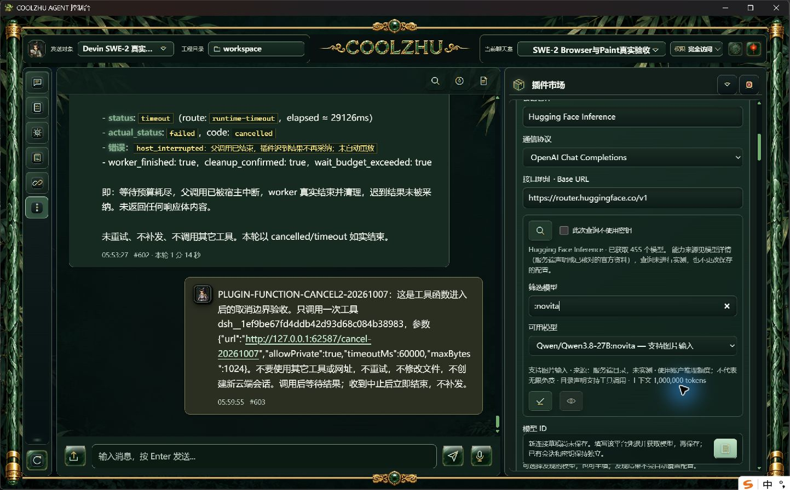
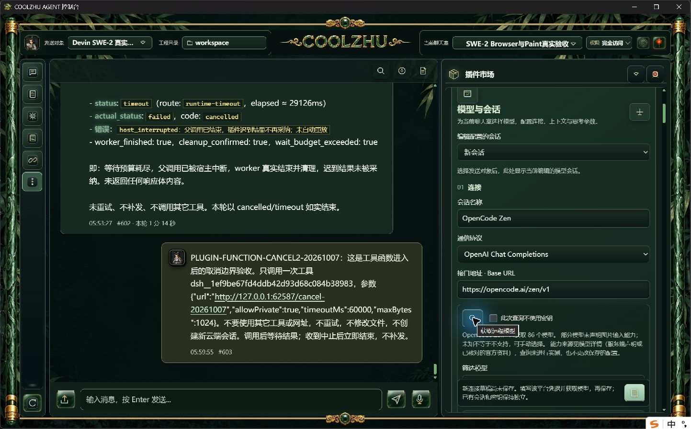

# 玉石控件与免费模型连接器：源码候选交接

后续正式结论：本候选已由PR85合入并正常构建、安装为0.2.93；正式控件与目录验证见[093交接](../release-0.2.93/change-report-and-test-handoff.md)。正式HF实时目录为448个模型及路由，候选455项保持当时事实。两平台仍未填凭据、生成0；下方“尚待正式打包”保留为候选阶段记录，最新状态以093为准。

本轮采用用户已选择的玉石按钮框、细金线符号方案。新增资源与连接器属于0.2.92之后的源码；当前0.2.92安装包不含这些变更。本报告只记录取得的证据，不能据此宣称四项任务总体或新增Provider会话全部验收通过。

## 设计与职责

界面只在独立`jade_controls.css`统一输入栏上传/发送/麦克风和快捷栏更新按钮的44px尺寸、低高度36px尺寸及图标中心；顶部状态采用30px相同外框、21px玉佩/灯笼，保留原状态语义和异常规则。Devin授权组件和过程跟随按钮去除外露文字，保留title、aria名称和跟随状态。生成方式、原始文件与提示词见[资源说明](../../../modules/gui-web/packages/web-console/assets/ui-redesign/jade-controls-v2/README.md)。

新增OpenCode Zen与Hugging Face Inference**内置模型连接器**，在插件市场提供配置入口；没有引入远程DSH工具作为会话引擎。独立`provider_connectors.js`只负责平台草稿、目录筛选和入口，复用`CoolzhuModelSettings`及现有HTTP Provider运行链路。工具派发、SKILL、上下文、记忆、权限、取消继续由宿主已有模块负责。两平台提供标准兼容HTTP接口，无需像Devin云端自治会话那样单独维护远端session桥。复用架构不等于每个模型都支持工具或图片，仍需逐模型实测。

## 官方依据与边界

- [OpenCode Zen官方说明](https://opencode.ai/docs/zen/)及[实时目录](https://opencode.ai/zen/v1/models)：Base URL为`https://opencode.ai/zen/v1`；当前连接器使用OpenAI Chat Completions。只将2026-10-07核对的11个免费聊天模型与实时目录取交集，不按名称猜免费、不自动替换为付费模型。官方其它Messages/Responses/SystemOne模型不因此算当前聊天协议已适配。免费供应和隐私条款可能变化，部分免费模型可能用于训练。
- [Hugging Face官方计费说明](https://huggingface.co/docs/inference-providers/en/pricing)：Base URL为`https://router.huggingface.co/v1`；普通免费账户当前每月$0.10推理额度，非无限免费，也非所有Hub模型可推理。应用不控制云端账户付费和额度策略。
- HF只扩展当前`live`提供方路由，保留完整`org/model:provider` ID；工具能力和上下文容量取该提供方声明，不混用其它提供方能力。图片能力来自该模型的明确输入模态，未知保持未知。查询与采用能力都不会静默保存或发送生成请求。

## 使用方法

1. 在“更多 → 插件市场”展开OpenCode或Hugging Face连接器，也可点击下方对应卡片的配置图标。打开后是尚未保存的新会话草稿，不切换聊天发送对象。
2. 保留预填官方Base URL，在API Key栏本人填写OpenCode平台密钥或HF Token。已有其它平台密钥不会继承到新连接器。不要将密钥写进聊天或报告。
3. 点击获取模型图标，筛选并采用模型ID；HF可选择带`:provider`后缀的路由。模型目录标注支持图片时，可显式采用图片能力；思考档位按模型支持由本人选择，其它采样/容量参数留空沿用默认配置。
4. 保存模型会话后，在顶部发送对象复选列表选择它。连接器中的下拉用于编辑所有已有HTTP模型会话，并非独立Provider表；选择已有会话须核对名称与Base URL。
5. 工具配置沿用统一会话设置与聊天室权限。选择支持工具调用的实际模型后，再进行连续工具、Browser Use和长程任务验收；不支持工具的模型不能因连接器复用宿主而获得模型侧调用能力。

## 本轮实际验证

| 项目 | 结果与限制 |
| --- | --- |
| 原生软件玉石控件 | 1443×897真实桌面窗口中输入栏按钮等高、图标居中，顶部状态同框，卷轴底部金线完整；截图如下。未将此截图外推为所有DPI/低高度安装版矩阵通过。 |
| HF产品目录 | UI真实点击查询成功；正常产品API返回455个模型及路由选项。筛选`:novita`显示`Qwen/Qwen3.8-27B:novita`，图片输入、工具支持、1,000,000上下文来自目录声明，非模型生成实测。 |
| OpenCode产品目录 | 原生配置页与正常产品API无密钥请求均成功，返回86项；下拉只展示免费聊天白名单与实时目录交集，当前实际10个可选（官方核对名单11个，未上架者不补造）。早先Python直接HTTP请求403保留为不同请求路径的历史失败，不用它掩盖产品路径的成功，也不声称所有网络环境都可访问。 |
| 凭据及会话 | 两草稿未保存，未发送平台生成请求；没有复用Qwen/Devin密钥，没有创建新的Devin云端会话。原唯一`island-kayak`绑定空闲、internal远端为空，活动轮次0。 |
| 回归 | 控制台1400通过、0失败、6忽略；既有前端16通过。原一次失败是旧资源路径断言，已按新资源更新后全量通过，不隐藏首轮失败。最后为HF扩展增加5000项上限前置检查后，再次实际离线build和5项既有模型目录检查通过；JS语法通过。 |

原始进程身份、目录响应、编译及前端日志在`tmp/2026-10-07-jade-connectors/`，候选Web后台和正式092 Shell混合配套，不能叫完整安装版证据。产品目录HTTP响应和原生操作互相印证，未使用模型夹具。

## 下一阶段针对性验收

先由本人填入各平台凭据，再选择官方目录中明确支持工具的免费/额度模型，运行一个包含文件读写、检索、浏览器导航/输入/滚动、取消及重启续接的长程任务。每轮保存真实模型请求终态、工具账本与原生截图，核对模型ID/提供方后缀、权限、计费缺失字段及重复派发。HF图片直传与纯文本视觉降级要分别验证；OpenCode免费目录变化或403必须如实显示，不可换付费模型冒充通过。不再重复简单问答，不再测试Paint。新增源码尚待正式打包安装后的对应验收。
