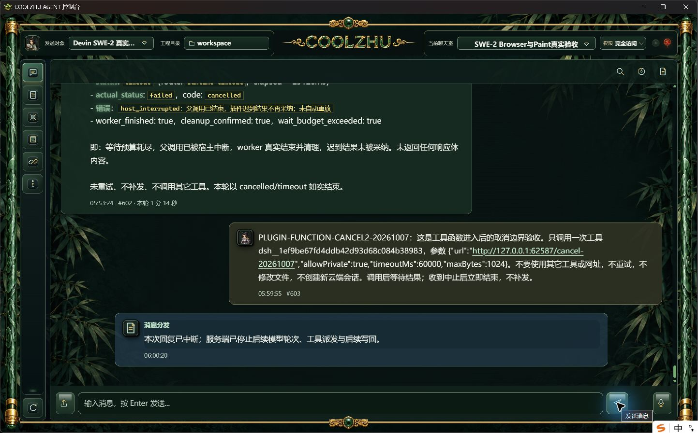

# 真实DSH插件函数执行中的取消与等待预算超时

此为092之后源码候选实操，不追认091/092正式包包含入口兼容修补。真实模型继续原SWE-2-medium、原聊天室、唯一云端`island-kayak`。未使用模型夹具、未新建云端测试会话，Paint未测试。

## 真实插件与修复

选取社区真实`izwarm195/dsh-net-tools`，固定提交`7392ec55ca6db884821311d739859ddea72211de`，15个来源文件，来源摘要`3b6ee0ea714c22e115d3ce786b876bc1f34b81116d21de79fbd398c0c69c7c8b`，工具`net_fetch`。只请求本机测试服务器，不调用`net_proxy_status`或读取代理凭据。服务端等待45秒才写响应体，以真实GET与对端EOF证明函数已经进入并退出等待。

真实安装揭示两处兼容缺口并修复：

- npm清单`main: "./index.js"`被旧入口校验拒绝。仅剥离一个`./`，按原严格相对路径校验，再与固定Git文件清单匹配；不改来源`package.json`字节/哈希，继续拒绝父目录、绝对路径、ADS、node_modules及`././`。
- 合法Node内置`fs`/`https`等短名称被固定来源解析器误拒绝。使用固定Node的[官方isBuiltin接口](https://nodejs.org/download/release/v24.15.0/docs/api/module.html#moduleisbuiltinmodulename)转为`node:`身份；未登记第三方包及回执外相对导入仍拒绝。这是导入来源约束，**不是OS沙箱**，未扩大执行权限或替换审批。

## 实操结果与失败保留

| 轮次 | 事实 | 结论 |
| --- | --- | --- |
| `PLUGIN-FUNCTION-CANCEL-20261007` | GET于12:52:55.245143Z进入；外层等待预算耗尽并中断宿主，EOF于12:53:19.379005Z，工具账本12:53:19.395Z转failed；原生点击取消12:53:31.649Z已晚于完成。 | **只计函数等待预算超时清理，不计用户中途取消通过。** 真实终态为cancelled/host_interrupted，迟到响应未采纳、未重放；模型回复转述worker_finished/cleanup_confirmed，但不以模型措辞替代直接回执。 |
| `PLUGIN-FUNCTION-CANCEL2-20261007` | 原生发送真实模型请求；观察到GET13:00:20.339715Z后约46ms，通过正常产品聊天interrupt接口取消；run13:00:20.446Z变interrupted；socket EOF13:00:21.473397Z，工具账本13:00:21.489Z变failed。 | **函数进入后取消通过**：约1.13秒断开真实等待连接，UI显示已中断，活动轮次0、云端锁释放。不是强杀子进程，不声称取得额外Win32进程句柄等待证明。 |

第二轮run为`run-chat-f2478d2058fc3cf63b27b19f35e5c57fa69d1718d89a736a`，turn为`chat-turn-1791377993396-1`。两轮各一个工具调用，无重试、补发或迟到业务响应写入；第一轮run完成并不代表工具成功。

原始时间观察、run事件、两条工具账本和服务端GET/EOF在`evidence/`；未公开不相关旧工具记录。第一轮漏过取消窗口的原图和完整调试日志保留于`tmp/2026-10-07-plugin-function/`，不抹除失败。

## 收尾与后续

已经正常产品接口撤回此次新增net_fetch白名单、停用仅本次安装的net-tools、正常关闭本机测试服务器。原calculator及既有Computer Use工具未变；原唯一远端绑定空闲、internal远端空。未删除历史安全记录。

仍缺：新源码的正式包安装验收、插件许可冻结窄竞争、独立内层函数deadline语义（本次超时来自外层等待预算，不能冒充所有超时阶段）。总体后续以[验收队列](../../analysis/2026-09-21-integration-review/current-acceptance-queue.md)为准，不重复简单算术作为长程验收。
