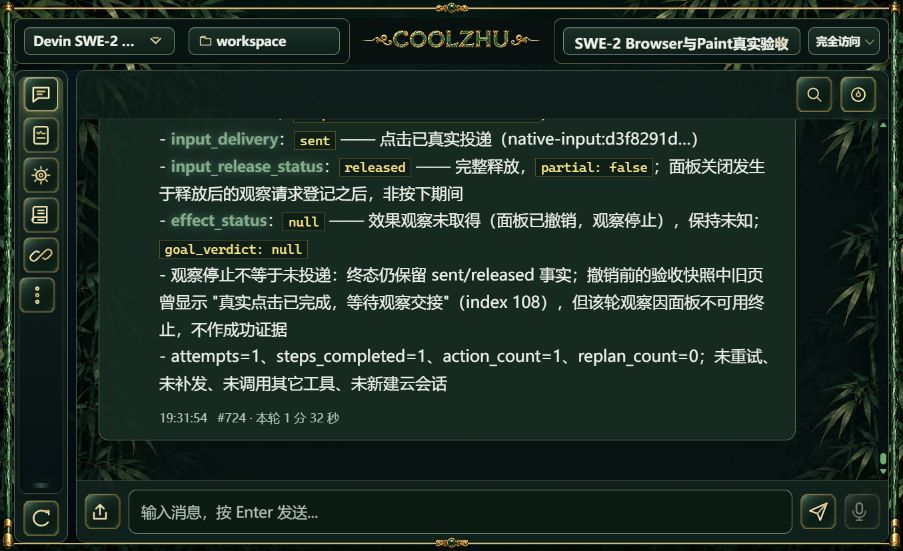
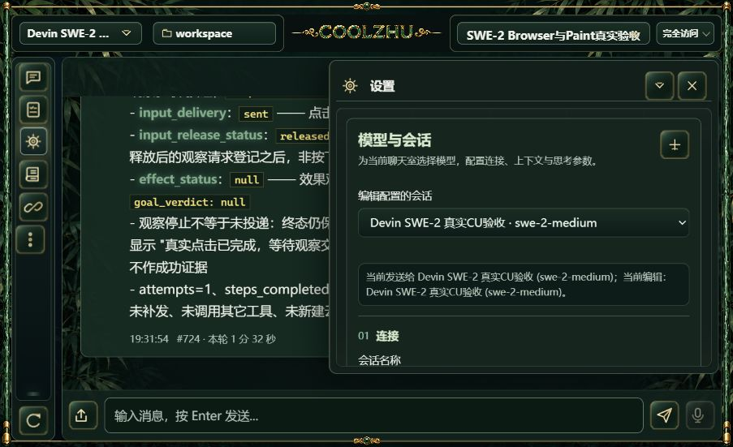
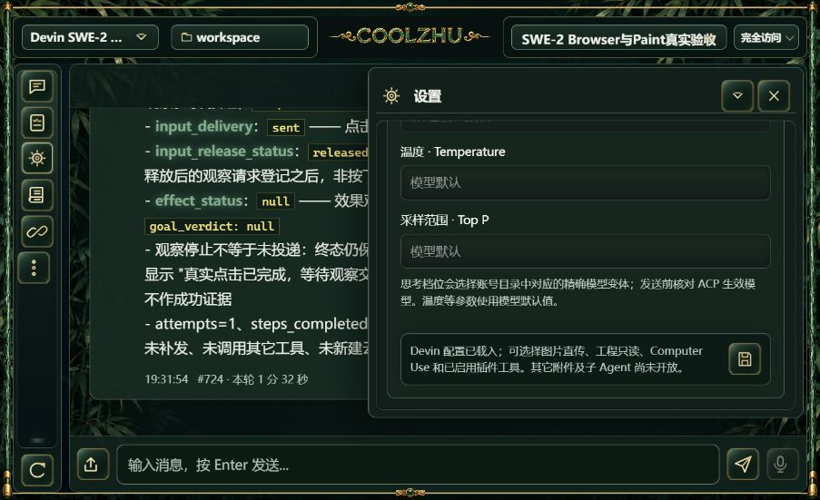

# 正式0.2.110低高度页面补验

本次由正式安装web-console EXE在8765提供编译期内联资源，沿用原SWE-2-medium/唯一island-kayak。服务身份来自已核验安装记录：web SHA256 `48d71da04b1c6b4011896bb995bd0a1973587c86a477131fc5739d32da88ca11`，冻结源码733d5f3。本专项无模型请求、无新云端会话、不保存任何模型参数。

通过正常页面和浏览器真实903×551视口，检查首页、设置扩展栏及其底部。顶部发送对象/目录/聊天室/完全访问可见；控件图标加载、下栏输入/上传/发送/话筒与金框没有明显重叠；右栏滚动到达保存按钮，顶部关闭按钮及聊天输入区保持可见。正常关闭右栏后聊天区恢复；页面中79个有布局尺寸的图片均complete且naturalWidth大于0。此计数仅为本页当时状态，不冒称全市场插件自带图标均已验证。

首次设置视口后即时截图仍包含浏览器旧画布的空余区域，后续DOM确认实际903×551、再次截图已正确匹配。保留最终截图；未为截图注入CSS、缩放或修改页面。控件按DOM实际button角色操作；曾用AX的checkbox角色查找导致零匹配，未影响产品状态，随后读实际DOM改用button正常打开。

本次为正式服务的浏览器布局实操，不能替代原生壳低高度、Windows混合DPI/负坐标、多屏、系统字体缩放与CU矩阵。截图中的#724是既有Browser失败报告，不是本轮新调用或通过证据。

临时标签页9关闭，视口override已reset。原正式原生窗口保持运行，SWE-2配置及唯一远端绑定未改；Paint不测、微信不动、Opus暂停，Goal继续。

