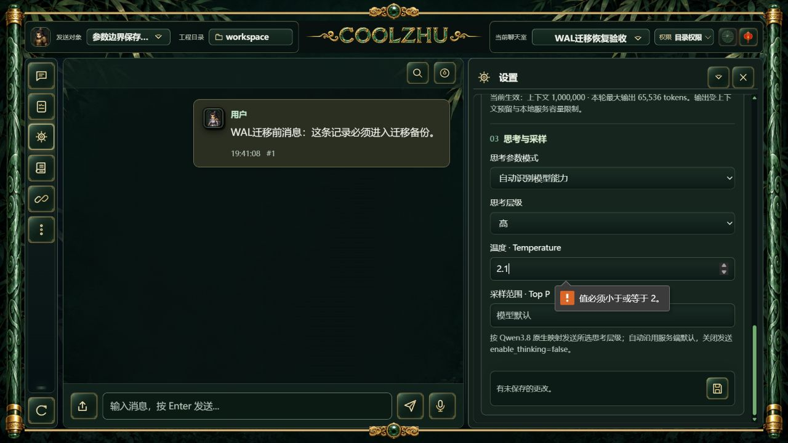
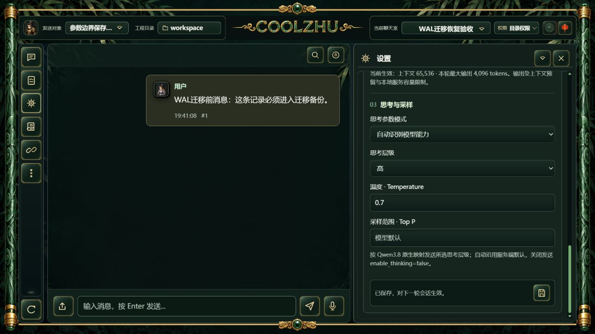
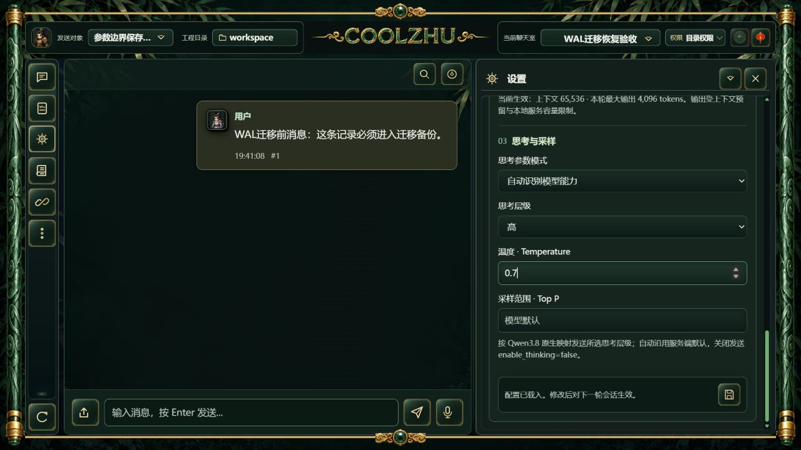

# 会话参数职责拆分：候选验收

本专项仅验证原参数规则提取到 `session_model_config.rs` 后的兼容行为。正式安装版仍为0.2.110，其冻结源码733d5f3不含此重构；不可把候选实拍追认为正式发布验收。

独立比对基线883e71e与候选：DTO/serde默认值、协议和地址解析、HTTP校验规则、用户预算约束及原四项参数测试均一致。仅增加模块可见性，将参数错误交由HTTP层映射400。权限、revision、保存与密钥保护仍由原业务入口负责；不新增Provider表，不开放Devin的Goal/Relay。

## 编译与回归

实际 `cargo build -p coolzhu-web-console --offline` 子进程退出0；完整 `cargo test -p coolzhu-web-console --offline` 子进程退出0：Web1423通过/0失败/6项既有忽略，lib8项及native-host1项通过。原四项参数测试原样通过，未添加镜像单元测试。原始日志和独立比对结果见同目录。

实拍使用提取后的首次实际构建，二进制身份见facts.json。整理时去掉新模块末尾一个多余空行，再次实际build及完整回归均退出0；原五组规则比较仍一致。最终源码和构建身份另见verification.json，不把两次构建的字节身份混为一谈。

## 正常界面与真实服务

使用本轮真实候选EXE及独立工作区，SQLite通过只读源连接备份既有验收副本。独立端口8767、日志目录及输入安全目录；无原运行库写入。创建的“参数边界保存验收”是本地配置记录，填写qwen3.8-flash用于验证参数页面，未配置密钥、未调用模型，也未新增任何Devin云端会话。

1. 正常设置页输入上下文65536、最大输出4096、支持图片直传及温度2.1，点击保存。浏览器原生约束显示“值必须小于或等于2”；HTTP读取确认草稿未保存。
2. 独立HTTP请求同一真实后端提交温度2.1，返回400及协议范围错误，参数和configuration_revision逐项保持；此步另验服务端规则，不把浏览器校验误称后端拒绝。
3. 正常页面改为温度0.7并保存，实际显示“已保存，对下一轮会话生效”，生效65536/4096。Base URL保持原输入的百炼地址。
4. 仅停止自有空闲候选服务，使用同一EXE重启；HTTP逐项比较全部参数及revision一致。正常页面重新打开设置，65536/4096、0.7、图片直传及高思考层级恢复，并保留实拍。

模型请求0、新云端会话0、原运行库写入0。自有服务两次终止后均wait确认退出1；这是验收驱动主动关闭空闲服务的Windows进程退出值，不是模型取消或业务失败证明。外层驱动最终实际退出0。临时标签页8已关闭，TEMP入口文件恢复，原正式SWE-2/唯一island-kayak及原生窗口保持运行。

首次归档比较脚本使用不够精确的注释锚点，额外取到上方WorkspaceConfig字段，DTO比较误报false；查看文本差异后改为完整注释锚点，五组独立比较均true。此失败发生于证据整理，不是产品字段变化，未通过删除产品校验规避。

## 验收边界与后续

只关闭参数规则拆分的源码候选兼容检查，不宣称SessionConfigService、共享TurnRunner、单写者/outbox或全部派发hooks收敛完成。本轮没有真实模型推理或图片识别，因此不更新模型能力验收结论。后续合并出包时再验证正式安装身份及综合长程，不重复简单问答。

Browser新原生Target/跨来源commit严格按下窗口、精确pending资源撤销仍未命中，不能从本专项或普通导航推断通过。Paint免测、微信不动、Opus暂停；Goal继续。
