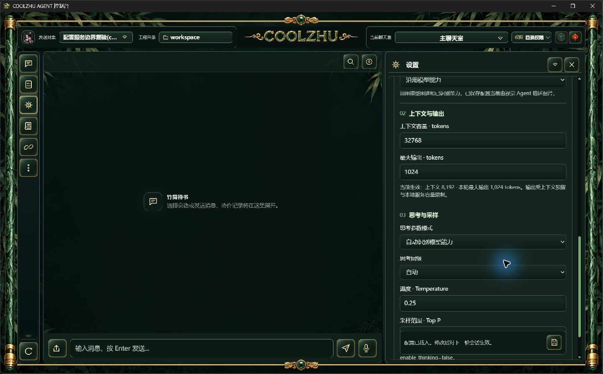
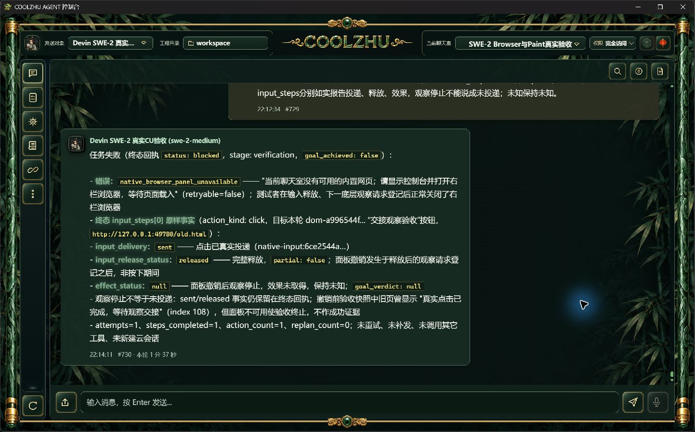

# 会话配置服务边界候选验收

从0.2.114已经验证的同步块提取 `SessionConfigService`。四个HTTP入口只组织输入与响应，服务接收原 `TrackedSessionStore`，复用既有配置发布、本地容量和失败恢复；无第二缓存/队列，不持存储锁跨await。插件目录IO继续在存储锁外。源码身份和候选EXE摘要见verification.json；当前正式0.2.114不含此提取。

实际offline build返回0。完整已有Web回归1,423通过、0失败、6项既有忽略，另lib8/native-host1通过，原始日志及实际退出收据归档。没有新增镜像实现的单元用例。

实际独立服务/SQLite验证：旧容量六读取者、180次保存、1,314次读取，混合0；统一参数六读取者、180次整组保存、1,145次读取，混合0，无HTTP失败。两接口本地约束和旧保存的采样保留正确。真实SQLite触发器拒绝保存的两组案例均返回500，并恢复原会话与参数；原缺项保持缺项。同revision竞争一方200、一方409，最终参数与SQLite一致。

正常Program Files壳加载候选服务，设置页展示用户上下文32,768/输出1,024、生效8,192/1,024、温度0.25。候选EXE正常结束后重启，通过正常Ctrl+R、重新打开设置和滚动取得同参数截图；配置版本保持。独立脚本已消费实际退出0，后台子进程正常Terminate的Windows返回1保留，不写成自然退出0。

两次准备检查因前一snapshot驱动尚未实际退出而在端口空闲断言失败，未启动新EXE、未发API或模型。preparation-failures.json保留原因；明确消费前驱动退出0后，在第三个目录成功复验。未按端口杀进程。

四个隔离SQLite库的runtime_runs均为0；Qwen ID仅用于本地参数规则，没有模型推理/模拟供应商回复。原运行库只读，原SWE-2-medium/revision51/唯一island-kayak解锁、活动轮次0。已停止身份核验相符的隔离壳并恢复原正式控制台。当前壳与隔离后台安全状态目录不同，本轮仅读设置、不执行CU，不将其作为CU证据。

只关闭Web配置领域服务提取的候选验证，不宣称WBS2.1全面完成；LLM resolve、固定工作区作用域、跨资源崩溃/单写者/outbox、SharedRunner及Browser严格时序继续开放。新包正式复验另记，整体Goal继续。

