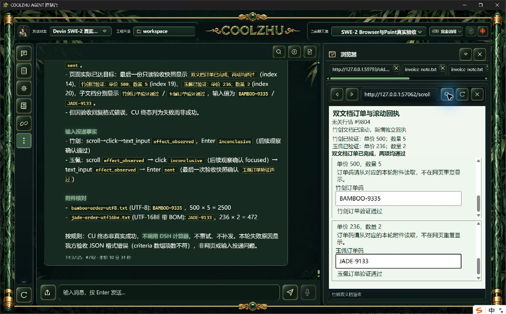

# 动作规划格式反馈候选：输入完成，最终验收格式仍失败

Web SHA 4646f4c675fe9e5fd1c753dfe77d98f255f7edea2945a22b4b6c0d587dc22b29；壳SHA 29dba7278d444a2b713aca5c87f72a54806b872ff6acc928e7e6f69d7fdcf9f9。Web offline build实际0（26.52秒），完整1432通过/0失败/6既有忽略；壳构建0、78测试通过。

唯一SWE-2-medium/island-kayak，父轮`run-chat-37982a6c7775695924ac5aa5400a1ef844284c19f349723f`，可见消息#791/#792。真实UTF-8附件BAMBOO-9335（500×5）、BOM UTF-16BE附件JADE-9133（236×2）。八步浏览器输入全部sent，输入释放released或not_needed；两个子文档各滚动、点击、填写、Enter，页面实显示两项通过。

最终native_browser_verification_invalid：只读验收结构没有满足每条标准的有界结果。宿主没有将页面部分成功改成整轮成功；DSH计算器未调用，2972仅预期值，不是工具证据。父轮failed/end_turn/drained、原绑定解锁。本轮动作规划格式拒绝事件0，未触发纠正，不能据此证明纠正正向可用。无结果分页读取，分页正向仍待验收。

下一修复为同一验收请求的有界结构反馈，保留原期限、取消、页面原文归因及freshness核验；不自动补齐标准或生成成功判断。既有提示只有单条固定例，需去除其对多标准验收的误导。批次正式发布仍未完成。

