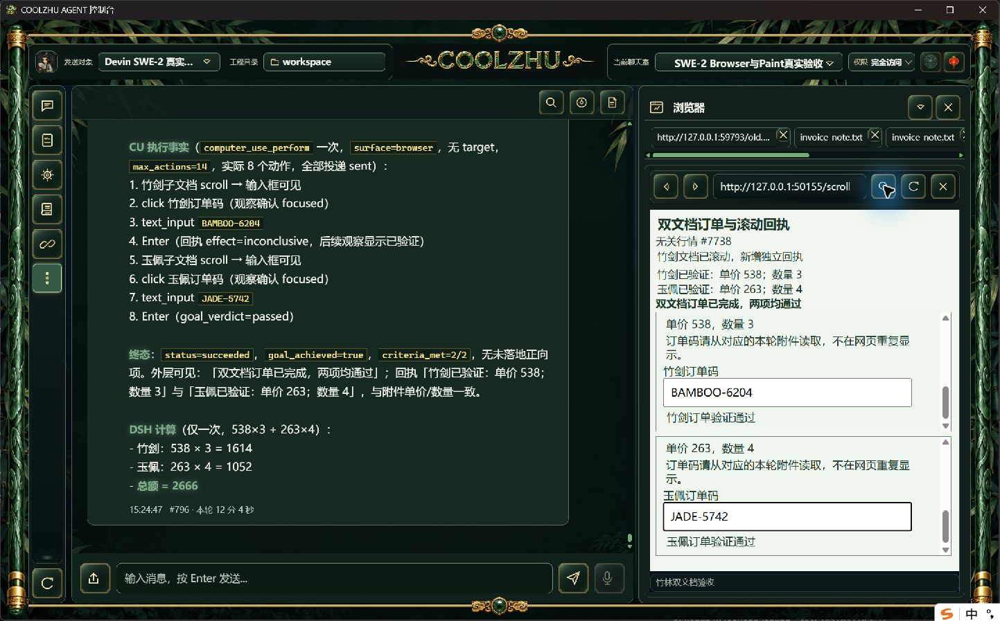

# 同请求引文反馈：真实长程候选记录

整体验收：**通过**。仅计本候选，正式包仍0.2.124。Web `c616f5ddedc5ff7de28bf966c8151e34f3faa72f348cf8a2ea9e27f221c1bf2c`、壳 `29dba7278d444a2b713aca5c87f72a54806b872ff6acc928e7e6f69d7fdcf9f9`；源码 `b378fb02758bda47f613f126d524b9142f2af2ff`。Web offline build实际0，完整Web1433/0/6既有忽略，关联8/0和native host1/0；壳沿用相同29dba二进制及此前78/0。首编译错误原日志保留，修复后实际build0。

原唯一SWE-2-medium/island-kayak，父轮 `run-chat-e1e488ef93c5902cc1d6aa7b9afcb3d1700f687d1db55eb8`，可见用户 `msg-1791583964230-user`。实际UTF-8和BOM UTF-16BE长附件，普通跨来源双子文档网页、100ms行情与滚动插入AX回执。CU终态 `succeeded`、goal_achieved `True`，输入步骤8；工具调用2。独立预期总额2666只有在验证脚本确认实际DSH调用、回显、附件SHA/编码及协议收尾后才作为通过，不用口算冒领。

结构或引文反馈0次，结果分页读取2次；事件和原终态如实保留。零反馈不证明真实纠正分支，零分页不证明长结果分页正向。本修复复用原精确grounding规则，冻结宿主page/index，在原请求共用最多两次拒绝；不放宽分隔、不替模型改文、不重执行输入、不延期限。最终freshness与事实验收独立保留，met=false仍允许。

此前所有失败保留，不追认旧候选。批次正式出包/独立安装复验、严格nativeTarget/commit和在途撤销/HRESULT、完整32WBS矩阵仍开放。Paint免测、微信不动、Opus暂停，Goal active。

