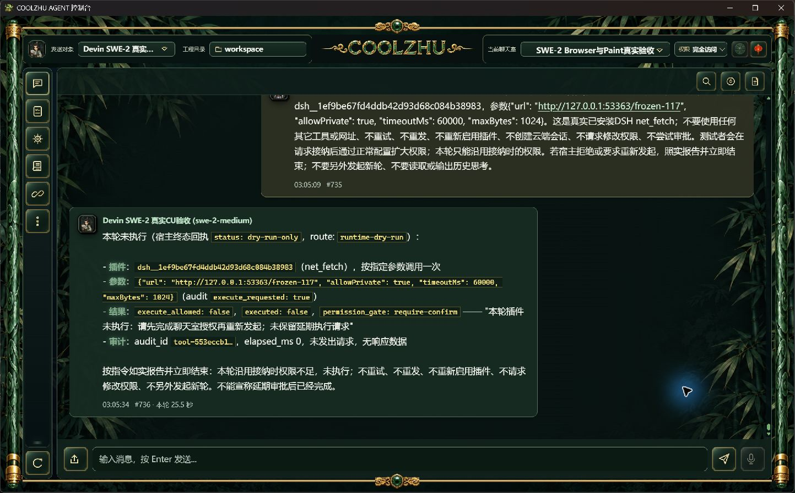
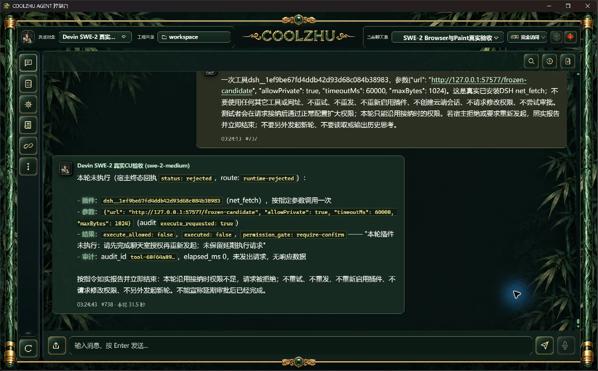

# ACP 插件不可续接审批：真实失败与候选修复

正式117，真实SWE-2-medium及原island-kayak，接纳时目录权限、prepared阶段正常扩大完全访问，旧DSH net_fetch仍被冻结权限拒绝，真实HTTP请求0。父completed、ACP end_turn/process_drained=1，工具却awaiting_approval，attempt unknown并保留绑定锁。页面“未保留延期请求”与台账矛盾，是agent错误。原user735/reply736及实拍保留。

候选明确限定ACP返回Rejected，原权限gate及未执行事实不变；正常分发投影failed，监督器按协议终态与真实排空结账。旧锁仅通过正常聊天接纳rotate事务收束精确普通聊天scope的DSH awaiting_approval，必须旧unknown/end_turn/drained及终态父run、工程/房间/Agent/轮次均匹配。追加tool.approval_not_resumable，保留旧unknown；不续执行旧请求、不直接改验收库、不增云端会话。非ACP正常审批及approval_running不变。

候选真实一次调用：run-chat-5bef037384ae4b0d0e07f2dd207c3e6ec4900ba7c5a45521，user737/reply738，模型swe-2-medium。prepared观察1791541457072.9856→权限提交1791541457149→返回1791541457159.1292，实际工具登记1791541473336，终态failed。真实协议terminal/end_turn/drained=1，唯一原island-kayak解锁，网络请求0。旧af87…attempt仍unknown/end_turn/drained=1，旧工具failed且仅追加一条不可续审批事件。独立settlement-verification及facts为准，不按模型转述判成功。

候选后台为tmp下独立EXE，桌面壳仍正式117，不能算新正式版验收。首次直接target/debug运行DSH因旧运行资源大小不符启用失败，未调用模型；保留enabled-initial-failed，随后按固定锁核验290资源及第一方宿主源码，正常启用成功。不修改受审查锁，不用全局Node兜底。

最终offline build0；Web1424通过/0失败/6既有忽略，另lib8/native-host1；前端22通过/0失败。新增一个协议/身份/排空收束边界回归，校验执行中与非DSH待审批不被误收束，并非模型回复夹具。真实模型和普通HTTP服务独立取证。

本轮退出：observer/send/server均actual exit0，恢复原完整权限/开发覆盖/模型参数，撤回临时白名单、插件停用，revision自然53→54→55，不手改旧revision。配置正常服务保存后SHA变化独立记录，不宣称原字节保持。候选停止后恢复Program Files117及原壳；正式117尚不含源码修复，需要新包正式复验。

复验设计：正常新包核对文件摘要后，同一原SWE/唯一远端接纳目录权限请求，prepared时正常扩大权限；必须真实工具进入冻结权限判定，拒绝且HTTP0、tool failed、terminal/end_turn/drained/解锁；否则不计通过。非ACP交互审批正常入口仍需专项实操，严格Browser新nativeTarget/跨来源commit按下窗口、观察撤销/HRESULT竞争继续开放。Paint免测、微信不动、Opus暂停；整体Goal继续。
