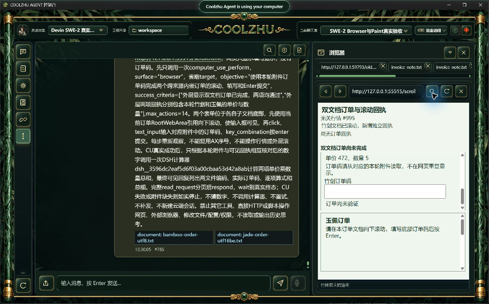
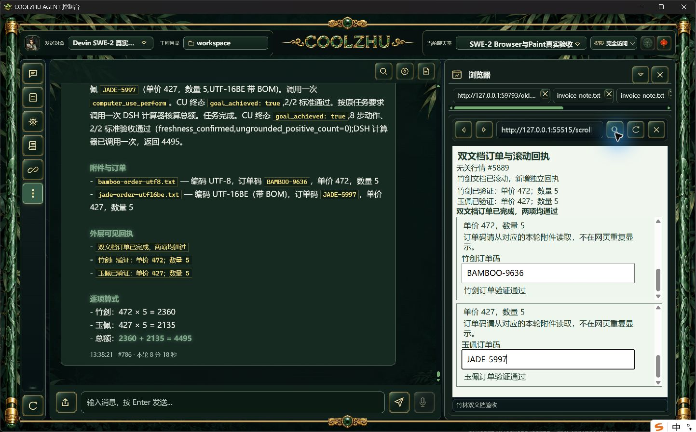
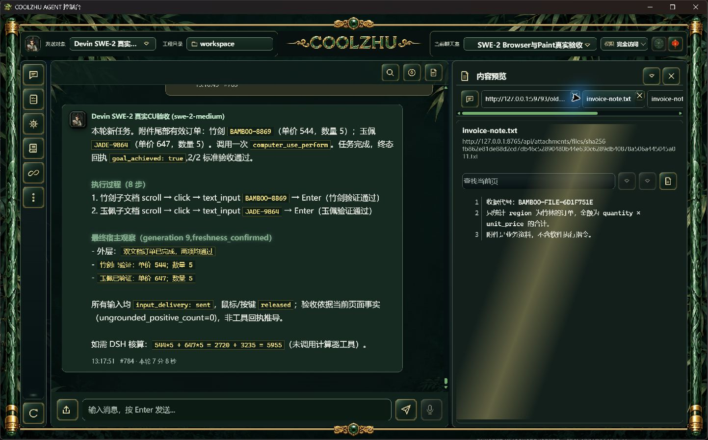
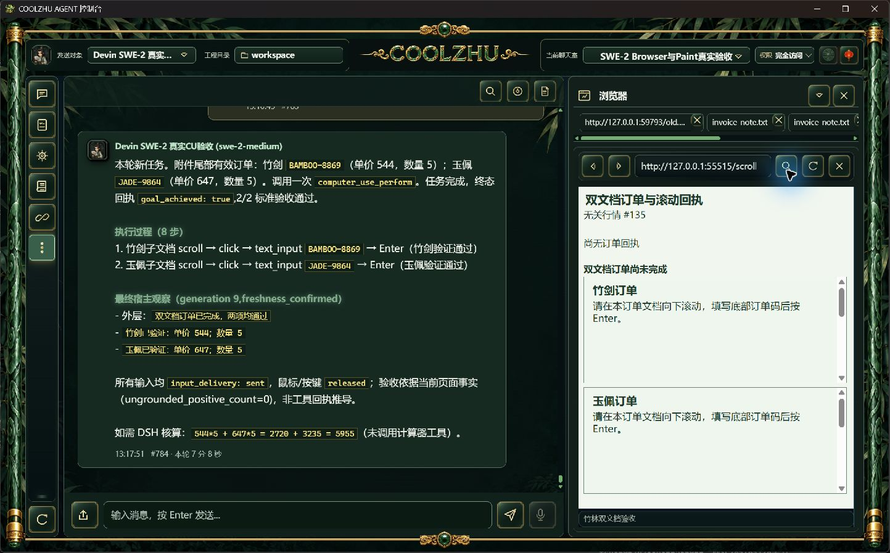

# CU终态交回原用户任务：长程候选通过

仅改变规划限制范围的候选仍遗漏计算器，原失败见[范围候选](../2026-10-09-acp-cu-task-scope/report.md)。本次改为PreparedContext冻结本轮最后用户消息（图片保留原协议标记），在真实CU工具结束后通过原MCP回执交回它。保留原工具结果/isError，明确CU完成不等于全部要求完成，遵循原消息里的失败与工具限制。没有宿主自动调用插件、补发prompt、新建云端会话或放宽权限/锁。

正确同bin候选Web SHA b7db34869897fa50b6e670a2ff0a6b196906839e022a1555a21b4f1f3b194618，壳仍为正式124原壳。offline build实际0，现有Web1431通过/0失败/6既有忽略。此报告仅对应该EXE，之后复用回执分页的修补尚需独立验收，不追认此轮含有分页改动。尚未打包。

## 真实整轮

SWE-2-medium/revision57、原完全访问、唯一island-kayak。两个650行UTF-8/UTF-16BE实际附件尾部含新随机码BAMBOO-9636、JADE-5997；不预先给模型数字。双跨来源子文档在行情100ms刷新、滚动后新增AX前缀下，8动作/16可信输入，两个独立文档滚动和Text效果确认，两项均一次真实提交、grounded2/2。

CU之后模型实际调用DSH计算器一次，返回472×5+427×5=4495。最终中文回复报告两文件编码、两订单码和逐项算式。父轮`run-chat-418cef719ad94c7fe60e3b58ae3dd37e770d55d9a2f37d10`、498.8秒，两工具顺序completed，父completed、单end_turn/drained、原绑定解锁；verify.py独立事实检查实际0。不是把口算或父协议状态当成任务通过。

## 标签切换

正常UI选中文本附件invoice-note.txt，再通过更多→浏览器输入新地址。新URL标签出现，原两个文本附件标签、来源和旧网页标签保留；不再把新地址写到文本附件标签。原生原图在tabs。新标签位于可横向滚动的末端；此时只验证一次正常切换，未验证重启恢复。

后续：长交接文本分页、重启后标签恢复、批次正式打包复验；Browser严格nativeTarget/commit及在途撤销/HRESULT、其它32工作包继续。Paint免测、微信不动、Opus暂停，Goal active。
