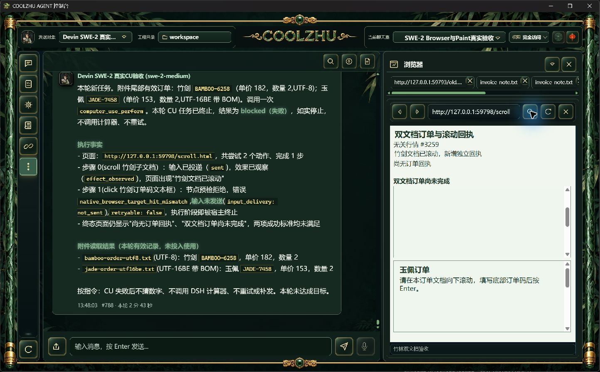

# 长CU交接分页候选：正常Browser流程未通过

候选Web SHA 51314a8c50e79b70be26e7e43b90ee67b3667d53142cee07024425ea485a5c24，配合未修改正式124壳。offline build实际0，现有Web测试1431通过/0失败/6既有忽略。

原唯一SWE-2-medium/island-kayak父轮`run-chat-2cfecdddc11f3753ffe2de24b4d0236cd06d908941569b46`。实际UTF-8、UTF-16BE附件含BAMBOO-6258（182×2）、JADE-7458（153×2）。子文档滚动已投递且观察到效果；随后点击输入框前命中预检拒绝，错误native_browser_target_hit_mismatch，点击not_sent。实际2次尝试、仅1步完成、父failed/end_turn/drained、绑定解锁。

这是正常任务的新失败，**不计通过**。模型遵守失败约束，没有调用计算器、重试或新建会话。无tool.result_page_read事件；没有分页正向完成证据。旧交接候选的成功不能替代本候选验收。

原生图显示首个子文档处于空白区，尚未露出订单输入框，可访问性树却仍列出该输入框。后续检查发现观察的可见性提示仅核矩形是否落在顶层视口；同进程iframe裁剪没有纳入提示。执行预检仍正确拒绝未命中的输入。下一候选将补只读命中提示，保留原执行检查，不强制发送点击。

标签重启恢复：当前5标签及两个invoice-note.txt来源保留，正常新URL替换选中网页标签。原图见deployment/restored-tabs.png。

仍待：修复后长程正向复验、长交接分页真实读取与续接、批次正式交付。Goal active；Paint免测、微信不动、Opus暂停。
