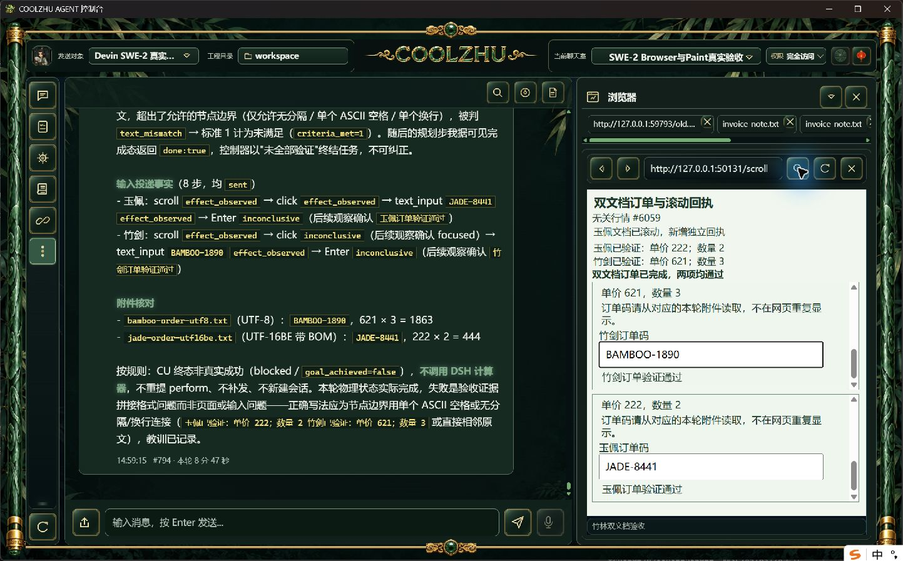

# 结构反馈候选：动作完成，引文不匹配仍未通过

Web8893d20f66b6e31e767868b830aff4e93ea870810879c24752b57b033415be87、壳29dba7278d444a2b713aca5c87f72a54806b872ff6acc928e7e6f69d7fdcf9f9。offline build0、Web1433通过/0失败/6既有忽略，壳相同已通过78项。

唯一SWE-2-medium/island-kayak，父轮`run-chat-3cdf6ac3aae655c768253c0c684488160999f5dc951c4348`，可见#793/#794。长附件UTF-8竹剑BAMBOO-1890（621×3）、BOM UTF-16BE玉佩JADE-8441（222×2）。八步全部投递释放，两子文档分别滚动/点击/填写/Enter，两个实际订单提交通过。格式拒绝0，验收结构符合要求；宿主标准0原文确认，标准1把两个节点用分号拼接，超出精确连接规则，text_mismatch，实际只确认1/2。模型随后done，原控制器verification_failed结束。

零计算器、零结果分页读取；2307只是预期值，不是工具结果。父failed/end_turn/drained、唯一绑定解锁。不计候选整体通过，更不能追认正式包。原终态last_verification保留真实节点节选及脱敏归因，与原生截图对应。

下一修复在同一冻结验收快照内反馈现有引文不匹配，最多两次拒绝共享原上限，原预算/取消不变；不替模型修文或生成成功，不改最后独立freshness核验。批次正式交付和严格时序、其它32矩阵仍开放。

