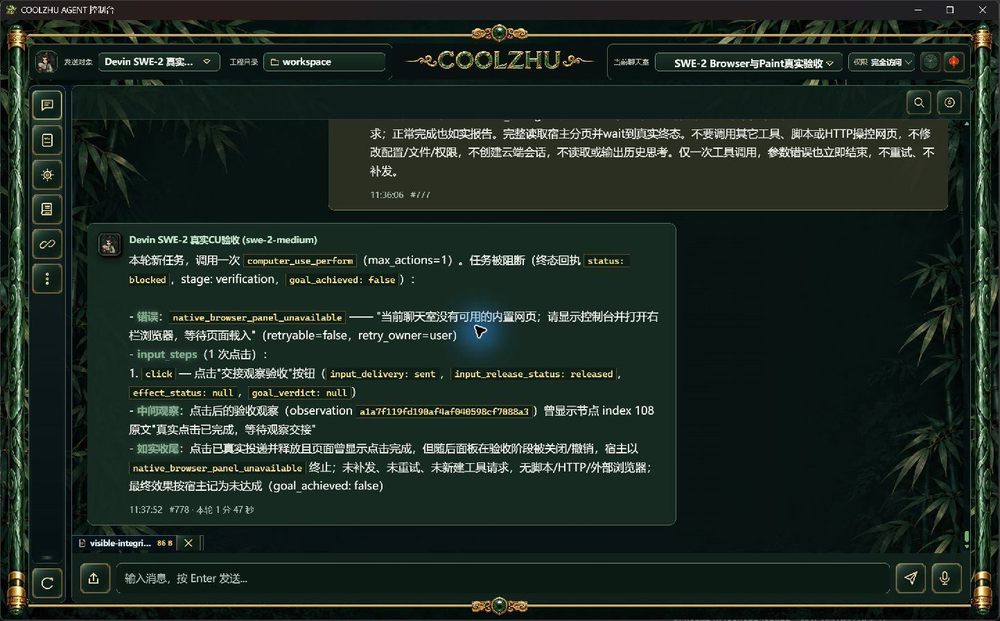
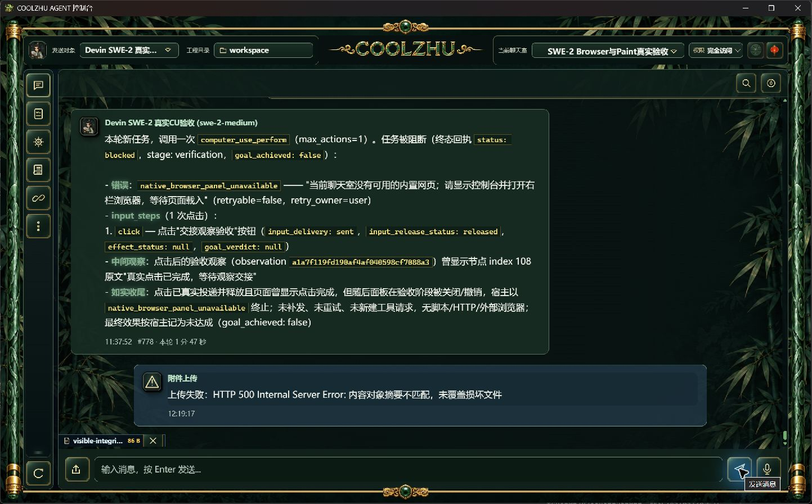
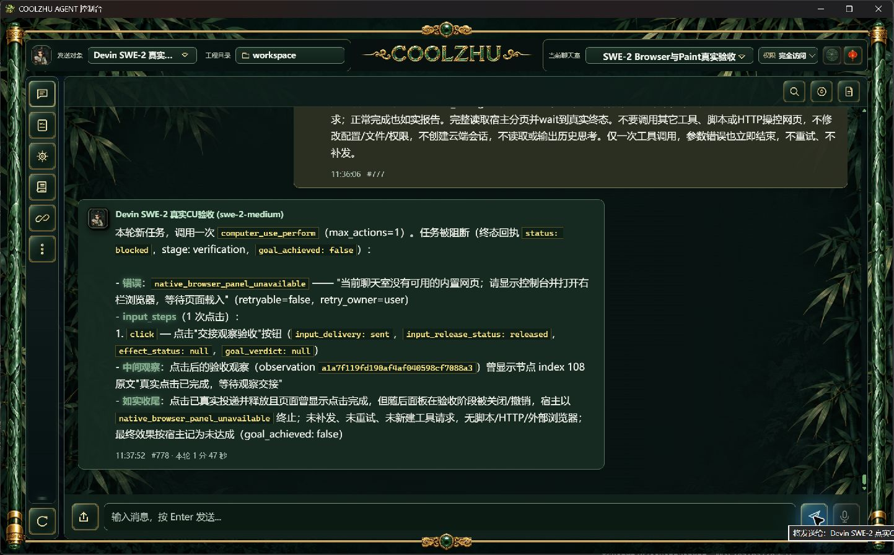

# 附件发送前内容完整性：源码候选与实际验证

正式0.2.123已有上传和下载摘要检查，但发送入口读取内容寻址对象时未检查名称中的SHA256。文本对象被改写后会重新生成正文快照；图片对象被改写后可继续编码。已在content_blob_store集中增加已读字节校验，文本冻结及图片编码复用同一帮助函数；校验失败在模型派发前返回400，不覆盖损坏对象。沿用旧非内容寻址文件兼容路径，不增加存储表、缓存、权限或重试。

实际正式EXE与候选EXE使用同一份真实SQLite在线备份的独立副本。副本保留真实SWE-2配置，仅通过聊天室既有模型开关关闭调用，正常上传真实UTF-8文本及真实PNG，再分别保持、改写、恢复自己的隔离对象。before-v3与candidate-v2的result.json各记录两类文件、六次实际HTTP检查：正式123的损坏对象继续进入模型开关检查（403）；候选损坏对象在发送前被拒绝（400/摘要不匹配），原始及恢复对象仍进入模型开关检查（403）。十二次发送均新增runtime_runs=0、devin_acp_attempts=0；原运行库写入0，新云端会话0。该测试没有提供模型响应夹具，也不冒称真实模型多模态正向验收。

正常原生文件选择器选择本轮86字节文本，确认预览；先经正常上传API建立对象，再仅改写隔离存储中的同摘要对象，正常点击发送。UI显示“上传失败：HTTP 500 Internal Server Error: 内容对象摘要不匹配，未覆盖损坏文件”，损坏对象保留、模型和运行计数不增加。**这张截图证明原生上传冲突提示；新增发送读取校验的证据是以上实际HTTP对照，不能把两者混为同一个入口。** 上传提示仍含HTTP技术文字，留待正式界面错误呈现整理。

首次新增负例误选名称不同但字节完全相同的green/red图标，导致baseline图片负例及第一次完整回归失败：第一次Web1430通过/1失败/6忽略，实际exit101，未计通过。两图实际SHA均为a54fc0e9013c2eb7fd20733472db69a2edd2ade8fdaa1da3c87afa43db07a056；随后改用自己的PNG副本附加字节，先断言新旧SHA不同再测试。第一次API准备还误用不存在的诊断行UPDATE并触发行数断言，未启动服务、未调用模型；改为正常副本行插入后继续。before-v2图片负例无效，candidate第一次图片断言失败；这些结果保留，不计最终覆盖。原生选择器首次点击被目标窗口校验拒绝，刷新后以文件名框Return正常确认，没有将未知输入当成功。

最终offline build实际exit0/19.31秒；完整Web实际exit0/76.59秒：1431通过、0失败、6既有忽略，另lib8与native-host1通过。只增加一项回归，覆盖实际内容对象读写、原始文本/图片可读、被改写后拒绝且不覆盖证据。候选Web SHA256为2db074d75ce5983ba9d2f089f82ae7da0be54868ce8d15d4569a6c82be2c3158。源代码候选包含此前长会话摘要修补，正式123尚不包含这两项；待有意义的批次出包及真实SWE-2长程续接复验。

候选服务正常退出并回收；以路径、启动时间和EXE摘要核验原正式Web身份后恢复8765原生壳。original-restored-receipt.json是新壳收据，之前history-summary收据中的旧壳已退出，不得再用于停止操作。恢复实拍如下，原SWE-2/唯一island-kayak配置与原权限保持；Paint免测、微信不动、Opus暂停。

evidence-manifest.json记录38项原证据的长度与摘要；不包含实际数据库、副本配置、登录凭据和完整模型响应。图片历史压缩、spill/GC、有效PDF/音频/视频通路、严格Browser竞态及其它工作包仍开放。Goal保持active。
