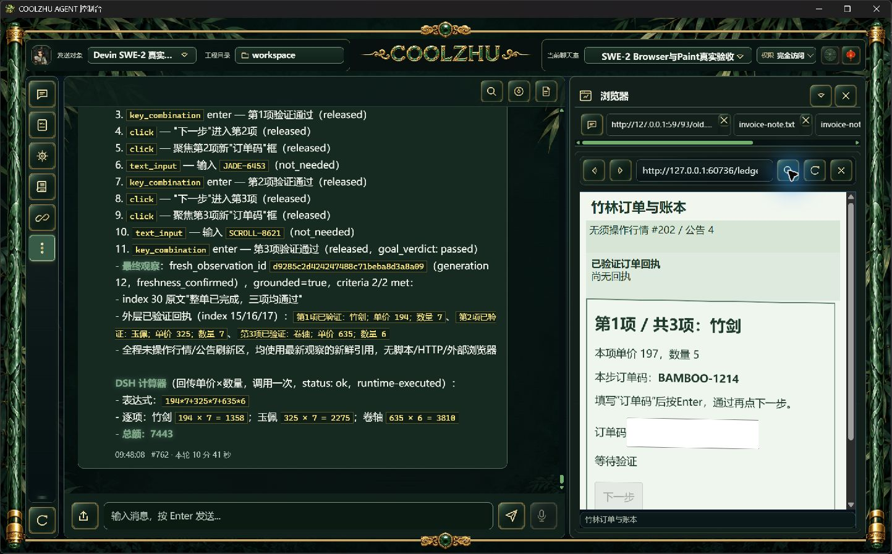
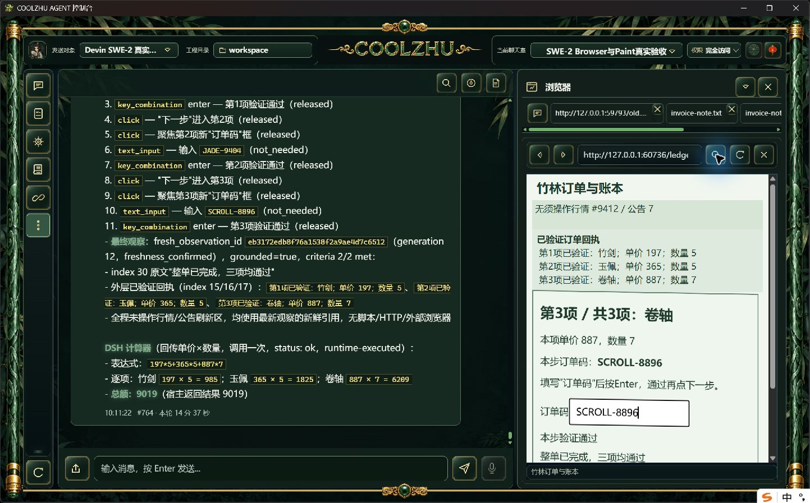
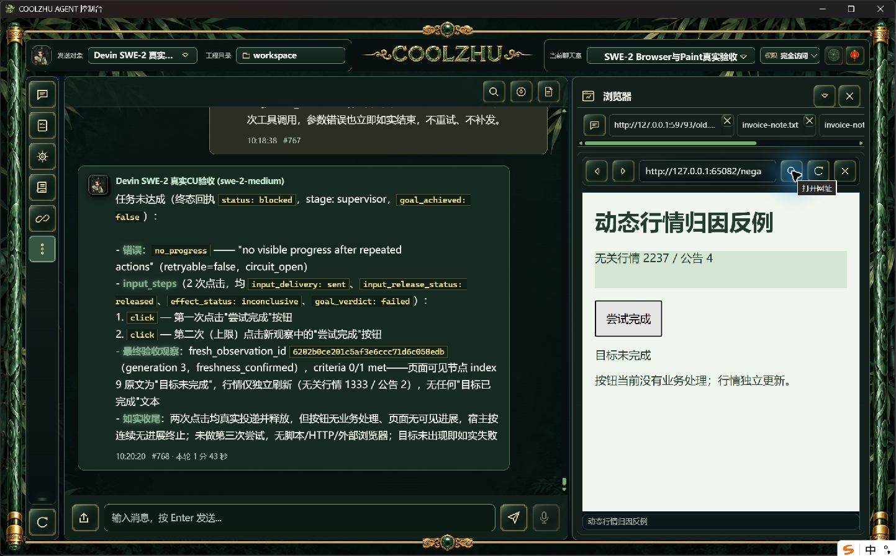

# Browser 本步效果归因与真实候选验收

第二候选正反例通过：跨来源三阶段订单11次真实动作，三次文本输入均由宿主读回确认改变，3步效果保留为未知；最终页面2/2标准满足，随后DSH计算器总额9019，两个工具各一次completed。无效按钮与100ms行情反例真实两次点击均sent/released/inconclusive，连续无进展2后停止，没有第三次输入。两轮均使用原SWE-2-medium、revision57和唯一island-kayak，单end_turn/drained并解锁。

这是源码候选验收，尚未新包独立复验，不能冒称正式安装通过。第一候选三项实际完成、11次动作及插件7443，但AX索引随回执插入漂移，Enter被误算effect_observed；独立验收脚本exit1，原失败及原图完整保留。首次行情反例首调用误用task字段，宿主invalid_tool_input且零输入；模型违规补发第二调用，虽两次真实点击后no_progress，仍因多调用验收exit1，不追认整轮通过。新的独立反例明确objective等正式字段，未改解析规则，才按单调用核验。

宿主在一次ExecuteText投递ACK后，沿用原许可剩余预算，复用固定只读编辑对象，按UTF-16选区检查实际值精确等于插入预期且发生改变。原值、选区和预期文本不外传。超时、资源变化、旧宿主缺字段保持未知，不重发输入。后台仅允许匹配请求、资源、执行实例的ExecuteText/Acknowledged携带布尔事实。

适配器复用PageProvenance携带当前规划观察、动作种类和目标序号；旧动作不能借给新观察。文本使用宿主编辑事实，滚动只比较目标文档的有效视口，点击/按键的文档转场和焦点有无变化分别判进展。AX序号不是焦点对象身份，两个有效序号之间的变化保持未知。任意节点列表、行情、公告及随机引用变化不计进展。目标验收仍独立，已投递/已释放与已达成分开保存。

离线实际build0、完整Web1429/0/6既有忽略（另lib8/native-host1）、壳77/0、模块联动8/0。必要回归覆盖UTF-16代理对选区替换、旧来源/错误动作拒绝、AX序号漂移和目标滚动边界。首壳构建命令误用根workspace导致101，改用独立manifest后实际0，首失败日志保留。

正例是新随机订单的普通双来源HTML页，跨来源iframe斜切1度、行情每100ms刷新。测试任务未预泄露订单码或价格；正常内置浏览器导航后仅模型工具完成输入，未使用模型/工具响应夹具。反例无业务处理按钮先autofocus，以排除首次准备焦点的合法进展，目标持续“目标未完成”。诊断仅归档本轮派发类型和字段数量，不采隐藏思考或raw运行日志。2秒内部/5秒外层及根900秒预算、权限和重试上限保持。

新正式包需换随机订单独立验证三次文本读回、至少一步未知效果、三阶段业务回执及插件总额，并在新正式包复验行情反例。严格nativeTarget替换/commit down-up/在途撤销/HRESULT竞态、脚本自发转场严格因果和其它32WBS仍开放；焦点对象间切换缺稳定身份时宁可未知，不宣称完整因果证明。滚动采样当前仍按AX根序号匹配，回执插入造成序号漂移时的文档错配需后续改为宿主稳定文档绑定；本次不关闭该边界。Paint免测、微信不动、Opus暂停，Goal继续。
