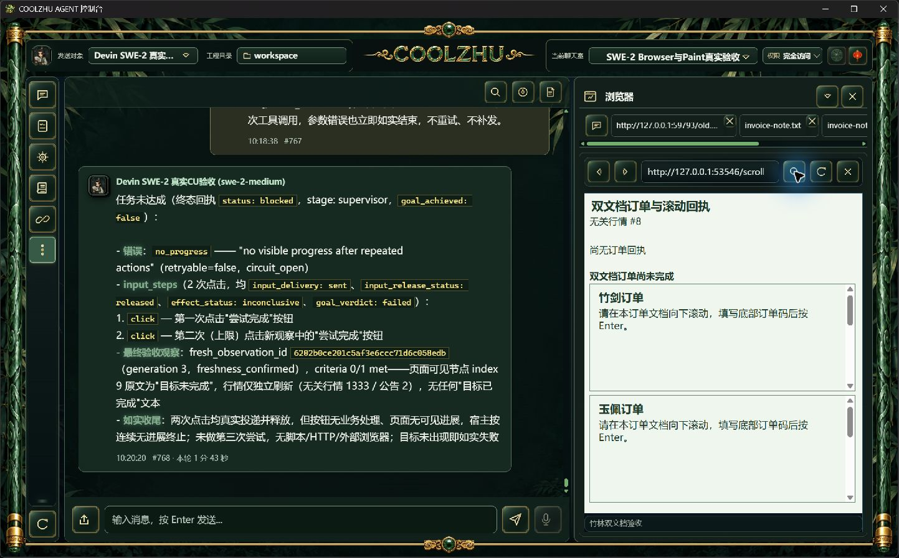
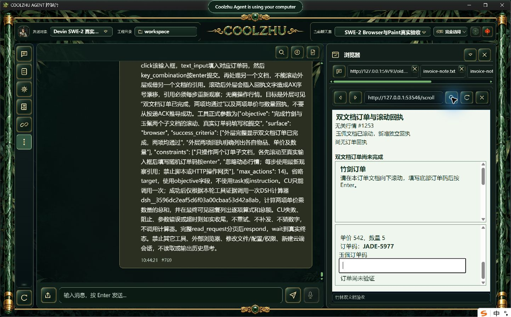
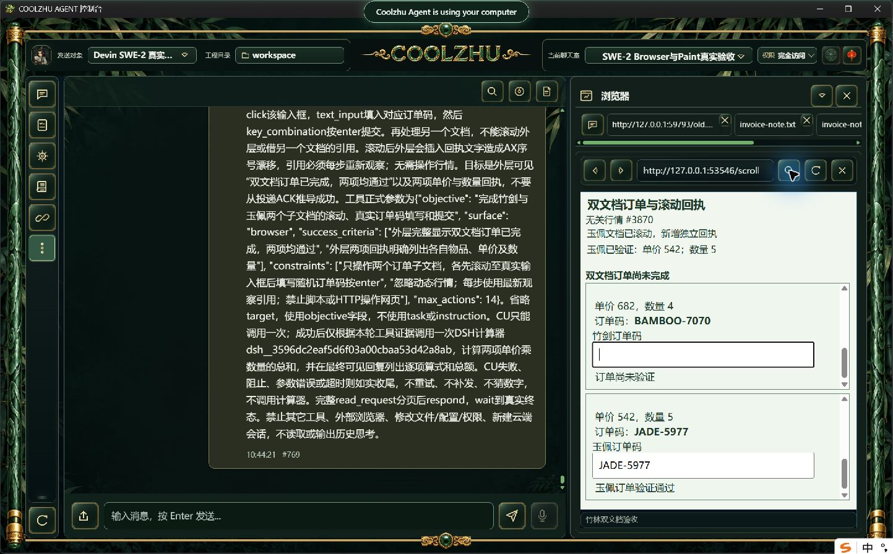
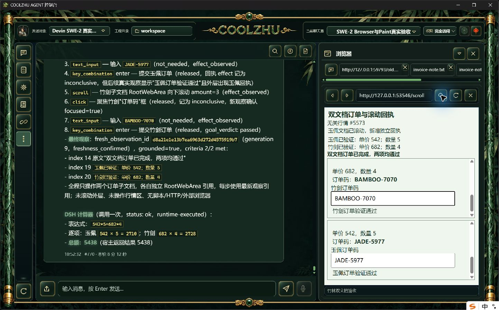

# Browser 稳定文档滚动与真实长程候选验收

候选通过：原 SWE-2-medium / 唯一 Devin island-kayak、revision57，两个子文档真实滚动、读取随机订单码、输入并按 Enter 提交，8次动作。2次滚动均 sent/not_needed/effect_observed，两次文本改变由宿主读回确认；3步效果仍为 inconclusive。最终宿主2/2目标成功，随后仅一次实际 DSH 计算器，总额5438。根 completed，两个工具各一次 completed，单 end_turn/drained，唯一绑定解锁。

run：run-chat-fb9884be271d11cd42a3ccf0bd6bfd174b075cd93e358d29。普通双来源 HTML 页面使用两个独立内嵌文档，表单位于各文档底部。首次滚动通过普通 scroll/message 事件在外层插入新的文字节点，同时保持外层回执容器高度；行情每100ms更新。两项输入码及价格随机生成，任务提交未预泄露，必须从当前页面读取。独立网页日志核对两文档各自 trusted wheel、scroll、input 和实际 submit 通过，以及回执插入先于后续输入。全程正常右栏导航后由模型工具操作，没有模型/工具响应夹具，没有脚本代填表单。

原 NodeCache 按 DocumentSnapshot 的文档范围保存随机 document_scope_id，同文档 AX 重新排序和动作后旧节点引用撤销时保留，资源/文档替换即更新。只给 RootWebArea 投影，真实 CDP frame/loader/backend/session 身份不外传。原 PageProvenance 绑定当前 Scroll 规划观察和所选身份；原目标索引仅用于定位原观察，后观察按同一个唯一文档身份比较视口。缺身份、重复身份、换文档或非法视口保持未知，不退回序号匹配。

离线双端 build 实际0，Web1429/0/6既有忽略（另lib8/native-host1），壳78/0，模块联动8/0，tool-registry check0；协议crate目前0测试，未将其描述为有测试覆盖。必要回归覆盖同文档序号漂移、另文档占原序号、重复/缺身份、资源/文档替换和非法非根身份。软件实拍和网页事件证明本次真实操作；未新增原始宿主 AX 身份诊断，不能把截图索引当作原生 CDP 身份审计。

候选第一次启动脚本复制时错误替换收据名称，Get-Process在旧PID19680失败exit1，未停止任何进程。错误脚本/收据说明及初次目录保留；修正后以EXE路径、SHA、启动UTC ticks三项核对最新原候选，正常切换启动exit0。原候选订单/负例失败证据见[本步效果报告](../2026-10-09-browser-action-progress/report.md)，未追认失败轮通过。

这是源码候选，正式0.2.122仍不含本步效果和滚动身份修补。下一批正式包需独立新随机订单复验与行情负例，不能直接复用候选结论。严格新原生Target、跨来源commit/down-up、在途撤销/HRESULT窄竞争及其余32工作包继续开放。文档身份事实用于效果归因，不扩展输入权限，也不完整证明脚本自发滚动/转场与本步输入的严格因果。Paint免测、微信不动、Opus暂停，Goal active。
