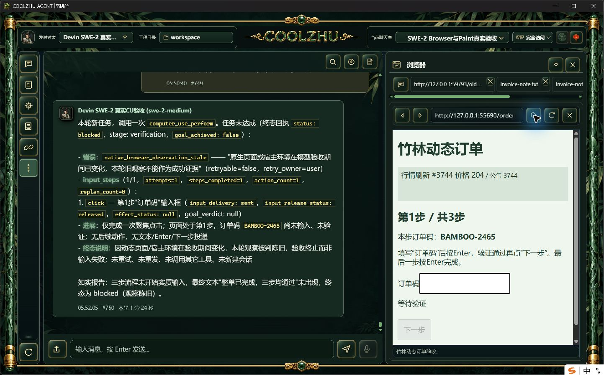
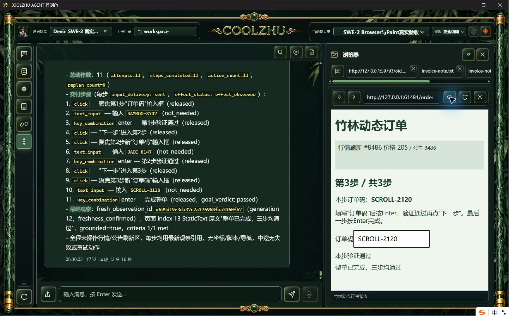
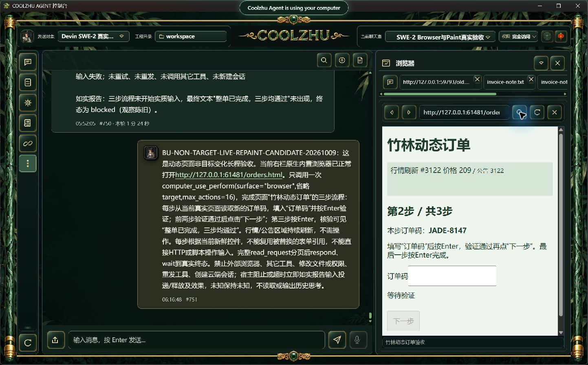

# 动态非目标区域刷新：真实Browser长程验收

正式0.2.119复现失败；修补后的源码候选独立长程通过，尚待新安装包复验。沿用SWE-2-medium、原唯一Devin云端island-kayak、原聊天室及完全访问；没有更换模型、新建云端或读取思考。

三步订单页每100ms更新非目标行情及公告，订单区域位置固定。每步独立随机码，只从页面读取；需要真实聚焦、输入、Enter验证、前两步点击下一步，最后核对整单完成。网页是正常HTTP测试目标，不代替模型或工具响应，没有直接写入输入或模拟完成。

原正式任务run-chat-2748c1a3dd10418b36594d77c3b952bb7f7bde68018837f5，聊天室回复#750。第一次点击有可信pointerdown/up/click，投递sent、释放released；未输入订单码，验收阶段返回native_browser_observation_stale，父轮和工具failed。ACP单end_turn、process_drained并解锁，唯一绑定不变。页面整单仍未完成，未冒称完成。HTTP测试服务正常停止actual0。原始10项材料见formal119-failure/manifest.json。

根因是native_browser_verification::ensure_fresh要求全部AX节点内容在模型判断前后相同，行情刷新造成误拒。设计与风险边界见[局部证据新鲜度方案](../../analysis/2026-09-21-integration-review/browser-live-evidence-freshness-2026-10-09.md)。保持输入阶段门控、文档及焦点检查、2秒内部/5秒外层上限；候选不追加重试或暂停页面。正式失败不会被候选结果覆盖。

源码另含ToolDispatchService的原体提取，119没有此变动。本次候选真实调用已覆盖提取后的协调入口；具体registry、审批及hook仍待后续职责迁移，不能据此关闭整个2.3工作包。

候选run-chat-bc78bc67ded03cad5d74bee2be5d67441075d88311ce13a8，一次computer_use_perform完成11步真实操作，耗时13分16秒，原900秒总预算未延长。三步输入和验证均true，两次推进、最终submitted=true；27条可信页面输入事件。所有动作sent/effect_observed，点击和Enter释放released，文本输入not_needed。工具及父轮completed，goal_achieved=true，单end_turn/process_drained，原云端绑定正常解锁、internal=null。聊天室回复#752与页面最终完成事实一致。候选原始事实及核验见candidate/verification.json，页面输入记录见candidate/events.jsonl；collect.py、verify.py、模型发送与HTTP服务正常停止实际退出均0。

首次完整Web回归LLVM内存不足exit101，使用单编译任务和关闭测试调试符号重跑，保留失败日志及实际退出。最终offline build退出0，Web既有1426通过/0失败/6忽略，模块联动8通过/0失败；六个既有可选真实集成项未擅自启用。首次重启前采证脚本发生PowerShell转义SyntaxError，后续独立preflight.py实际0确认无活动任务和唯一绑定解锁；该脚本错误不计通过。

本项只证明动态非目标区域刷新场景。中间visible_progress仍可能把行情变动算作进展，动作相关进展判据有待独立设计；严格在途撤销、commit down/up及HRESULT竞争、32工作包总体均未据此关闭。未增加重试、锁或时限，未暂停产品页面，未私有CDP注入。
