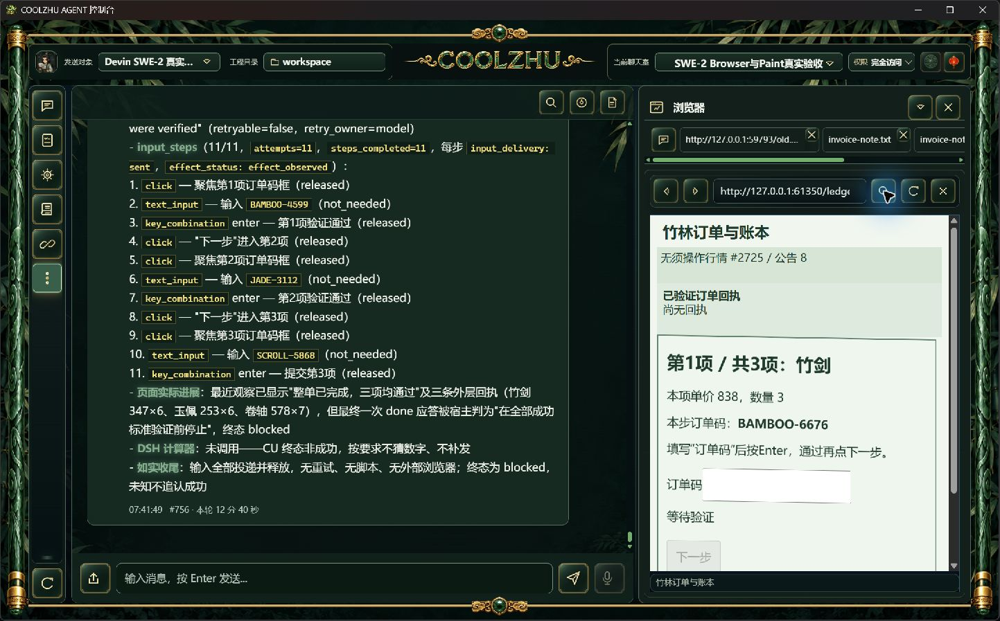
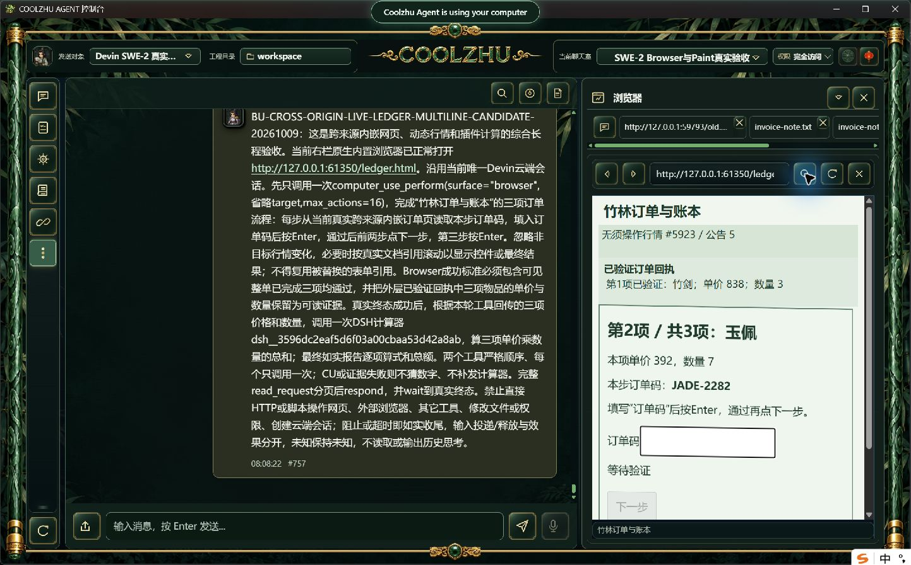
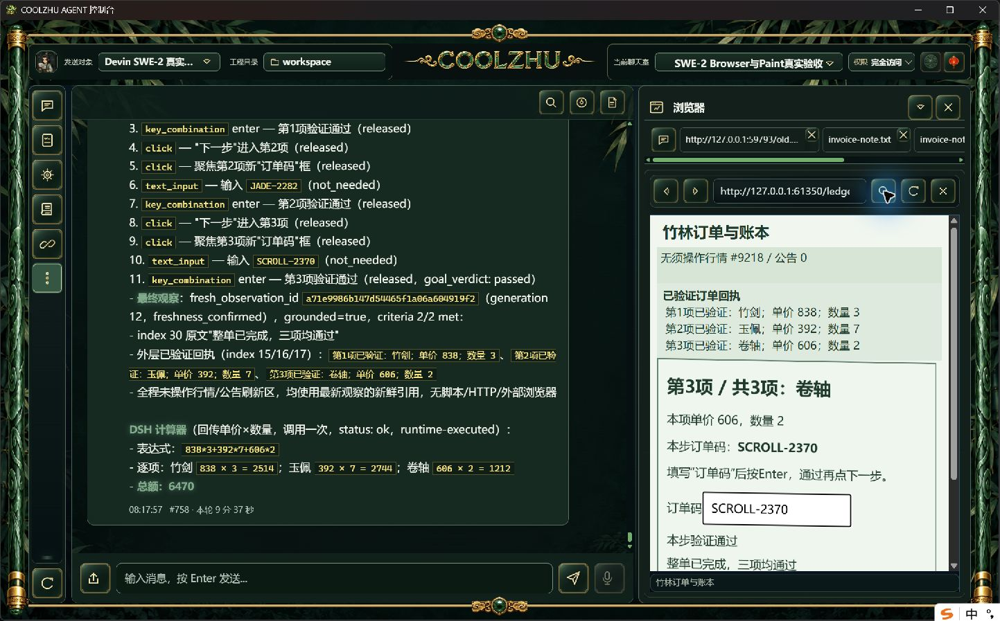

# Browser 多行回执修补与真实候选验收

候选长程通过：11次实际动作、27条可信事件，三项订单与最终提交通过；一次CU后一次DSH计算器均completed，独立总额6470，单end_turn/drained、原唯一island-kayak正常解锁。 父轮 `run-chat-f45f37862bb06adb1e1d0ea1e3c5b376cc50974d0f598f9c`，耗时577.1秒。当前只是修改后的Web程序配合已核验121壳运行，不是新正式安装包；正式独立复验待办。

正式121原失败：三阶段页面实际完成，但三个相邻StaticText引文65字与63字原节点拼接不一致，宿主1/2、CU blocked、父failed、计算器未调用。原始失败与实拍完整保留于[121报告](../release-0.2.121/change-report-and-test-handoff.md)，不追认该版本通过。

修补只允许选定相邻或原有合法桥接文字节点在边界用空字符串、单ASCII空格、单LF连接；内部字符/数字、节点顺序/跨度、全部StaticText选中和两次宿主新鲜度规则保持。提示同步同样规则。规划返回无动作而目标未全部满足时，控制器继续失败，但保留最后部分验收事实，不新增模型请求、输入或成功判定。

实际离线build0、core143/0、完整Web1428/0/6忽略、模块联动8/0。必要边界回归验证三种分隔正例，以及改数字、插入标点、改内部空白、漏文字和跨控件负例。源码检查不替代真实模型。

真实任务沿用SWE-2-medium、revision57/full-access和唯一island-kayak。普通新双来源订单网页，跨来源iframe斜切1度、无关行情100ms刷新；任务不预泄露随机订单码、价格或数量。正常右栏导航后由模型读取、聚焦、输入、Enter及下一步，无脚本代做输入、无模型响应夹具，Browser2/5秒和根900秒预算未调整。诊断只归档本轮实际派发的类型/字段数量投影，raw日志区间未保存，不采隐藏思考。

后续正式包需使用新随机订单独立复验上述完整顺序、逐步输入/释放、最终回执和总额；不能复用本轮通过替代安装版。中间进展归因的行情误报、严格原生资源竞态/在途撤销/HRESULT、其它32WBS仍开放。其方案见[后续进展方案](../../analysis/2026-09-21-integration-review/browser-progress-followup-plan-2026-10-09.md)。Paint免测、微信不动、Opus暂停，Goal继续。

