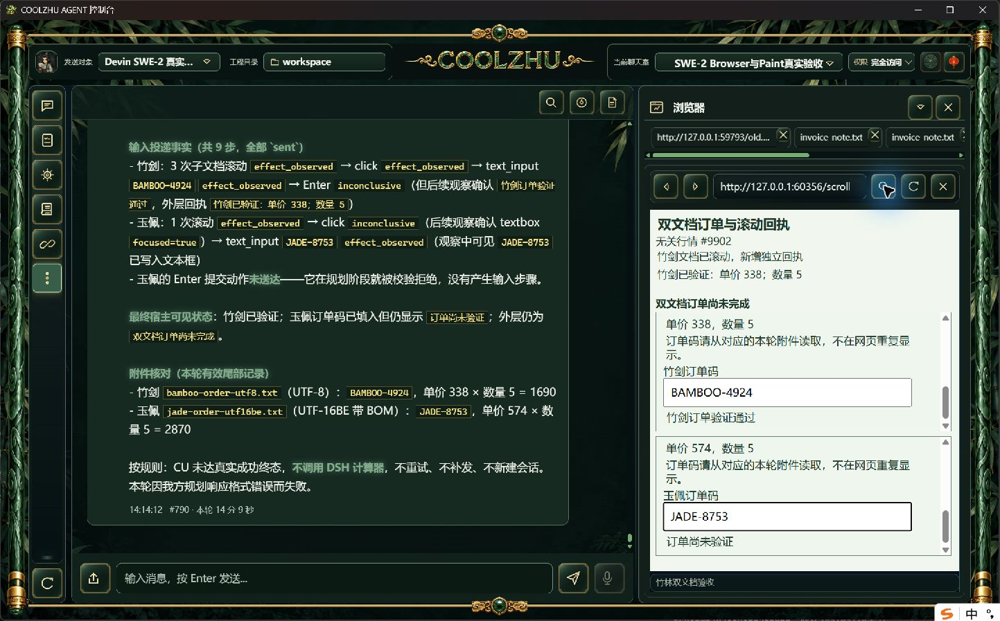

# 子框可见命中提示候选：长程整体仍未通过

Web SHA 51314a8c50e79b70be26e7e43b90ee67b3667d53142cee07024425ea485a5c24，壳SHA 29dba7278d444a2b713aca5c87f72a54806b872ff6acc928e7e6f69d7fdcf9f9。壳offline build实际0（55.67秒），既有壳测试78通过/0失败；Web沿用上一候选的offline build0与1431通过/0失败/6忽略。

唯一SWE-2-medium/island-kayak，父轮`run-chat-cf8f9d0d336756b795803cd882284003a11d5f43877e515f`，可见消息#789/#790。实际UTF-8附件BAMBOO-4924（338×5）、BOM UTF-16BE附件JADE-8753（574×5）。原生截图显示首个iframe经三次滚动才露出输入框，第二个滚动一次露出。观察可见提示与实际裁剪一致，两处click、text_input正常投递；共九步输入，首个Enter已提交通过。

第二处Enter尚未投递，模型提交的action对象含额外字段，原解析器返回invalid_plan，父轮failed/end_turn/drained、唯一绑定解锁。脱敏动作诊断保留redacted_fields=true；可见最终回复自述summary位置错误。**不是预算耗尽，不是输入命中拒绝，也不是通过。** DSH未调用、总额未计算，无tool.result_page_read事件，分页正向验收仍未完成。

下一修复：桥接在动作执行前反馈格式错误，允许同一请求最多两次格式拒绝，原预算与取消不变；不改写模型回复、不自动重发动作，超限仍由原执行器invalid_plan终止。待新的独立真实长程验证和批次正式安装复验。

