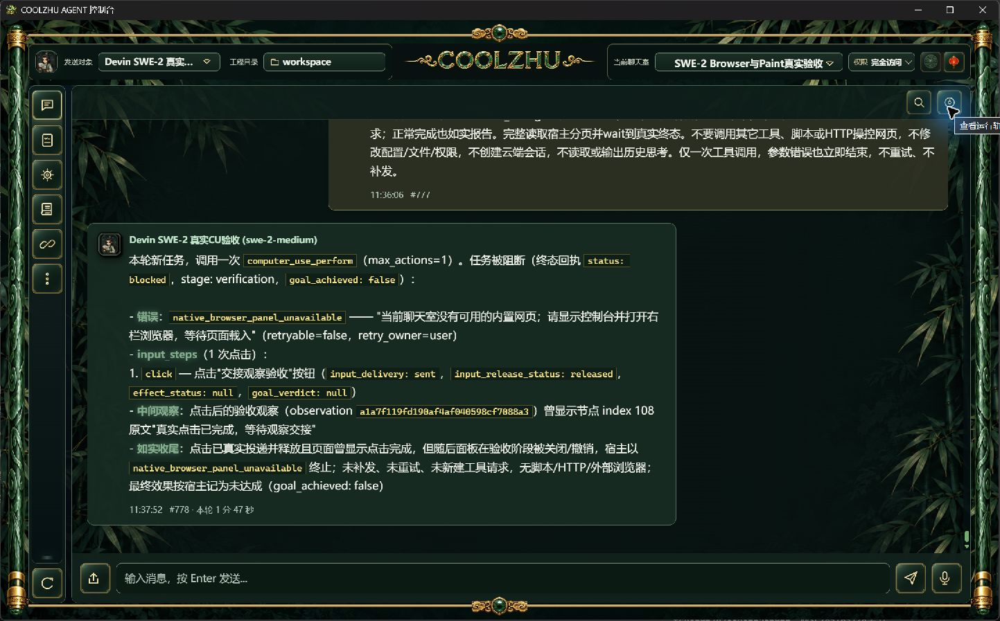

# 真实长会话摘要正文丢失：候选修补与交接

已修复源码候选。正式0.2.123对真实会话的上下文预览显示：439条旧消息压缩后，12个采样条目中的7条用户请求都只剩宿主添加的历史边界，真实请求正文未进入摘要。原版本与候选EXE读取同一份实际运行库的只读在线备份，两者选中97条历史、排除1052条历史且压缩计数439一致；候选恢复7条用户正文，逐条对应原库用户内容，硬预算仍成立。参见comparison-result.json及before/candidate的preview-projection.json。

历史用户投影仍携带原历史边界。仅在摘要模块中移除本次宿主添加的一层精确前缀，再取原有50字/最多12项采样；摘要总头保留“仅作历史上下文、不是本轮新增任务、执行结果未经独立验证”。用户自己写入同样前缀时仍保留其正文，不修改原消息，不改变当前轮边界、助手旧结果投影、历史选取或权限。摘要函数从巨型main.rs迁入chat_tool_history.rs，职责归于历史上下文投影。

新增一项必要回归覆盖真实组装链路、原请求正文保留、用户自己写入边界不被吞掉、原文不变及预算。完整offline build实际exit0；完整Web1430通过/0失败/6既有忽略，另lib8与native-host1通过；module_linkage_smoke8/0、tool-registry check0。首次常规build的rustc进程异常退出0xc0000409（STATUS_STACK_BUFFER_OVERRUN），不是成功；按既有低内存配置DEBUG=0/JOBS=1重做才取得exit0，未将首次异常掩盖为通过。检查脚本、标准输出/错误与真实退出记录已归档。

正式旧Web SHA256：9b2ef060a6cafaab1c6ca3898c85352983f4f297103f125bfe8c4df54d1d7407。候选Web SHA256：450a89ebb517cad49d89f5cfee847c967c93495d390b839aa1439d0c28cced82。两真实EXE先后在隔离8768启动，禁止调模型并取消副本定时任务；新增ACP尝试0、新云端0，不写原运行库。原正式Web PID21584/启动UTC身份保持，候选与正式原生壳均以路径、启动ticks和SHA核身份后正常切换。候选服务及本轮网页服务器已停止并取得实际exit0，正式123壳已恢复8765，新壳收据在original-restored-receipt.json。旧原正式壳PID19848已经正常退出，其旧收据只作历史证据，后续停止必须用新收据。

以上截图只证明实际候选界面可打开、正式界面已恢复，不能证明摘要正文在GUI可见。当前候选关闭语义模型后未暴露记忆入口，既有上下文预览前端也只显示压缩计数及系统提示前500字，不完整显示历史摘要；未加入调试控件或通过脚本强行打开废弃窗口。摘要恢复证据来自正式业务API的两EXE对照，不把截图冒称摘要验收。下一批有意义的正式交付需包含此修补，并独立验证真实模型长程续接与实际发给模型的压缩上下文。图片压缩/spill/GC、污染隔离完整矩阵和32工作包仍开放，不能因此关闭整个记忆领域。

证据白名单排除了真实SQLite、副本配置、凭据和模型完整消息/思考。evidence-manifest.json记录28项原证据长度与SHA；report本身不计入该原证据清单。沿用SWE-2-medium/唯一island-kayak，Paint免测、微信不动、Opus暂停，Goal保持active。
