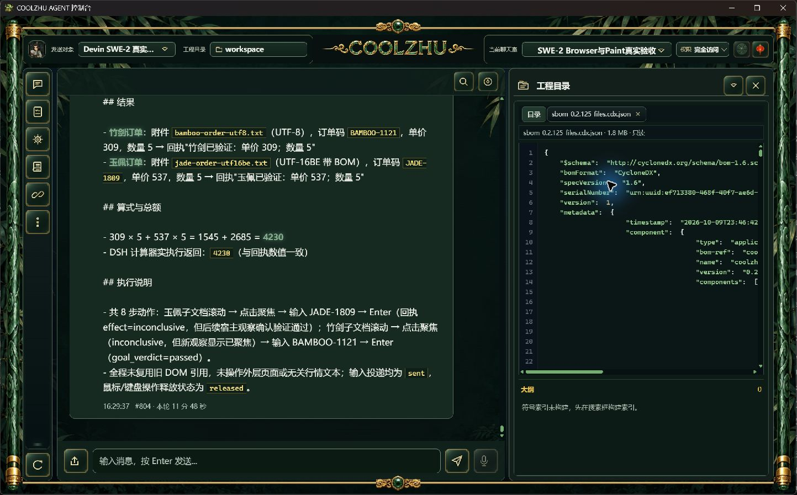
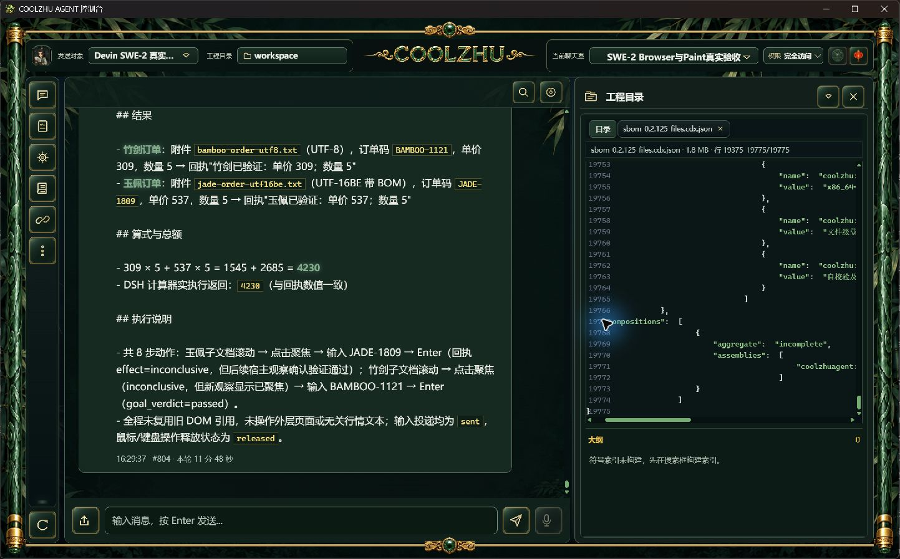

# 大文本只读预览候选验收

正式0.2.125拒绝完整1.8MiB SBOM的原始失败保留在[上一专项](../2026-10-09-package-file-sbom/report.md)。此次将工程文件读取提取到独立的有界快照模块，最多64MiB文本可复用原只读分页与行号窗口；编辑和单页仍各限256KiB，行窗口最多801行且超字节上限明确拒绝。元信息和分页内容来自同一打开句柄及读取结果，不把截断数据的摘要当完整文件版本。方案见[设计与边界](../../analysis/2026-09-21-integration-review/project-large-text-preview-design-2026-10-09.md)。

## 实际结果

- offline Web构建实际退出0，耗时44.06秒，实测EXE SHA ef7e461b7041aa1ad4bd3a165ce7a84f8e903cf8ce1d3ba0c08dde5de9537088。源码始末SHA保存在web-retry2-result.json。
- Web回归实际退出0：主集1433通过、0失败、6既有忽略；lib8通过、nativehost1通过。联动8通过。初次rustc分配18MiB失败的exit101与第二次分配2MiB失败且工具会话丢失的原日志均保留；后者没有最终退出收据，不补造退出值。停止本任务自有正式预览进程后低调试/j1重试，通过后恢复正式125。
- 使用原运行SQLite一致性备份的独立工作区，配置指向8767；没有向模型发送任何新请求或创建云会话。完整1919770字节SBOM分八页重组逐字节相等，SHA 96ca3ba211b7a1b2afa4cfdddc2c3430f0fc8a22bf434aeba283f13d6413de3e；19775总行数及19375—19775尾窗与原文件相同。单响应不超过256KiB、请求任意宽行窗最多801行。
- 带BOM及前导空行保留；64MiB加一字节稀疏文件读取413、未生成假的完整revision；超长单行行窗413，字节页仍保持字符边界。大文件写入413且原SHA不变；自有小文件外部改写后旧版本写入409，外部内容保留，测试结束恢复自有原字节。
- **原生窗口专项通过**：通过正常工程文件入口打开完整SBOM，首屏显示1.8MB/只读，随后在文件搜索框输入`:19775`并按Enter，原生窗口显示19375—19775/19775及最终composition内容。三张截图为未经裁剪、重绘或二次编码的原字节。API验证的native_gui_passed=false保持原记录，原生结果独立记录，不修改旧API收据冒充GUI证明。
- 候选仅替换独立包副本的Web EXE，壳复用125安装文件；结束按PID/绝对路径/启动时点/SHA确认自有进程后停止，恢复Program Files正式125与原工作区。原配置SHA、运行/ACP/聊天消息数量不变。

## 边界与后续验收

本次仅关闭完整SBOM的源码候选首尾行显示缺口。超长单行的GUI字节翻页、模型编辑工具、spill/GC及全工作区矩阵仍开放；读取上限是有界整文件快照，不宣称流式随机访问或锁住所有外部原地改写。无新增模型夹具、无子代理，Paint免测、微信不动、Opus暂停。

候选与记忆边界等待下一批正常MSI；正式125四发布资产、冻结源码与上一失败收据保持。后续模型应独立核验新包的版本/源/载荷身份，再经正常文件入口复测完整SBOM首尾，检查保存禁用、BOM空行、旧版本409和超限413；不得将本候选截图追认为正式新包已通过。Browser严格在途导航/关闭/取消、nativeTarget/commit及其余32工作包继续，Goal active。

