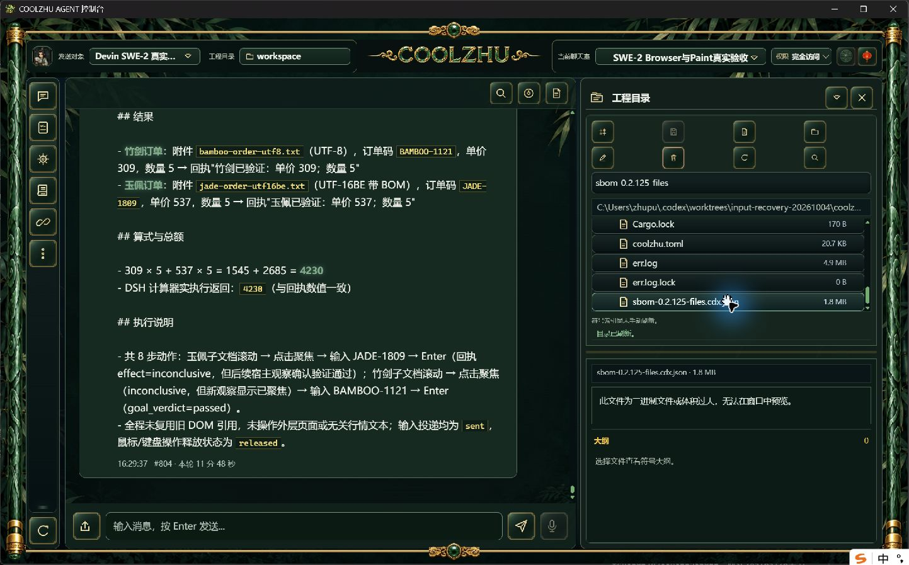

# 文件级SBOM补充导出及真实安装核验

新增独立脚本`scripts/export-package-sbom.ps1`，复用已有身份模块，先验证包报告、载荷清单引用、三种构建身份、1159文件集合和规范摘要，再输出文件级CycloneDX 1.6。完整库依赖、许可证、漏洞和签名信息仍缺失，组成完整性明确标注`incomplete`，不伪造依赖图、不把载荷集合摘要当MSI哈希。方案见[设计与风险](../../analysis/2026-09-21-integration-review/package-file-sbom-design-2026-10-09.md)。

本次针对正式0.2.125的冻结报告`pkg-report-release-20261009-153059491-1bd127ea`做独立补充导出；冻结源码e8373cb39690b2af91831b93c13f85f3c6d6a234，四个原发布资产、MSI和源快照未改。新导出脚本属于源码候选，不追认125已含新脚本或记忆修补，不将当前PR文档提交冒充冻结源码。

## 验证结果与边界

- Windows PowerShell 5.1及PowerShell 7真实导出均退出0。除各自UUID与导出时点外，解析后的文件组件、报告属性及完整性声明完全一致。初始命令只保留工具chunk及实际退出的观察收据，没有完整原stdout；不把后补文本冒称原日志。
- 使用[官方CycloneDX 1.6 JSON Schema](https://cyclonedx.org/schema/bom-1.6.schema.json)原始字节做离线Draft7及format校验，两份产物通过。官方Schema SHA为1ebcb88a2c845ecb6ff7bee7aeabdff9422cb0347f3d6875b241bd444b7e098f；原文件在本目录留存。
- 独立Python逐项核对清单与SBOM的1159文件路径/长度/SHA，再读取Program Files实际安装字节：1159/1159一致，总432195512字节。来源报告文件SHA 03b46736c8088b582aa9b1f506b71cb25723bbdf4cc0e97f728bae54a098ba4d，清单文件SHA e6455dda5ae159784d90c11cd955e81a0fb2f49b01c245b756d1bf030476af70；这些是单文件SHA，载荷规范摘要另列。
- 只修改自有清单副本的一个SHA，导出真实退出1且没有输出；既有SBOM再导出同路径真实退出1，原SHA保持。负例原stdout/stderr字节留存。没有修改正式报告或正式安装文件。
- **正式界面预览未通过**：原生右栏正常打开新文件，但1MiB上限拒绝约1.8MiB的完整SBOM，并显示“此文件为二进制文件或体积过大，无法在窗口中预览”。失败实拍保留，不缩短产物、不补算完整预览通过。大文本分页预览作为4.3新增缺口继续修补。
- 记忆资料边界候选提交1d3ba64dd40ad7238f3814d4f02f6cb93e568c93两路CI 38005257314/38005253943均success，原收据在memory-candidate-ci.jsonl；本次新源码提交另验CI。

## 使用方法与后续用例

```powershell
powershell.exe -NoProfile -ExecutionPolicy Bypass -File scripts/export-package-sbom.ps1 `
  -ReportPath <归档的package-report.json> `
  -PayloadInventoryPath <对应payload-inventory.json> `
  -OutputPath <新的输出文件名.cdx.json>
```

输入错配、文件改写、重复路径或同路径重复输出应在生成前失败；正常输出应保留冻结版本、source/build/payload身份、实际文件SHA和`incomplete`。输出自身不加入原载荷摘要，避免自引用。再次导出允许不同UUID/timestamp，不宣称逐字节相同；后续正常批次打包可调用脚本并在新版本发布证据中关联，不改写125既有发布归档。

6.4只计文件级SBOM候选通过；完整编译依赖、许可证/签名和发布索引自动关联仍开放。正式大文件预览、严格Browser时序和其它32工作包矩阵继续，Goal active。此次模型调用0、新Devin会话0、无子代理；Paint免测、微信不动、Opus暂停。



截图为原生未经裁剪/重绘原字节。原始SBOM、官方Schema、独立校验脚本、负例和逐文件安装比对收据均见本目录，文件SHA/长度见evidence-manifest.json。
