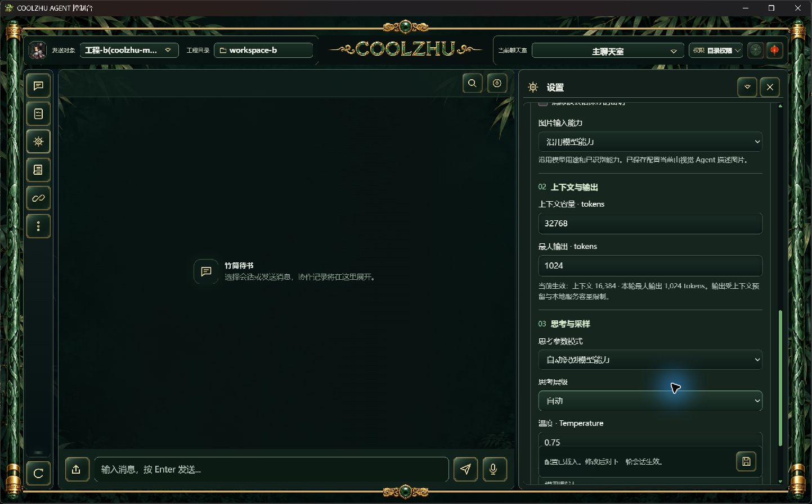
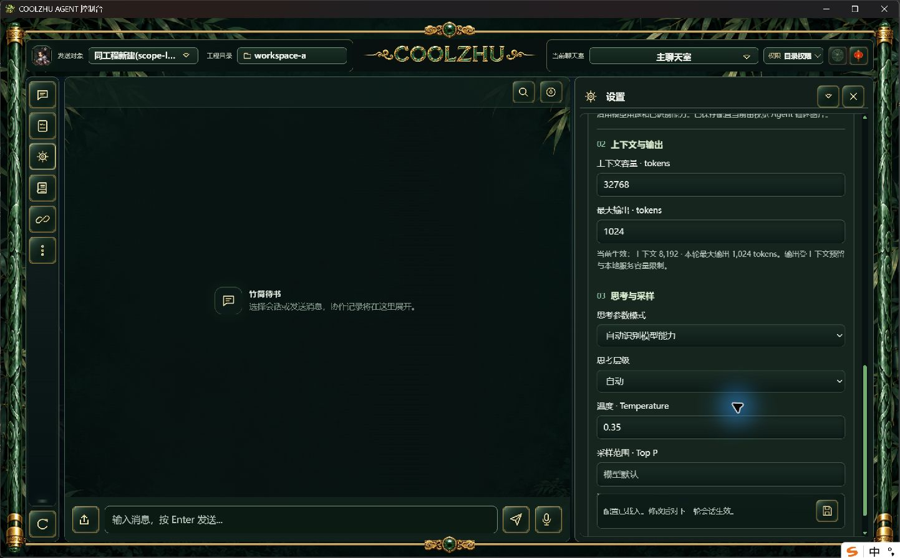
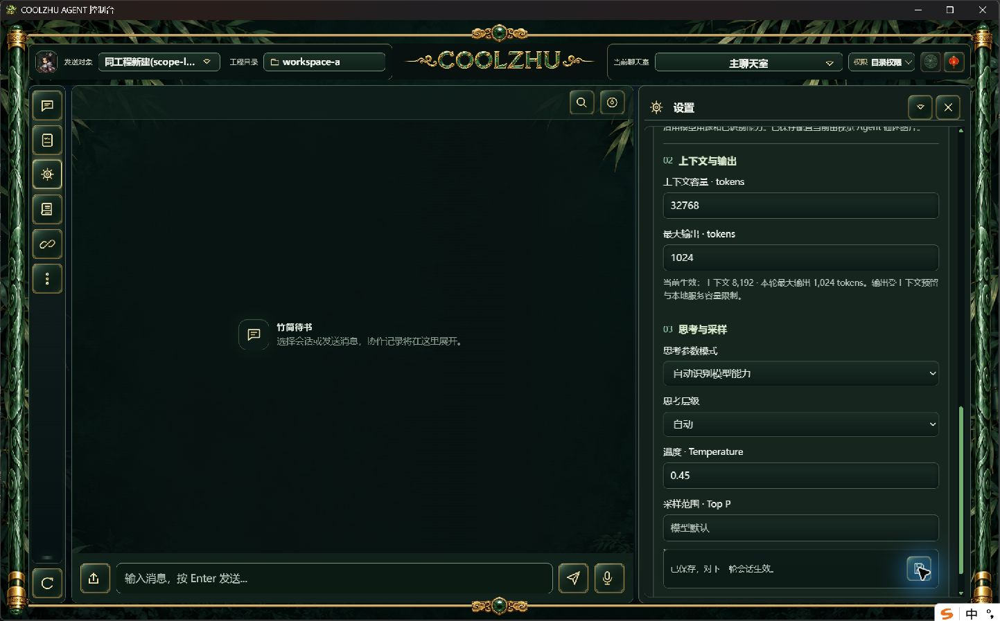
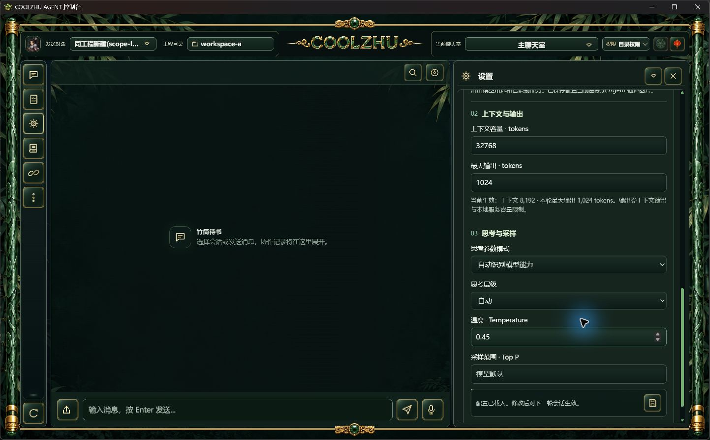

# 模型配置迟到请求与工程 ABA：候选验收交接

2026-10-09。正式0.2.116已复现旧工程A配置页在切到B后错误保存成功：两工程相同会话ID、相同revision 10，旧A请求200，B名称与温度被改。原事实见before116/facts.json；复现采用独立真实HTTP服务、真实配置文件和SQLite，没有模型响应夹具、供应商请求或原验收库写入。

修复复用workspace_activity短时锁和RAII pin，绑定非凭据的配置加载标识。成功切换、同工程重载及服务重启使旧标识失效；失败切换不改变标识，正常保存仍用配置revision处理冲突。统一设置页、Devin插件及免费Provider插件的模型配置入口从顶栏完整工程路径绑定/api/workspace返回的工程ID和标识，不再误用截断编码的草稿缓存键。迟到的读取、保存、容量保存及新建请求409，草稿不提交，提示刷新页面后重新打开。无头HTTP旧客户端仍兼容，不宣称所有旧客户端都获得保护。

最终源码八文件摘要见final-source-files.json，候选Web EXE SHA256 f84a8d0037898457f93d4c3cbe1d75b2224859bbc55dc8b65785647e3eeacdc2。实际offline build、既有Rust完整回归及前端回归退出均0：Web主程序1423通过/0失败/6既有忽略，另lib8、native-host1；前端22通过/0失败。无新增镜像实现测试。

## 验收结果

- candidate2/facts.json的16组真实API检查通过：跨工程迟到读取/保存/容量/新建、只带旧工程ID的首次读取、A→B→A、同工程重载、服务重启、失败切换不作废作用域、400/409后pin释放、配置revision冲突、无头兼容、正常新建与保存。错误请求后B配置文件字节和SQLite会话行保持一致。
- 正常原生壳操作：工程B温度0.75/容量16384；正常顶栏切A并选择共享会话后温度0.35/容量8192；用数值框改为0.45并正常保存，页面显示已保存，独立读取revision 12。同一候选EXE重启后温度0.45/容量8192/name/revision逐项保留。
- 全部六个隔离库runtime_runs为0；原SWE-2-medium/revision51/唯一island-kayak绑定未改，原正式壳已恢复、活动轮次0。隔离后台正常由自有驱动terminate收尾，Windows子进程exit 1独立记录；驱动最终actual exit 0，不把子退出1伪写成0。

## 保留的失败与边界

首候选candidate的API检查通过，但原生页读取失败：UI把草稿缓存键当工程ID。native-initial-binding-failed.jpg及AX保留，不计GUI通过；最终改为完整工程路径并等待顶栏路径就绪，candidate2上述实拍才计通过。首次隔离壳受正式壳单实例影响而退出，其first-launch日志/收据保留。数值框首次AX操作缺坐标、下拉临时子窗口遮挡，均重新观察后用正常GUI完成，不改产品权限。一次PowerShell转义的python准备命令语法失败，未修改产品或启动配置；后续正常启动复用脚本。最新壳收据仅代表重启后的那次启动，壳环境workspace路径为B，实际展示URL50528已由独立后台重启到A，不伪称壳metadata为A。

候选修复尚未进入正式0.2.116；需新包正式复验。新建与参数保存仍是两步，完整SessionConfigService、单写者、outbox、所有修改/发现接口的权威epoch另列未完。本专项零模型，不能替代供应商连通、Browser Use严格取消或其它总矩阵验收。严格Browser纯截图关闭晚9502ms，仍未通过。Goal持续进行，Paint免测、微信不动、Opus暂停。
