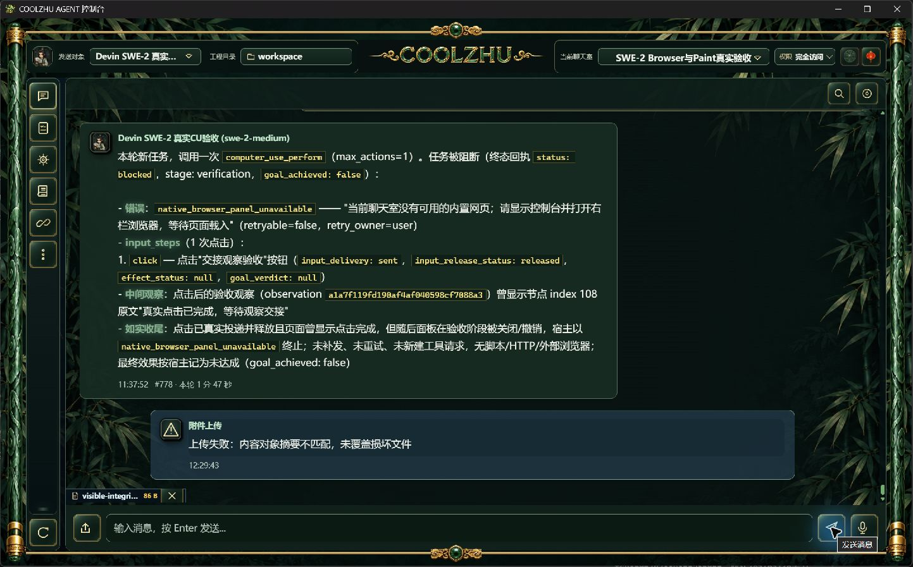

# 控制台错误提示清理：候选实拍

实际损坏附件提示此前包含“HTTP 500 Internal Server Error”，网络失败还直接拼出API路径和fetch错误。统一requestJson现在显示服务端JSON中的可读原因；非JSON错误页只显示“请求未完成，请稍后重试”，连接失败和超时显示中文操作提示。状态码、statusText、body仍作为Error属性保留，原调用者按状态处理的行为不变；不改变权限、重试、上传状态或后端错误码。

offline build实际exit0/14.99秒，候选Web SHA256为acc8860ea7e2516a4948cc19a1e9386ecddfd810ea44b8c3247979dc79a0830b。Node语法检查exit0，既有22项前端检查22/0；附件读取源码的完整Web1431/0/6见前一报告，本项只有前端提示改动，未冒称重跑完整Rust回归。

同实际运行库副本、真实SWE-2配置、仅关闭该副本聊天室模型，正常原生文件选择器选择实际86字节文件，再点击发送；同摘要损坏对象被原上传流程拦截，界面显示“上传失败：内容对象摘要不匹配，未覆盖损坏文件”，无HTTP技术前缀。runtime_runs与devin_acp_attempts前后计数不变，新云端0。首次AX点击报告coordinate input geometry unavailable，未计输入成功，重新取得截图和新AX后正常选择；文件名Return与异步附件预览均独立观察后操作。

独立候选进程已退出回收，原正式Web身份保持、123壳恢复8765。此目录original-restored-receipt.json是最新原壳身份；前一附件/历史报告中的壳均已正常退出，只作历史证据。正式123不含本候选，待摘要、附件完整性一起批次交付；截图不证明真实模型或所有错误分支已完整验收。18项原证据长度/SHA在evidence-manifest.json，数据库、配置、凭据排除。Goal保持active。
