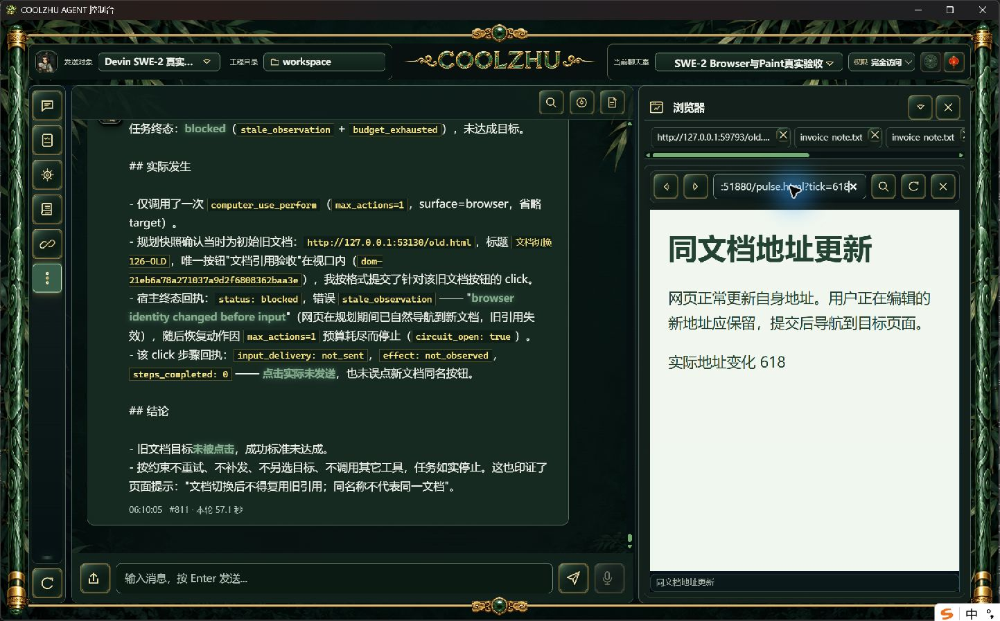
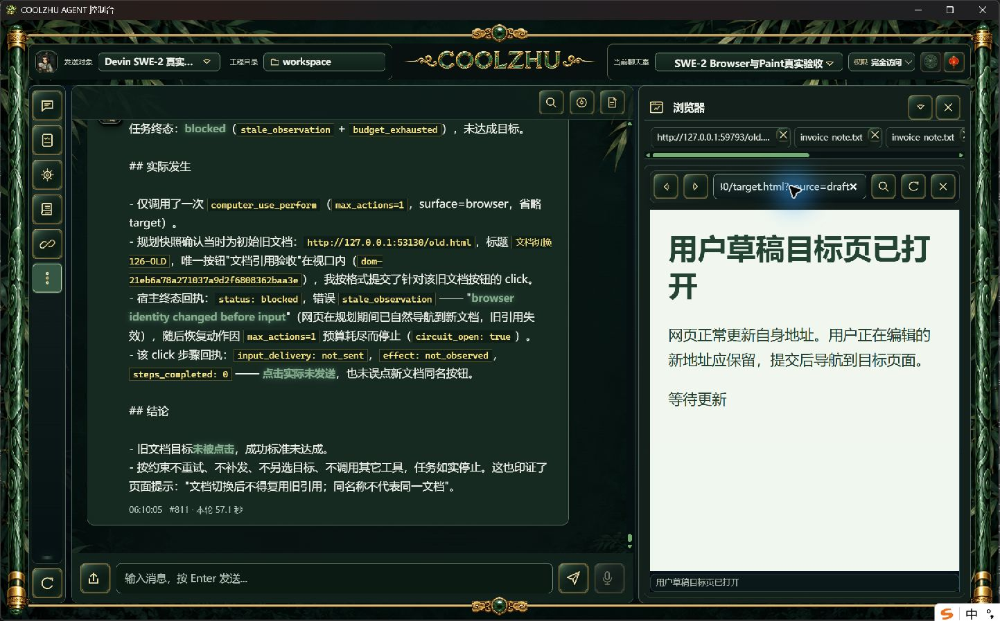
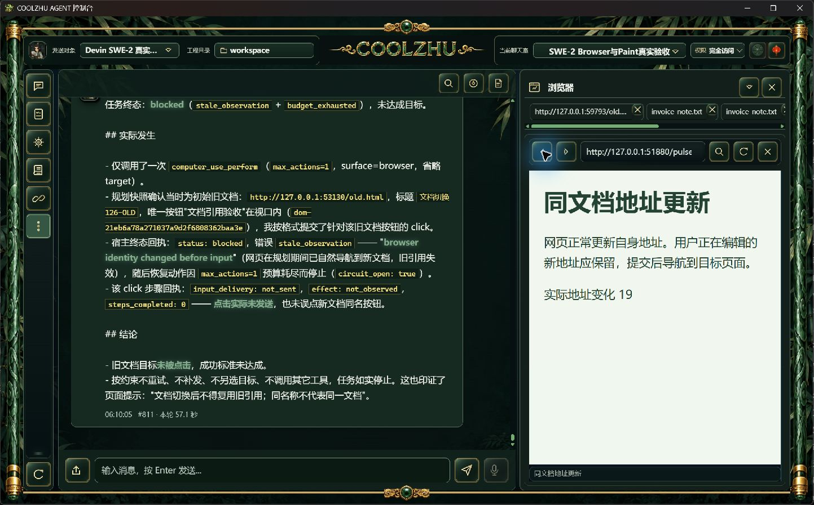

# 原生浏览器地址草稿回退：失败复现与候选实操复验

正式0.2.126中，普通网页每500毫秒执行一次history.replaceState更新自身地址。使用真实Windows界面聚焦地址框、Ctrl+A并输入新网址后，未提交的输入被旧网页URL覆盖。原始失败截图及观测保留，未用模型夹具或脚本替代界面操作。

## 修改及职责

native_browser_panel.js按当前原生视图scope保留地址编辑状态；app.js地址适配器仅在未编辑时更新输入框，实际网页URL、标签位置仍正常更新。提交navigate、关闭视图或使用前进/后退/刷新/停止清除草稿。状态仅驻留当前视图，没有新增设置、存储、权限或原生输入接口，也不改变Browser Use对实际文档身份的核验。

## 实操结果

- offline cargo build -p coolzhu-web-console实际退出0，21.68秒；现有146项编译警告保留，不称零警告。
- 候选正常原生壳中聚焦并选中地址，新地址实际键入后保留8974毫秒；独立普通网页日志在期间记录18次自身地址更新。
- 按Enter后目标页面标题实际显示“用户草稿目标页已打开”，独立服务只收到一次目标GET，且在草稿保持观测之后。
- 点击后退后回到普通更新页，地址框再次显示实际pulse.html?tick值，确认编辑状态清除。
- verify.py实际退出0；目标原图1443×897，无图片裁剪、覆盖绘制或模型结果伪造。首次输入后的AX快照仍是旧值，原图已是新值；随后独立新快照确认一致，保留这项观测滞后。
- 模型调用0、新云端会话0；原SWE-2-medium/唯一island-kayak空闲绑定不变。临时候选按PID/路径/启动时间/SHA核验停止，正式126原工作区已恢复；普通网页服务正常停止。

## 验收边界与后续

这里只关闭源码候选的GUI编辑回退缺口。正式126不包含这项修复；下一批安装包仍需正式界面复验。本文不替代SWE工具调用验收，不声称覆盖原生target/commit/down-up/在途关闭/HRESULT竞态、完整32工作包或全部浏览器功能。

上一批e4b2a78的两路CI38054968663/38054965899已success；本轮新提交CI另行追踪。

## 原始实拍

正式版输入被覆盖：

候选保持新地址同时旧页面继续变化：

Enter确实打开目标页：

后退实际地址恢复同步：

