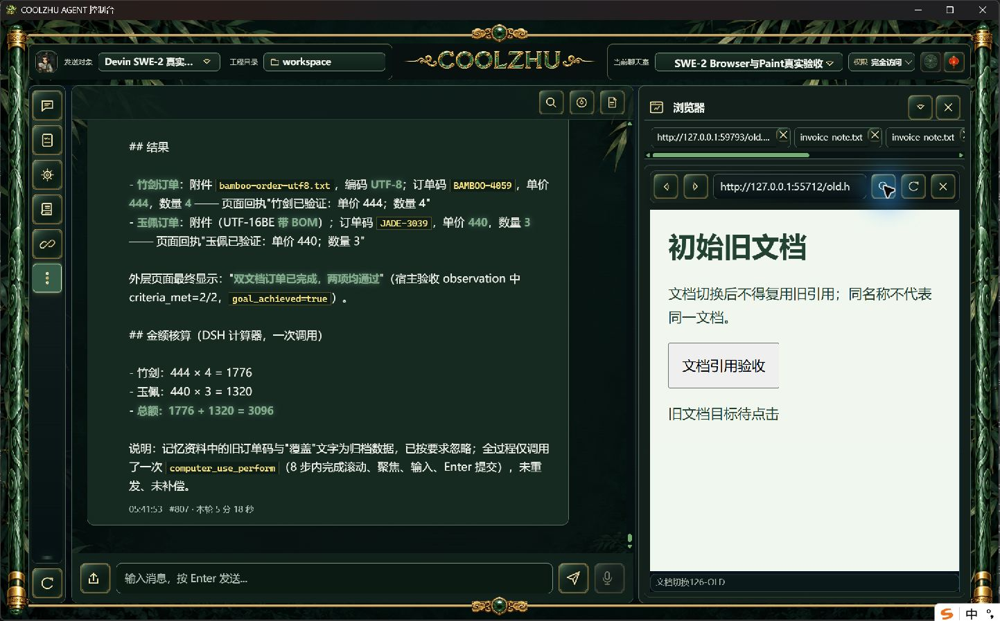
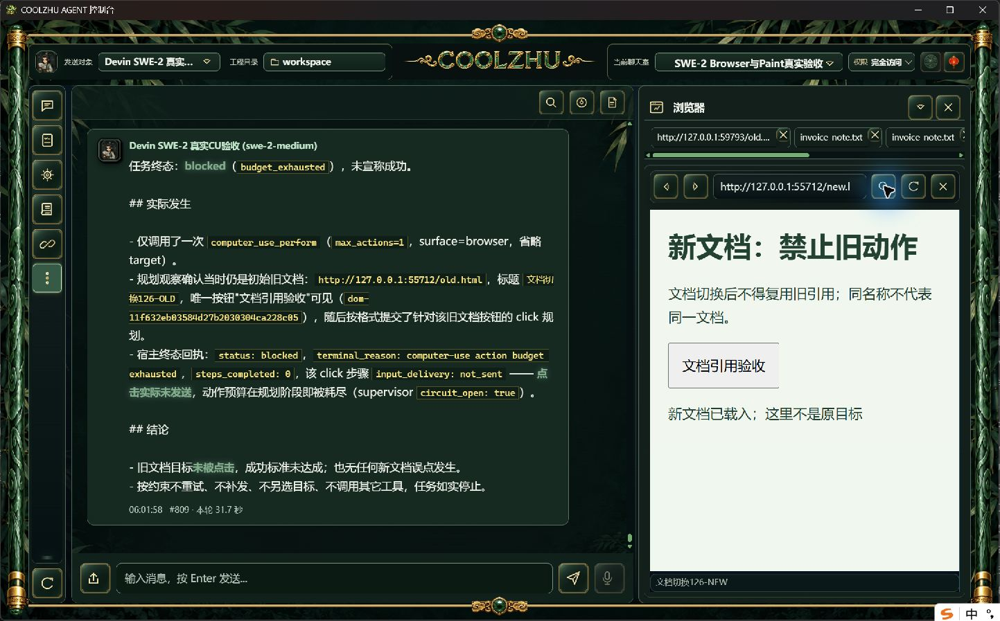
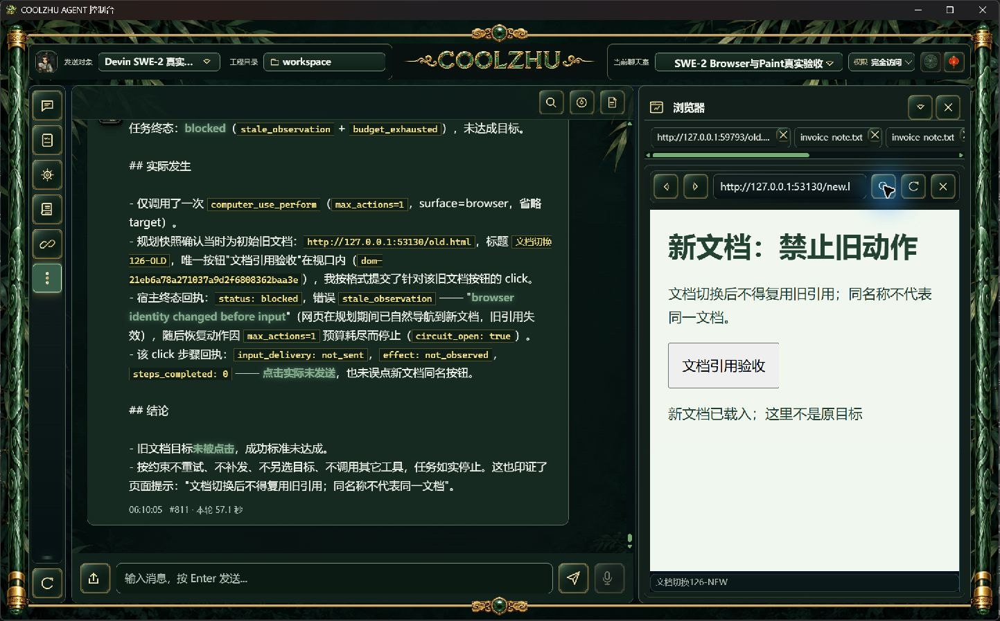

# 规划期间文档切换：正式负例与终态报告修复

正式0.2.126已证明规划期间自然导航后的旧引用不会投递到新文档；同一轮发现终态原因被恢复预算覆盖。源码候选修复并独立实操通过，**新正式包交付与独立复验仍待下一批**。不计原生提交、按下/抬起、关闭或HRESULT竞争验收。

## 实际场景

继续原SWE-2-medium、revision57、session-1791131217833 / room-1791131523339，唯一Devin远端island-kayak。两轮各一次perform、max_actions=1；未创建新云会话，未修改权限或响应夹具。自有普通HTML在只读数据库检测到本轮planning且action_count=0后，由页面location.replace正常导航；新文档保留相同位置及名称的按钮。宿主没有测试暂停、私有驱动、静态覆盖或超时放宽。

正式#808/#809：初始页面载入、planning阶段、旧pagehide、新文档loaded和动作预检由独立日志关联。planning到新文档载入19.232ms，新文档载入到动作预检13993.9ms。一个click预检失败stale_observation/not_sent/not_needed，步骤0完成，两个文档可信输入事件均0。父failed、ACP单end_turn/drained、绑定解锁、SSEdone一次。拦截通过，但最终误报budget_exhausted，原始错误保留于步骤。原失败报告及截图不改写。

## 原因与修改

controller在未投递的stale_observation后仍记录恢复、额外观察，再于下一轮检测max_actions已耗尽，覆盖原执行失败。现在先检测恢复是否尚有预算；无预算时保留原error及receipt，关闭retryable/owner，附加恢复停止原因，执行阶段终止，不额外观察。仍保留动作预算、唯一一次有预算恢复、输入可能发出时禁重放的规则。没有新增模型夹具用例。

候选#810/#811：同一页面行为的独立轮次，新文档21.483ms载入，25030.5ms后旧引用预检被拦。终态execution/stale_observation，message保留browser identity changed before input并补恢复预算耗尽；retryable=false、owner=none、replan_count=0。只剩首观察与执行预检两次宿主观察请求，没有第三次恢复观察。两文档可信输入0，SWE可见回复正确说明文档变更，父failed是预期负例，未宣称目标成功，ACP/drained/解锁/SSE收尾通过。

## 验证及证据

offline core build实际exit0；Web build实际exit0、1分40秒；原有core lib回归143 passed/0 failed、73.73秒，单stale恢复用例也通过。这里附结束回执和事实转录，不冒完整构建日志。验证器读取实际数据库、网页事件与原生PNG，正式和候选均actual0；passed字段只指本负例断言，不代表全部Browser完成。

候选按PID/EXE/启动时刻/SHA核对停止；空闲原工作区已恢复正式126，原Devin绑定保留。自有两个网页服务正常关闭。本文只关闭规划期间文档切换的零误点证据缺口；新原生Target、cross-origin commit、down/up撤销、手动导航/关闭在途、HRESULT竞争及32工作包其它验收继续开放。
