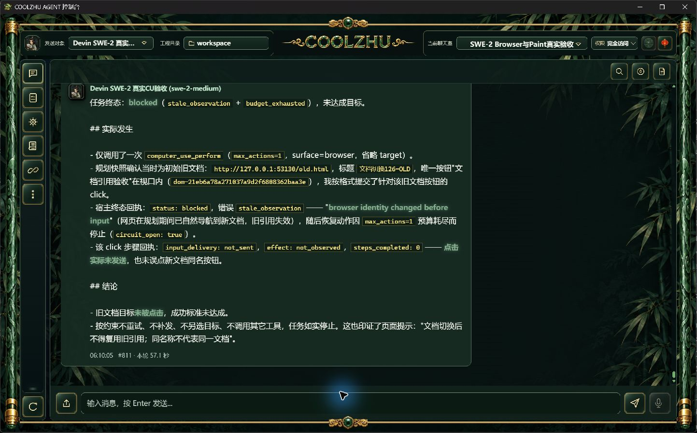

# 上传图标真实布局偏移修正

用户反馈正确：正式126中上传箭头仍偏左。此前只修SVG的中心对称，却把“已居中”写成了已完成结论，遗漏按钮DOM中的隐藏“附件”span。其字号为0仍是flex子项，旧规则gap=6px使整组居中时唯一可见箭头左移3个CSS像素。此次纠正此前验收判断。

改动只有index.html上传按钮：删除隐藏span，明确data-icon-only=true；原SVG、玉石外框及其它图标均保持。悬停title、aria-label和上传事件仍为原功能。单个图标与gap=0使按钮内容真正居中，而不是再给图片加补偿位移。

正常offline Web build实际0（20.65秒），已有146编译警告不冒零警告。候选原生1443×897实拍显示箭头与金框对齐；正常HTTP返回的按钮实际只有一个img，无隐藏文字，title/aria-label均保留。前后原始JPEG未裁剪或重绘。原图亮度近似测量中心134.5→137.0，抗锯齿和JPEG有亚像素误差，该测量只辅助解释实拍，不作为像素级无误差声明。初版过窄色相阈值失准，改用同一观察区域内亮度阈值；不把初版数字计作验收。

模型调用0、新云端会话0，不重复模型连通或Paint。这里只计源码候选通过；正式126仍存在这个布局问题，等待与前两项Browser修复合并交付下一批安装包并正式实拍。

## 原始截图

正式126修正前：

源码候选修正后：

