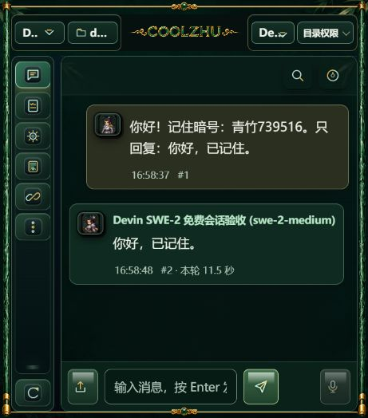
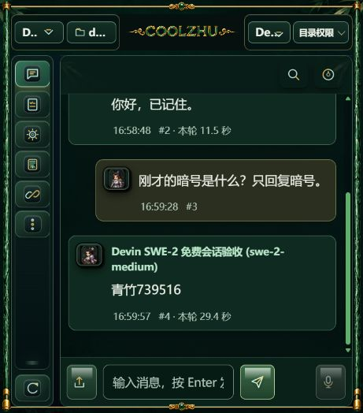
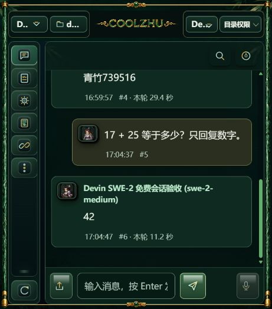

# Devin 聊天室真实文本验收 · 2026-10-04

用户明确要求“Devin 模型接入聊天室会话才算完整验收”。本次从实际控制台输入框发送三轮消息，使用正式 `/api/chat/send/stream`，经 Devin ACP 生成后进入原有聊天室消息与持久运行记录。不是将旧 smoke 回执导入聊天室，也没有修改 DOM、重建消息或编辑截图。

## 实际结果

| 场景 | 实际结果 |
|---|---|
| 中文首轮 | 输入记住暗号，真实回复“你好，已记住。” |
| 同一聊天室续聊 | 不重复提供暗号，真实回复“青竹739516” |
| 刷新与后台重启 | 两轮四条消息恢复，继续使用原 Agent、聊天室和远端绑定 |
| 重启后的基础计算 | 输入 17 + 25，真实回复“42” |
| 持久化 | 六条用户/回答消息；三个独立真实 run/turn/attempt；ACP generation 为 1、2、3 |
| 模型与终态 | 三轮 requested/effective 均为 swe-2-medium；end_turn；进程树排空；绑定无锁 |
| 非流式入口和房间隔离 | `/api/chat/send` 在另一聊天室真实回复“未知”；两个房间 remote session 不同；运行 completed |

CLI 固定为 `devin 3000.10.48 (fcf7ba39)`，并核对已安装文件 SHA256。每轮生成前核对已登录 CLI 的模型目录，只有 Free 的 SWE-2 变体可以提交；未配置收费回退。Free 是真实账号目录标记，本次没有读取账单，不能将其写成“实测费用为零”。ACP 没有证明路由后底模身份，resolved_model 保持空值。

### 聊天室原始截图

首轮：

同一会话回忆暗号：

服务重启后的计算：

[三轮消息与 ACP 回执](chatroom-real-swe2-validation-20261004.json) · [真实非流式与房间隔离回执](chatroom-nonstream-isolation-20261004.json)

## 实现与能力范围

新增 `devin_acp/chat.rs`，将 ACP 的真实文本/思考增量转换为现有聊天室流事件；共享宿主上下文装配、聊天接纳、公开 turn/run、停止 token、根时限和消息保存。加载历史通知不计入新回复。只有 `end_turn` 且进程树确认排空后才发送完成事实。确定失败不会由流析构误改为用户中断；断连/取消未知保留台账锁，不重发提示。

Devin 使用独立文本工作目录、固定原生 CLI 和受控用户/项目配置；不加载用户工程文件，不开启导入、Hooks、子 Agent 或 MCP，检测到全局扩展则拒绝启动。Windows 环境仅保留官方登录定位和运行所需项，清除模型覆盖、付费回退及外部 API 密钥。ACP 客户端文件、终端和权限请求全部拒绝；远端工具观察不会变成宿主工具执行。真实 CLI 合成文件探测收到三条 failed 通知：未读取合成内容、未创建写文件或命令产物，进程排空。

[真实原生工具拒绝回执](text-native-denial-20261004.json)

当前交付范围是**聊天室真实文本会话**。完整工具桥、MCP/技能执行、附件、Goal、群发/接力、子 Agent、收费模型、Cloud observer 和安装包交付仍未验收。原生 Windows 没有宣称 OS 级沙箱；不能把这次窄文本配置的工具拒绝当成全面工具隔离通过。原有 Cloud 配置和手动测试面板保留。

在独立本地编译预览验证，正式安装版没有替换，用户原有工程聊天数据未修改。

## 工程验证

- `cargo build -p coolzhu-web-console --offline`：通过，使用原有 target 目录。
- 完整控制台回归：1360 通过、0 失败、5 忽略；另外 8 + 1 项辅助测试通过。忽略项中的真实账号测试另行显式运行。
- Devin 前端行为测试：9 通过；界面契约与修改文件语法检查通过。
- module_linkage_smoke：8 通过；tool-registry 离线检查通过。
- 真实原生工具拒绝专项：1 通过；聊天室三轮及非流式隔离核验均另行执行。

首次界面请求因手写固定 SHA256 少了七位而被拒绝，核对版本、官方有效签名和真实文件摘要后修正，失败记录留在旧测试房间。首次完整回归的历史“未就绪”文案断言随新行为更新；后续并行回归出现既有 CU watchdog 用例失败，单独重跑通过，再以单线程执行完整回归全部通过。没有修改该 CU 用例或实现，也没有隐藏失败记录。中间日志保留于 tmp/。
