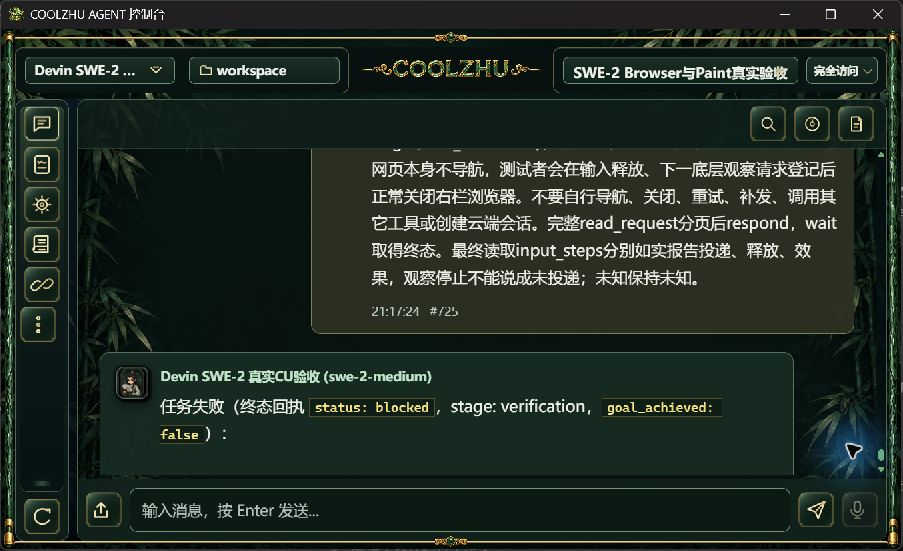
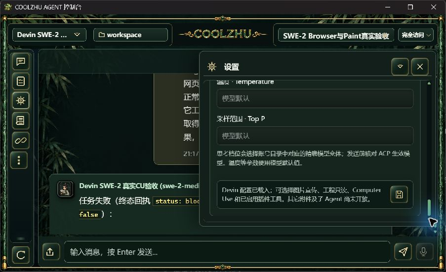

# 111正式原生低高度布局

Program Files正式0.2.111原生控制台，经Windows正常系统菜单调整到实际截图903×551，没有修改CSS、模拟网页viewport或调用私有窗口命令。顶层Agent/工程/房间/完全访问、Logo、快捷栏和底部输入/发送图标均在框内；设置侧栏正常打开，内部滚动至底部保存图标完整可见，固定头栏关闭按钮持续可用；关闭后聊天宽度恢复。四张同尺寸原生实拍分别覆盖首页、设置顶部、设置底部和关闭。

首次拖动窗口角未改变尺寸，仅选中了聊天文本，随后通过系统菜单达成尺寸，正常点空白处取消选择；保留该未命中事实，不称首次拖动成功。只读核对revision51、SWE-2-medium/唯一island-kayak不变，本布局测试模型请求0、新云端0，未点击保存或修改权限。完成后经正常最大化按钮展开控制台，实际1707×912。仅关闭本机原生窄低布局与设置滚动子项；没有改变OS缩放，不外推混合DPI、多屏或负坐标。

