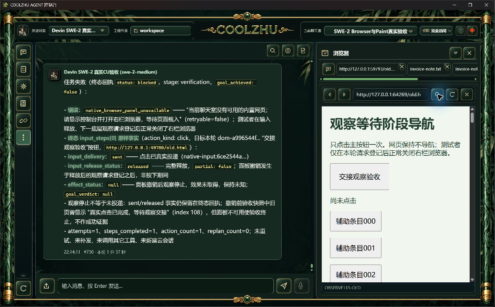
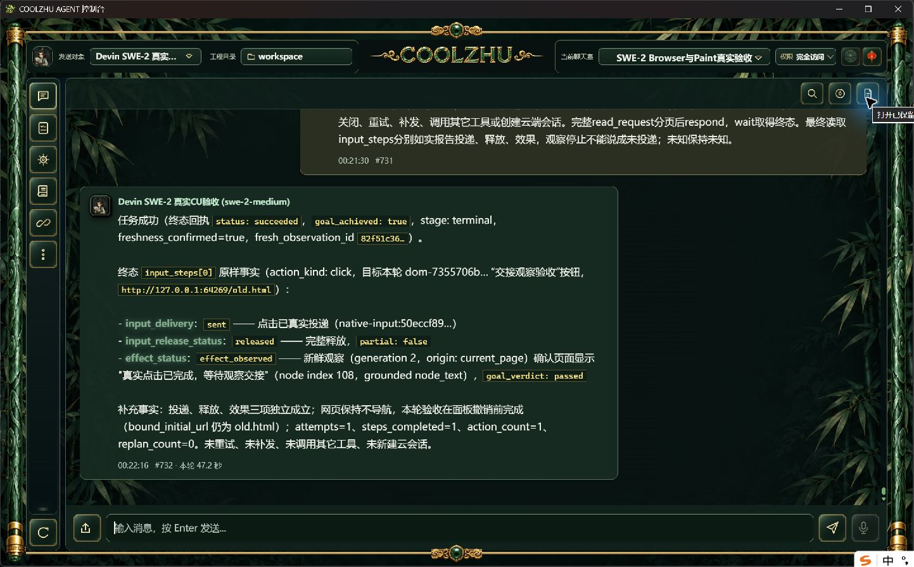

# 正式115观察等待撤销专项（未通过严格时序）

正式Program Files 0.2.115，同一SWE-2-medium/唯一island-kayak，仅一次perform/max_actions=1。连续只读观察器没有访问宿主私有通道或改变产品期限。检测登记后6.55ms返回文件，但fresh AX开始已晚5831ms，独立正常关闭开始晚16721ms，实际父轮完成后1750ms才关闭。单工具往返耗时降低并没有消除主会话两次独立操作间的调度延迟，不能据此改产品5秒期限或跳过fresh观察。

父轮completed/CU succeeded，原点击sent/released/partial=false/effect_observed/goal passed；这些仅是原已验收点击路径的再次事实，不计新增专项成功。事件3381登记request_id=729fe4cd8c8b0f6e76d8d112686964b4，但全轮没有browser.observation_stopped。严格等待期间资源撤销仍开放。没有重试、补发或新云端会话，单ACP terminal/end_turn/process_drained，绑定解锁，SSE done/EOF。server、watch和send实际退出0已消费。

网页是正常本地测试材料，网页里的提示不是授权；实操只有正常右栏打开与关闭。原始SSE仅计事件，不保存模型thinking。无需更改或重打已发布115源码。后续只有能够在原5秒期限内经fresh观察及独立正常操作命中，或取得真实自发资源故障的证据才重新执行；不再重复简单点击碰窗口。

