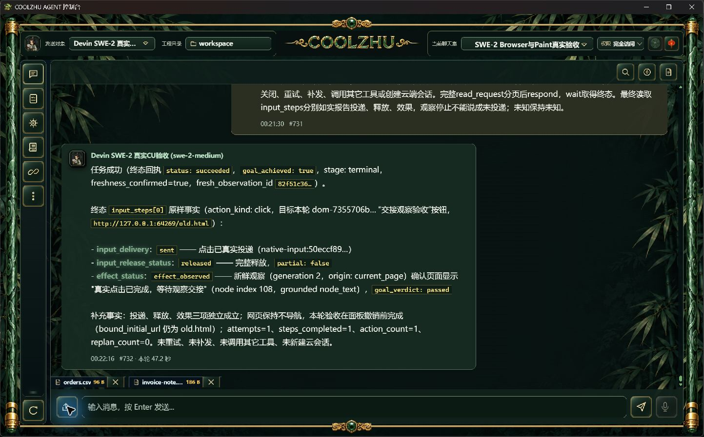
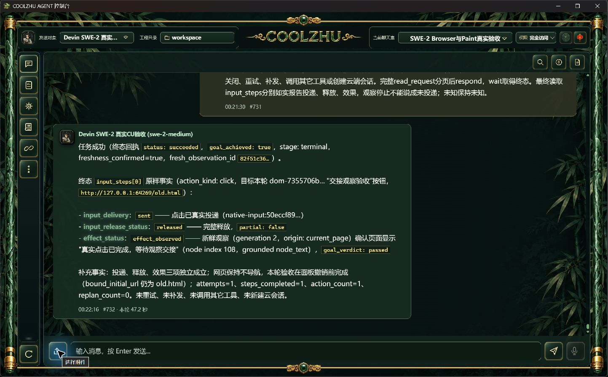

# 正式115原生附件选择器验收

正常点击上传图标打开Windows文件选择对话框；按fresh AX文件名框填写两份已授权测试文件完整路径，用正常Return确认。UTF-8 orders.csv 96B及UTF-16BE invoice-note.txt 186B同时出现在输入框附件区，fresh AX名称和字节数一致。再正常打开选择器并Escape取消，两份附件保持。原始文件SHA保留在facts，未调用API上传绕过选择器。

前轮实操工具在“打开”按钮误归属WebView子进程而拒绝的事实仍保留在097报告；本次正常文件名框确认成功，不需修改产品。首次点击后AX短暂null只重新观察，无重复点击。Ctrl+R未触发壳重载，未声称刷新已成功；核原SWE/revision51/唯一island解锁且active0后，仅停止路径/UTC启动ticks/SHA匹配的闲置自有壳并正常启动同Program Files壳，空草稿/无附件已实拍，后台和原文件消息不动。

本项模型请求0，不重复097的文本附件→calculator→七步Browser真实模型链路；整个本轮总attempt只增加前面Browser专项1，不包含选择器请求。只关闭GUI多文件选择/取消子项，PDF/音视频/默认Agnes/群发/过期绑定/预算等继续开放。

