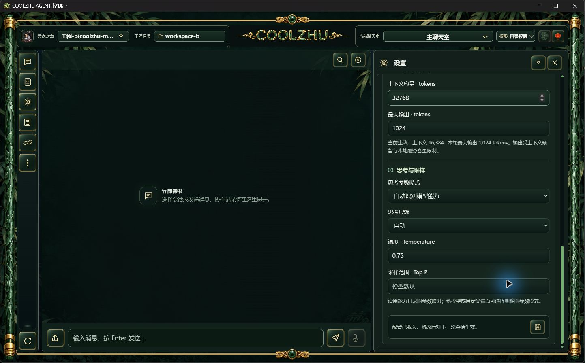
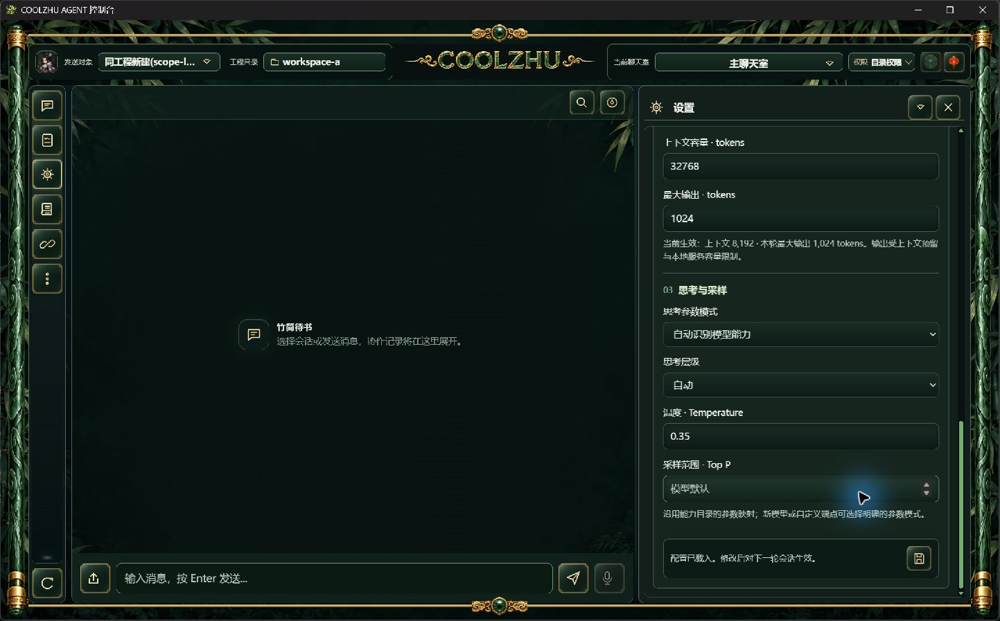
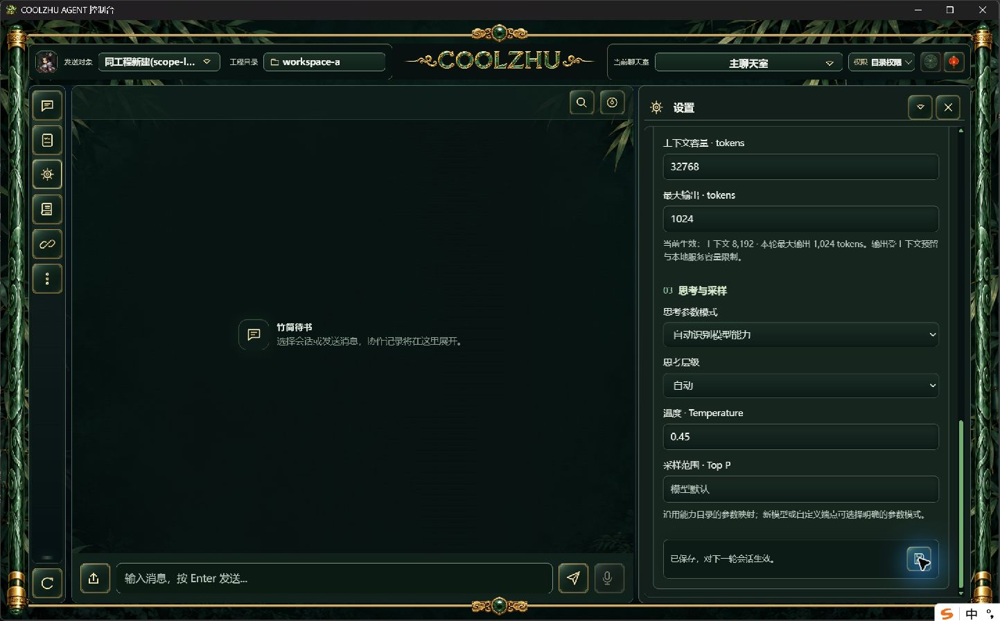
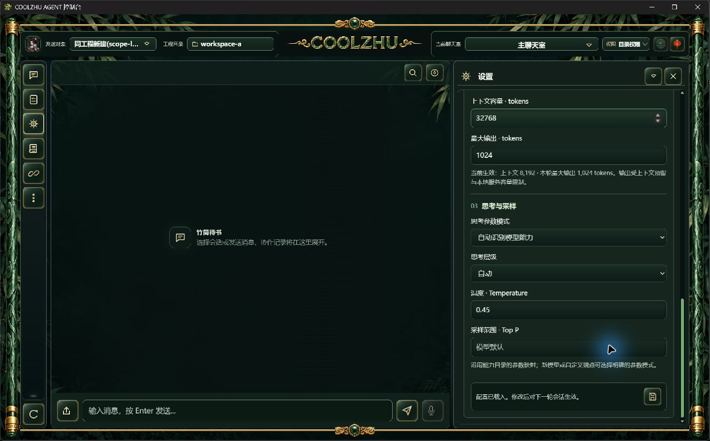

# 0.2.117 改动报告与测试交接

修复旧工程配置页迟到请求错写当前工程：正式116真实复现同会话ID、同revision的A草稿在正常切B后保存200并改B；117将统一配置页绑定完整工程路径、后端工程ID及非凭据配置加载标识。切换、同工程重载及重启后旧请求409，草稿未提交；失败切换不使当前页失效，正常编辑冲突仍由revision决定。无头旧HTTP客户端继续兼容，不宣称所有旧客户端均受保护。

源码冻结 `d094c7ae6e9def40bb4c0bfb6ed81d33bbb3f0ae`，快照 `0d80bf098adadd413fbb06a9200758f6e4b840d53180ea997fed2ae3836fdb3b`。正常发布构建实际退出0、六门pass、安装退出0，Program Files共1159文件逐长度/SHA一致。两路同源CI 37910989964/37910984282均success。MSI SHA256 `b19ef8d43ca5181f7acd44148bc12731602d70f792a70e6d28b0c1cbcfee0792`，285711880字节；正式Web SHA `a9f35f2e9bc3fbf3832b9601418d31298f400911845b7a403a880986785a95d3`，壳SHA `35eb4f0e69f702a17252ab25ba0f7584b276c7198fecd432a6e7c28ecb152875`。候选既有Web1423通过/0失败/6既有忽略，另lib8/native-host1；前端22通过/0失败。实际安装/构建/CI原收据见installed-validation，候选及原失败见[专项报告](../2026-10-09-session-config-late/report.md)。

## 实现职责

workspace_activity沿用短时Mutex和RAII pin捕获标识；不持Guard跨await，不增队列/重试/权限。SessionConfigService入口持pin校验X-Coolzhu-Workspace-Id和X-Coolzhu-Configuration-Scope；配置GET/POST、旧容量GET/POST、新建会话覆盖。GET工程及配置响应给标识，完整工程装入后再发布新标识。model_settings仅绑定一次，不自动续期；chat_experience、Devin及免费Provider三个入口传顶栏完整工程路径，路径未就绪时不挂载，避免草稿缓存键误作工程ID。错误提示刷新页面后重新打开，保留草稿。

## 正式安装版验收

16组真实HTTP/SQLite检查全部通过：跨工程旧读取/保存/容量/新建、只带旧工程ID首次读取、A→B→A、同工程重载、进程重启、失败切换不作废标识、非法参数400/旧revision409后释放、无头兼容、有效新建/保存及同scope正常编辑。旧请求之后B配置字节和SQLite会话行保持一致。不是模型回复夹具，不把单元用例当GUI实操证据。

正常原生壳：B温度0.75/容量16384；顶栏正常切A，选择共享会话后0.35/8192；数值框改0.45并正常点击保存，界面已保存、独立读revision12；同正式EXE重启后0.45/8192/name/revision逐项保持。编辑配置的会话与发送对象独立，切A默认发送对象为API检查正常新建的会话，实拍通过正常下拉选回共享会话，不声称自动改发送对象。

隔离两个SQLite库runtime_runs均0，模型0、新云端0、原库不写。两条长期隔离驱动都正常收尾并取得actual exit0；自有Windows后台terminate子退出1独立保留，不伪写成0。正式117已恢复原SWE-2-medium/revision51/唯一island-kayak，活动轮次0、远端解锁，原生新界面见installed-validation/installed-native-main.jpg。

## 其它未完及下一验收边界

本版仅关闭配置页迟到/ABA/重载/重启子项，不代表完整SessionConfigService/ToolDispatch/SharedRunner/跨进程单写者/outbox/权威epoch完成；新建与参数保存仍两步，其它修改/发现接口另列。Browser复杂长程已有正式证据，但严格新nativeTarget/跨来源commit落在down与up之间、在途观察撤销/HRESULT资源竞争仍开放；116纯截图驱动正常关闭晚9502ms，stopped0，不计严格通过，不改五秒期限或重复简单点击。附件、许可、调度、免费模型独立凭据及多屏等见[总清单](../../analysis/2026-09-21-integration-review/acceptance-summary-2026-10-08.md)。Paint免测、微信不动、Opus暂停。

未签名、预发布、不标latest、不发布自动升级清单；已公开[0.2.117预发布](https://github.com/coolzhulike/coolzhuagent/releases/tag/v0.2.117)，四资产服务端长度/SHA及实际tag绑定d094c7a均已独立核对；原收据见installed-validation/github-published-metadata.json与github-tag.json。整体Goal持续进行。
