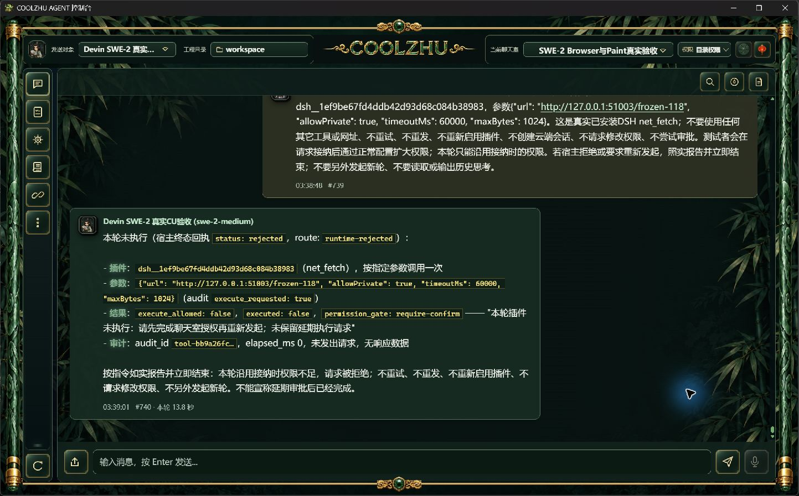
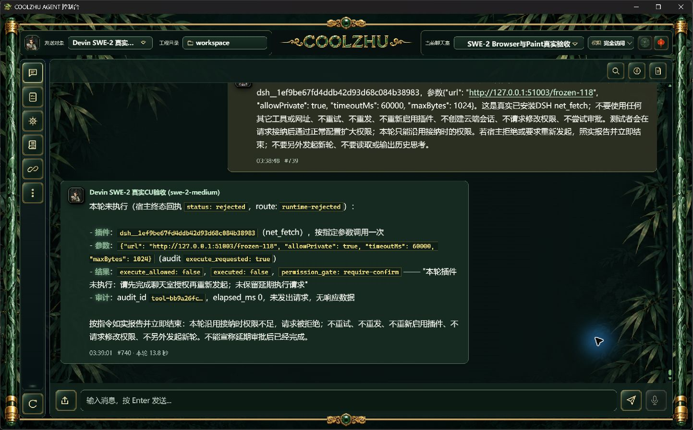

# 0.2.118 改动报告与测试交接

修复ACP插件不可续接审批导致唯一远端绑定锁住：接纳时权限不足、真实DSH工具未执行且ACP已end_turn/排空，旧实现只改提示仍把工具留在awaiting_approval。117实机失败保留；118限定ACP返回终态Rejected，正常分发failed、协议真实收尾后解锁。

已有旧锁通过正常聊天接纳的既有rotate事务收束，严格精确旧普通scope、父终态、unknown/end_turn/drained、DSH awaiting_approval；追加不可续审批事件，旧unknown保留，不续执行旧请求、不建新远端。非ACP审批和approval_running不变。实现仅dsh_web、tool_dispatch_settlement及devin_acp/journal三处职责：结果映射、旧投影结账、正常续发挂接。详见[方案](../../analysis/2026-09-21-integration-review/acp-nonresumable-approval-2026-10-09.md)和[117失败/候选](../2026-10-09-acp-plugin-approval/report.md)。

## 交付身份与检查

源码 `38c56135e42767542fc5f25376dccac728c7e07c`，快照 `bfbad9ec1bfce19264a9c273494f8fa9af6858a684f12cc18078478287dfb296`。正常发布构建及MSI安装实际退出0，六门pass，Program Files 1159文件逐长度/SHA一致。MSI 285715976字节，SHA256 `6c00e23b0ccd2c36a947e0273daf7623a5cebd7eaa923bde955e0722e18ed1be`；Web SHA `dc3881aa0f0bf1c0f42d362c7324facc46d5915909bd16b70e8fdf914f1b5308`，壳SHA `35eb4f0e69f702a17252ab25ba0f7584b276c7198fecd432a6e7c28ecb152875`。offline build0、Web1424通过/0失败/6既有忽略，另lib8/native-host1；前端22通过/0失败。同源两路CI 37918081435/37918074182均success；已公开[0.2.118预发布](https://github.com/coolzhulike/coolzhuagent/releases/tag/v0.2.118)，四资产服务端长度/SHA及实际tag绑定38c5613均已独立核对。原收据见installed-validation/source-ci.json、github-published-metadata.json和github-tag.json。

## 正式真实模型实操

模型swe-2-medium、原唯一island-kayak，user739/reply740。真实调用一次已安装DSH net_fetch：run `run-chat-1ee9bf6a55656cb9d323b82d32e8145c03861dcd1367cdc1`，接纳时目录权限，prepared阶段正常产品PATCH扩大完全访问，权限提交1791542328668ms；工具随后实际登记1791542338116ms，仍按冻结权限拒绝。真实网络请求0，工具failed，ACP terminal/end_turn/process_drained=1，绑定解锁，父completed。模型转述不替代上述独立事实。观察/发送/HTTP服务均actual exit0，未保存隐藏思考，SSE仅事件名计数。

旧af87…unknown/end_turn/drained=1保留，原awaiting_approval工具已在候选正常新接纳收束failed，追加事件1条；正式复验没有再改旧事实或重发旧请求。临时白名单及插件启用已撤回，原权限/开发覆盖和模型参数恢复，revision55→56→57自然递增，不伪改回旧值；新增云端0。具体结果与配置SHA变化见approval事实，配置正常保存不宣称字节不变。

补充观察：外部API改变权限后顶栏仍显示旧目录权限，正常刷新后以当前配置重读；本轮以权威API和冻结请求事实验收，不能把旧UI显示当实时权限已同步。该实时界面同步子项仍开放，未包含本版修复。

## 下一轮针对性验收与开放范围

复验可在真实SWE与原远端、已安装DSH上接纳目录权限请求，prepared后扩大授权。只有实际工具进入冻结权限判定并零HTTP、tool failed、terminal/end_turn/drained、解锁才算通过；未调用工具不计。旧锁恢复要求上述全部事实，未排空/非终态/异房或执行中不能被收束。非ACP交互审批仍另做正常实操。

本版只关闭ACP不可续审批收尾及冻结权限扩大这两个子项。Browser严格新nativeTarget/跨来源commit位于down/up间、在途观察撤销/HRESULT竞争仍开放，不延长五秒窗口或注入暂停；附件/调度/完整SessionConfigService/ToolDispatch/SharedRunner/单写者/outbox/epoch及其它总矩阵见[总清单](../../analysis/2026-09-21-integration-review/acceptance-summary-2026-10-08.md)。Paint免测、微信不动、Opus暂停，整体Goal持续进行。

未签名、预发布、不标latest、不发布自动升级清单。
