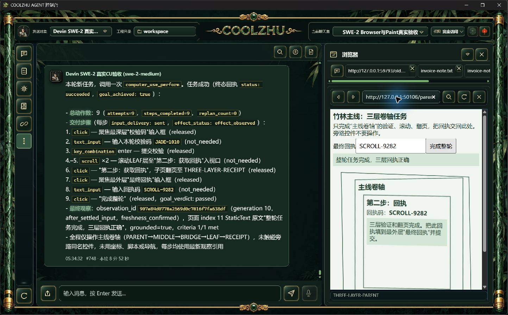

# 0.2.119 改动报告与测试交接

外部API改变当前聊天室权限后，顶栏此前保留旧值，需刷新。现在复用房间SSE既有一秒轮询/SQLite连接发送permission-changed失效通知，前端沿用权威权限GET和房间/工程/ABA代数校验，无需刷新显示已保存状态。只读通知不授予权限、不重派模型、不新增存储/锁/队列；历史协调器不等聊天流空闲再处理权限通知。

Browser读取结束的资源复核统一覆盖UI派发失败、callback和等待消费收尾；已失效优先resource_changed，资源仍匹配保留原成功/HRESULT。内部2秒、外层5秒不延长。此修补包含在正式119，但本轮普通长程不能证明严格在途撤销/HRESULT竞争已通过。[方案](../../analysis/2026-09-21-integration-review/browser-read-settlement-2026-10-09.md)和[源码检查](../2026-10-09-browser-read-settlement/report.md)。

## 正式身份与检查

冻结源码 `da7e178f1b1f5d2039337c5e3cdc3feebdcbb79c`，权威快照 `cddc25bf0fb473283367312f0595bb771f2fac31642532642be46bc340ec4139`。正常构建及MSI安装actual0、六门pass，Program Files 1159文件逐长度/SHA一致。MSI 285715976字节，SHA256 `d9a087b5e4ff73b24d7c9c7901add7e2c7766251a6cc346e4d9126eac68a0e82`；Web SHA `deaebb9503ee278b2193b3efb217ee0adf0c4893d6971e05d5603a795e57e522`，壳 SHA `bec1b44d26ca13b4fde4691df423178f90f088d7d1a4adb1d8a554d7668c5d34`。独立壳offline build/76现有检查通过；权限修补offline build0、完整Web1425通过/0失败/6既有忽略（另lib8/native-host1），前端22/0、模块联动8/0、工具check0。既有自动回归与实际模型功能证据分别记载，不用单元测试替代软件实操。构建提交两路远端CI [37928339308, 37928332030]均success，原始结果见installed-validation/source-ci.json。已公开[0.2.119预发布](https://github.com/coolzhulike/coolzhuagent/releases/tag/v0.2.119)，四资产服务器长度/SHA及实际tag绑定da7e178均独立核验通过；原收据见installed-validation/github-published-metadata.json及github-tag.json。

## 正式真实SWE长程

原模型swe-2-medium和唯一island-kayak保持。新HTTP页面、新随机校验码/回执，新一次perform；页面三层跨来源iframe、双反射及旋转/斜切，叶文档独立滚动、Enter校验、跨来源翻页、回父最终提交，旁路同名控件不操作。未用HTTP/脚本代做输入，正文未泄露校验码或回执。这是普通真实网页，非模型或工具响应夹具。

正式父轮 `run-chat-51d94b2e21500e6cf39cab6f2fc7168c36eabadf2898836d` completed，工具仅1条completed，9步均sent/effect_observed，终态succeeded/goal_achieved=true，22条可信页面事件佐证校验及最终提交accepted，没有旁路输入。单ACP terminal/end_turn/process_drained=1、原绑定解锁、internal远端为空。宿主原始步骤与真实页面事实共同判通过，不只依赖模型转述。[原始终态与事件](browser-longrun/verification.json)、[完整任务](browser-longrun/submitted.json)、[父轮台账](browser-longrun/facts.json)。

候选阶段两次测试提交漏native_browser_panel误走外部扩展通道、零输入失败均保留于[候选报告](../2026-10-09-browser-three-layer/report.md)；纠正正常前端提交后候选通过，再以本正式新页面独立复验，不追改原失败。候选成功用的旧校验码不可作为正式结果。SSE仅事件名计数，不保存隐藏思考。

## 正式权限同步

在上述任务正常结束后，正常PATCH保存workspace-write，未刷新/点击页面顶栏自动显示“目录权限”；再正常PATCH恢复原full-access，顶栏自动显示“完全访问”。[目录权限实拍](permission-sync/directory-auto-updated.jpg)、[恢复实拍](permission-sync/full-access-auto-restored.jpg)、[原状态及恢复](permission-sync/restore-permission.json)。参数revision57及Devin原绑定不改。仅关闭外部API保存后的同步子项，聊天在途、全部工程/房间切换实机矩阵仍不外推；忙时/ABA迟到事件和未提交跨连接隔离由两项必要边界回归保护。

## 后续针对性验收

三层页通过标准：从新鲜观察读取深层校验码、真正输入并Enter，叶文档独立滚动到按钮并跨域翻页，回父填新回执、完成可见结果；同时核对可信输入、逐步释放/效果、单工具/ACP收尾和唯一云端解锁。任何一步只模型声称成功、旁路输入、旧引用补发、未知效果或锁未解均不能通过。测试的滚动步数由页面实际布局及规划决定，不限定复用候选的10步。

权限同步通过标准：正常公开API保存已有房间，页面不刷新仍自动更新；通知本身不改授权，旧房间/工程/代数事件不能刷新当前状态，仍从原权限接口读取。首次SSE基线/重连也通知，避免GET与首次轮询之间的提交丢失。现有一秒轮询允许相应传播延迟。

只关闭这两项正式子验收。严格新nativeTarget替换、跨来源commit在down/up之间、确切在途观察撤销及HRESULT竞争继续开放；不能用普通翻页替代。非ACP审批、SessionConfig/ToolDispatch/SharedRunner完整收敛、单写者/outbox、附件/记忆、迁移/Windows全矩阵按[总体清单](../../analysis/2026-09-21-integration-review/acceptance-summary-2026-10-08.md)持续推进。ChatGPT订阅账号最小会话连通已有一手调研及真实成功，非正式provider或工具记忆链完整验收；OpenCode/HF真实免费模型等待其独立凭据。Paint免测、微信不动、Opus暂停，Goal保持active。

未签名、预发布、不标latest、不发布自动升级清单。
