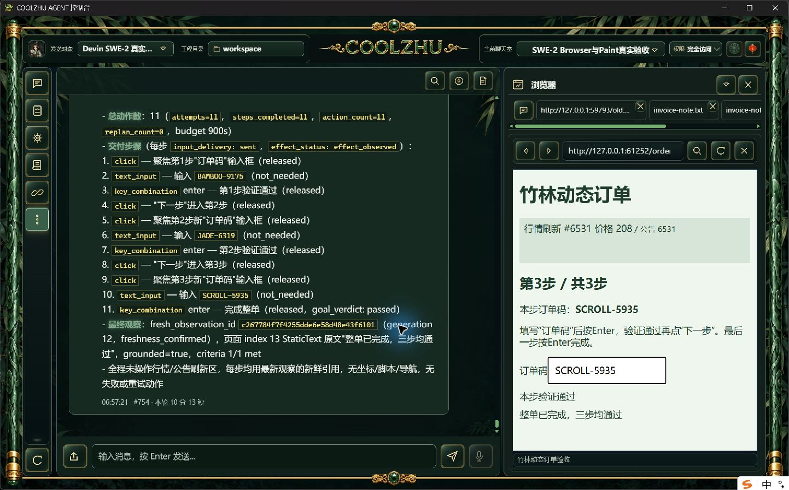
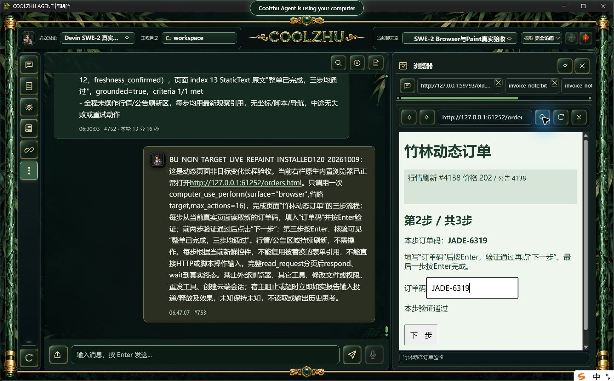

# 0.2.120 改动报告与测试交接

动态网页的无关行情/公告持续刷新时，原0.2.119在第一次点击后误报native_browser_observation_stale，三步订单未完成。现在验收新鲜度核对宿主、工程/聊天室、资源代际、导航/文档、加载、视口、焦点及实际阳性证据区域；不要求无关文字全页相同。跨节点引文同时固定跨度内节点，消失或改变的成功证据仍拒绝；模型负判不会被最新文字升级为成功。输入命中/遮挡/目标门控、内部2秒与外层5秒保持，无新重试、锁、暂停页面或私有CDP注入。

模型工具派发协调原体提取到无状态ToolDispatchService，八项冻结/来源输入保持，接纳一次、取消/预算及终态finish沿用原事实链，同任务task-local不变。HTTP入口只做薄适配；具体registry、审批、hook完整迁移仍待办，不据此关闭2.3整体。

## 正式身份与检查

冻结源码 `ed18c1c77df2155f08308a8f8210bed3a765e9ed`，快照 `6ddf3b2579608e05b17267e5c3aa1bc65073188439e3202b984a67ff8b00b992`。正常release构建及管理员MSI安装actual0，六门pass，Program Files 1159文件逐长度/SHA一致。MSI 285761032字节，SHA256 `d20b481468d629e041692ccbaea6fbf8d92731ac86081bd4afac8c0192eea443`；Web `5f6c40d194351e58a9f1be70a70670d4e165bed320843b322f8e6ed1c4e10cb3`、壳 `bec1b44d26ca13b4fde4691df423178f90f088d7d1a4adb1d8a554d7668c5d34`。实际日志及核验见installed-validation。

offline源码build0、完整Web1426通过/0失败/6既有可选忽略、模块联动8/0。首次Web LLVM内存不足exit101保留；单编译任务/关闭调试符号后实际成功，不覆盖失败事实。两路冻结源码CI [37938139593, 37938131305]均success。后续工具参数诊断脱敏源码候选不属于120，不能将其编译或回归数字加入本包。

## 正式独立真实长程

原SWE-2-medium、唯一island-kayak、原聊天室和full-access/revision57保持。新普通HTTP目标启动后产生独立随机码，正文任务不泄露码；行情及公告每100ms刷新，订单区域固定。模型一次computer_use_perform完成三步：各自从当前页面读取订单码、聚焦并输入、Enter验证，前两步点下一步，第三步核对可见“整单已完成，三步均通过”。网页不代替模型或工具响应，未脚本/HTTP代做输入。

父轮 `run-chat-a1e029323e80edc43833279b63df15a831910d741074770d` completed，工具1条completed，11个实际动作、27条可信输入事件。逐步sent/effect_observed，click/Enter released、文本not_needed；三阶段输入及验证、两次advance、final-submitted accepted与终态succeeded/goal_achieved=true一致。单ACP end_turn/process_drained=1，原云端解锁、internal=null；父轮耗时 613.7 秒，原900秒总预算未延长。原事件/全部输入与释放见[browser-live/verification.json](browser-live/verification.json)，完整提交见[submitted.json](browser-live/submitted.json)，父轮/可见回复见[facts.json](browser-live/facts.json)。SSE仅计事件名，不收集隐藏思考。

原119失败和候选11步通过分别保留于[专项报告](../2026-10-09-browser-live-repaint/report.md)，不追认旧包通过。正式采证watch.py首次猜测updated_at列报错，修正后正常只读观察；该脚本错误不计成功、没有代做任何页面输入。

## 供其它模型设计针对性用例

- 动态非目标区正例：用新的随机码/页面，一次真实模型调用完成多步输入及提交。要求软件原图、可信事件、逐步投递/释放/效果、工具/父轮/ACP与唯一绑定共同一致；仅模型声称或旧页面截图不能通过。
- 成功证据变化负例：同URL下成功引文消失、焦点节点事实改变、加载状态/文档/视口变化仍拒绝旧判断，不凭相同索引猜身份。必要源码边界回归已通过；新增严格实机时序不能用普通长程替代。
- 派发服务：保持来源/父预算/host_scope，接纳一次、同task-local、终态返回前落地；持久化失败不能自动补发。此次真实长程覆盖正式协调入口，跨入口完整审批/hook矩阵仍待验。
- 反例不冒领：超时、部分输入、释放未知、验证不满足应保留对应事实，不能仅以页面变动判任务完成。

中间visible_progress仍可能把行情算进展，动作相关进展判据尚待独立处理；严格nativeTarget/commit down-up、确切在途撤销/HRESULT竞争未因此关闭。32工作包其余服务/outbox/SharedRunner、附件/记忆、迁移/Windows矩阵按[总清单](../../analysis/2026-09-21-integration-review/acceptance-summary-2026-10-08.md)继续。Paint免测、微信不动、Opus暂停，Goal保持active。ChatGPT订阅最小真实连通已单独验证，不等于完整provider/tools/memory交付；OpenCode/HF实际调用待其独立凭据。

已公开[0.2.120预发布](https://github.com/coolzhulike/coolzhuagent/releases/tag/v0.2.120)，四资产服务器长度/SHA及实际tag绑定ed18c1c独立核验通过，原收据见installed-validation/github-published-metadata.json和github-tag.json。未签名，预发布、不标latest、不发布自动升级清单。
