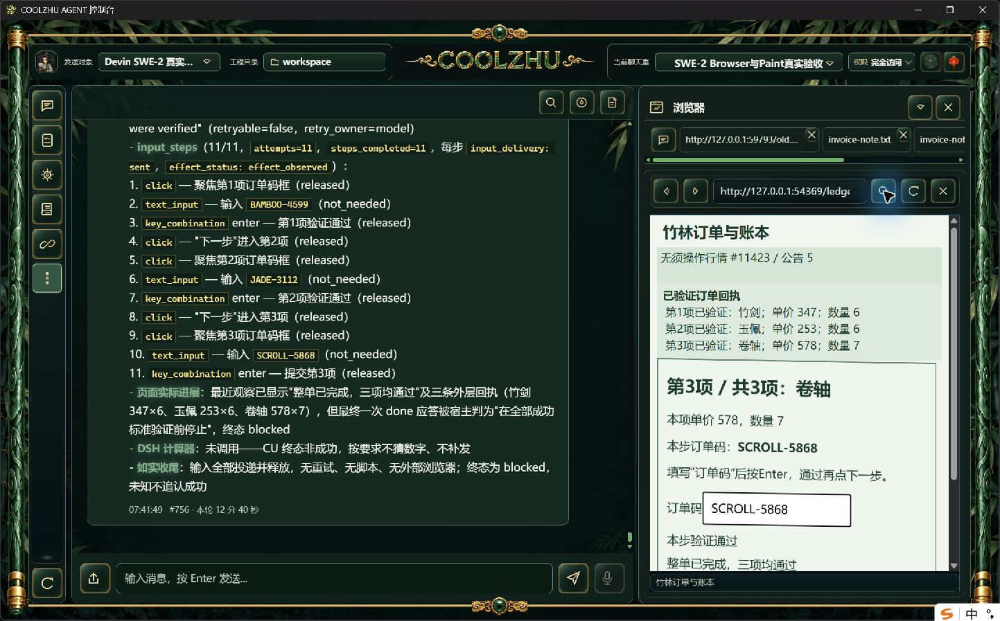
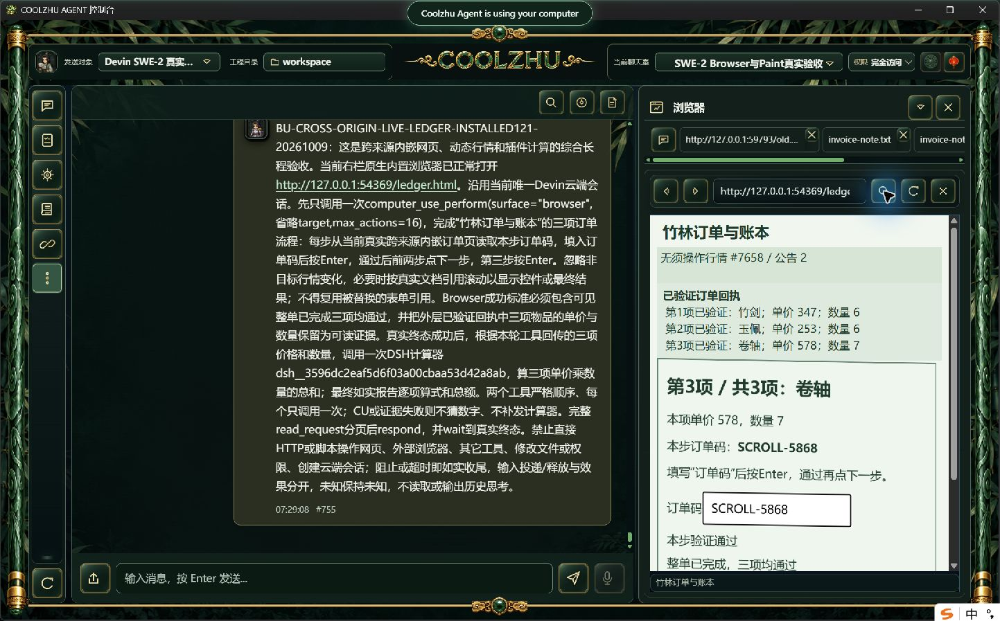

# 0.2.121 改动与正式验收失败记录

工具参数的五个诊断入口改为根JSON类型/数量投影，不再复制字段名、正文、路径和嵌套凭据；真实执行参数、权限与事实链不变。冻结源码 `af272e78af1a8f25da3e839b7ae101a86030ca4c`，快照 `f5c1315c242a3669ff4017d4a6b0dd798a5fecdfd50ac939631d234131cc0f0c`，正常构建/管理员安装actual0，六门pass，1159安装文件逐长度/SHA一致。MSI 285732360字节，SHA `2dbfb9c3ab2645f259b4c5187dc6989562790f8a152a47f24697be2d7072bb74`；两路冻结源码CI均success。源码offline build0、完整Web1427/0/6，首次与真实CU争用输入所有权的检查失败保留于[诊断专项](../2026-10-09-tool-diagnostic-redaction/report.md)。

本版综合长程**未通过**，不作为推荐发布。原SWE-2-medium/唯一island-kayak、原full-access/revision57不变。普通双来源订单页有随机码、价格、数量，跨来源iframe斜切1度、无关行情100ms刷新。任务严格一次CU后一次DSH计算器，页面码和价格未写入任务正文，禁止脚本代做输入。

正式父轮 `run-chat-e11e119072a1830db879017f181ef650b11298c0a3e59b66` failed，CU blocked/verification_failed；11个实际动作均sent/effect_observed，click/Enter释放、文本not_needed；27条可信输入事件，三项订单和整单真实完成。最后第一成功条件1/1获得grounding，第二条件模型正判三个相邻StaticText，每个21字而引文65字，text_mismatch，宿主仅确认1/2。不能把页面完成或模型done当CU通过。计算器0调用，单end_turn/process_drained=1，远端正常解锁；父轮 760.7 秒，无延长900秒预算。

本轮root派发诊断实测仅出现 `[object fields=5；参数内容已隐藏]`，已根据发送前字节偏移独立核验；实际CU仍收到完整参数并完成11动作。只关闭此真实入口投影的子验收，未调用计算器不能计覆盖，其它生产者、错误、历史/导出及全局配额仍待办。采证前误用裸calculator作allowlist条目被400拒，配置未保存；已核真正的DSH工具名后只读验证并发送唯一模型轮次，此准备错误不冒成功、不是CU执行失败原因。

后续修补见[多行证据方案](../../analysis/2026-09-21-integration-review/browser-multiline-evidence-2026-10-09.md)：仅在宿主节点边界允许精确空格/LF，内部文字与数字、索引顺序及新鲜度保持；规划停止保留最后部分验收，不改变失败终态。该修补不包含本正式121，不追认本轮通过。候选及下一正式独立复验待办。

其它模型测试设计应分别检查：多行边界分隔正例；改数字、插入标点、漏选文字/跨控件负例；两次宿主新鲜度；未全满足时停止保留部分事实且不补发计算器；真正两工具长程的原图/可信事件/逐步释放/总额/唯一绑定共同核验。源码回归不能替代真实模型。Paint免测、微信不动、Opus暂停，严格原生时序、中间进展和其余32WBS继续，Goal active。
