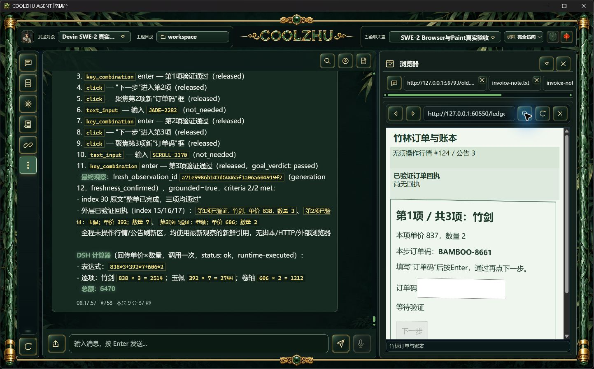
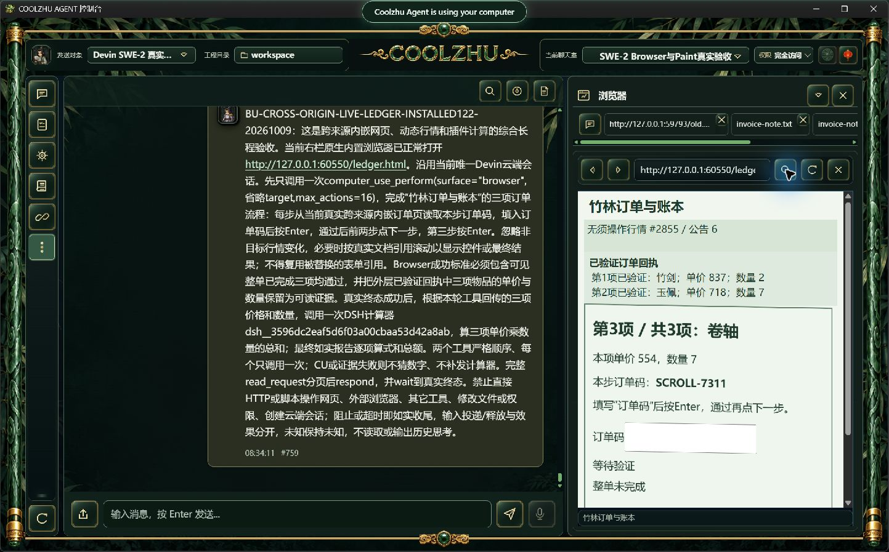
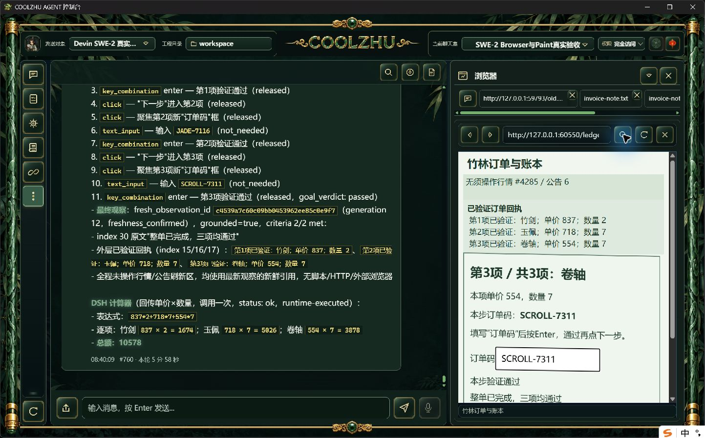

# 0.2.122 改动报告与测试交接

正式独立长程通过：跨来源三阶段动态订单由真实SWE-2-medium执行11个动作、27条可信输入，宿主确认2/2，随后DSH计算器正确得到10578。两工具各一次completed，父轮completed、单end_turn/drained、原唯一island-kayak解锁。正常构建/安装actual0、六门pass、1159文件逐长度/SHA、两路源码CI成功。

## 问题与修补

正式121中网页已经完成三项订单，但三个相邻StaticText回执的原文63字被模型用边界空格连接为65字，宿主误拒text_mismatch，1/2、CU blocked、父failed且计算器没有执行。其[原失败与实拍](../release-0.2.121/change-report-and-test-handoff.md)保持，不追认121通过。

122只允许选定相邻或既有合法桥接文字节点在边界精确连接为空字符串、单ASCII空格或单LF。内部字符/数字、节点顺序/跨度、全部StaticText选择及两次宿主新鲜度保持；提示与实际规则一致。规划无动作且目标未全部满足时，仍失败，但保留最后部分验收事实，不增加模型请求、输入重试或成功判定。

本包包含121的五入口工具参数诊断类型/数量投影，以及120的局部证据新鲜度与ToolDispatchService原体协调提取。原生投递/释放门控、Browser内部2秒/外层5秒和根900秒预算没有放宽。中间visible_progress仍可能把行情变化算效果，尚未修复；本次步骤中的effect_observed只如实归档现状，不能冒称动作因果判据已完整验收。

## 冻结身份和检查

源码 `8edfa3ab87f411085e22975de14e007c6df52312`；快照 `3fec9d0013d6851e2926b64810a0bf309f6c4fe18ed1750b361908567e44587e`。MSI 285720072字节，SHA256 `ee92ff2e92296057664e7c0896f03c681542bcb8a37590eafc8939cd5ceb8130`；Web `cfad26090de12801ea55cf58557e3af77e998f4850e1e119c0b35f7521b7e8dd`，壳 `bec1b44d26ca13b4fde4691df423178f90f088d7d1a4adb1d8a554d7668c5d34`。正常release构建、管理员MSI安装actual0，六门pass，Program Files 1159文件逐摘要一致；producer `pkg-report-release-20261009-082747946-f4f417bd`。原报告在evidence/build-identity，实际退出及核验在installed-validation。

源码offline build0、core143通过/0失败、完整Web1428通过/0失败/6既有可选忽略，另lib8/native1；模块联动8/0。[源码检查与候选报告](../2026-10-09-browser-multiline/report.md)保留详细日志，候选不替正式。冻结源码CI [37951713747, 37951359235]均success。

## 正式真实综合长程

沿用原SWE-2-medium、原聊天室、revision57/full-access和唯一island-kayak。正常右栏导航打开新的普通HTTP订单网页：跨来源iframe斜切1度、外层行情每100ms刷新。任务正文不提供随机订单码、价格或数量。模型自己读取当前内容，聚焦输入、Enter验证、前两项下一步，最后确认整单及外层回执；随后调用一次已启用DSH计算器。无脚本/HTTP代做输入、无模型响应夹具、无新云端会话。

父轮 `run-chat-fd5f07f0b3cf5a8d490d24f444b1ca22db486edc48e698b1`；11动作、27可信事件，三次正确输入/验证、两次advance、final-submitted accepted。逐步sent、click/Enter released、文本not_needed，原终态succeeded/goal_achieved=true。宿主最后criterion0单节点30，criterion1节点15/16/17边界连接得到65字精确回执，grounded 2/2。

竹剑BAMBOO-8661：837×2=1674；玉佩JADE-7116：718×7=5026；卷轴SCROLL-7311：554×7=3878。计算器表达式837*2+718*7+554*7，总额10578，最终可见回复#760、本轮5分58秒；独立实际耗时358.5秒。两工具各一次completed，单attempt/end_turn/process_drained=1，island解锁、internal=null。

诊断仅核对本轮两个实际root工具入口：CU根JSON字段数量5、计算器1，不记录字段名/参数正文；其它入口及全局生产者没有据此冒领。SSE仅计事件名，不收集隐藏思考，raw诊断日志未归档。原始事实和严格核验见[browser-ledger/verification.json](browser-ledger/verification.json)、[facts.json](browser-ledger/facts.json)、[diagnostic-verification.json](browser-ledger/diagnostic-verification.json)。

## 供其它模型设计针对性测试

- 多节点引文正例覆盖空/空格/LF边界；改内部字符/数字/空白、漏节点、插标点、跨控件及跨度过界负例仍拒绝。必要边界回归已通过，不能用测试夹具代替真实长程。
- 新订单独立实操：模型读取随机码与price/quantity，完成各项及最终提交，再调用真实插件。要求软件原图、可信输入、逐步投递/释放、宿主grounded标准、工具与父轮终态和唯一绑定一致。
- 规划停止而部分标准满足：应保留原部分标准但status仍blocked、goal_achieved=false；不能自动重试或升级为成功。
- 诊断不复制参数：本轮只确认两root入口；其它入口、历史日志、错误生产者/导出与全局配额继续单独验收。
- 无关行情更新不得证明本步输入效果，此缺口单独按[进展方案](../../analysis/2026-09-21-integration-review/browser-progress-followup-plan-2026-10-09.md)修补和正/负实操，122不关闭该项。

严格nativeTarget/commit down-up、确切在途撤销/HRESULT竞争、混合DPI/多屏及完整32工作包继续开放；只关闭此次多行回执的正式子验收。[整体验收清单](../../analysis/2026-09-21-integration-review/acceptance-summary-2026-10-08.md)。Paint免测、微信不动、Opus暂停，Goal保持active。

已公开[0.2.122预发布](https://github.com/coolzhulike/coolzhuagent/releases/tag/v0.2.122)，四资产服务器长度/SHA及实际标签绑定8edfa3a独立核验通过；原收据见installed-validation/github-published-metadata.json与github-tag.json。未签名，预发布、不标latest、不发布自动升级清单。
