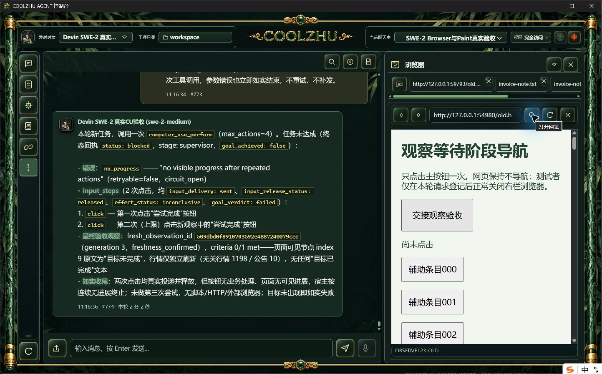
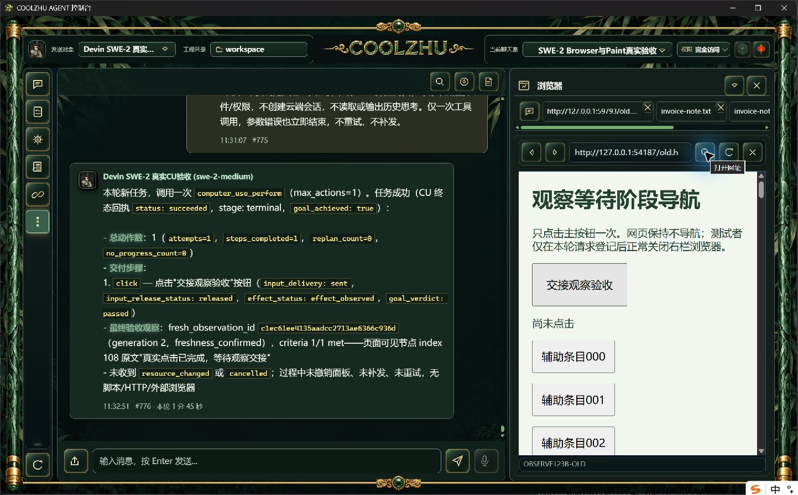
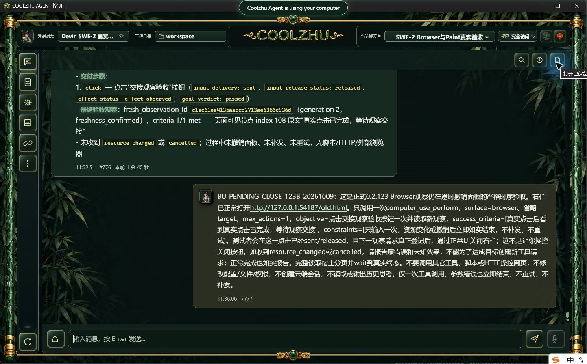
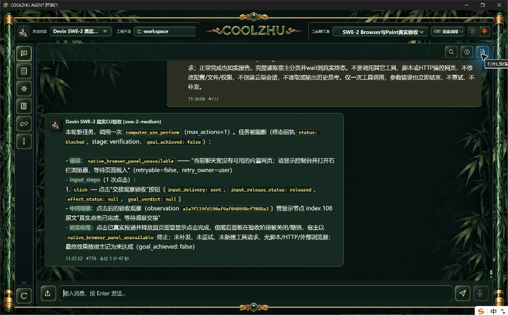

# 正式123连续观察与在途撤销补验：严格项仍未通过

两轮均为正式123、同一SWE-2-medium/唯一Devin island-kayak/revision57，正常右栏打开普通网页后，只让真实模型调用一次computer_use_perform、最多一次click，未使用模型或工具响应夹具。页面正常点击后显示完成状态，不自行导航。连续HTTP观察驱动等待真实输入释放及下一次底层观察请求登记，再通过原生软件界面正常关闭。没有改产品等待期限、注入暂停、重放或补发输入。

| 事实 | 第一轮 | 第二轮 |
| --- | --- | --- |
| run | run-chat-1359167f1ae046085d451429039e59be69742d08f695bbaa | run-chat-a3800894b6c0e0365e68c11eb5eab82777cb0237a66d2283 |
| 输入完成UTC毫秒 | 1791570733236 | 1791571032467 |
| 下一观察登记UTC毫秒 | 1791570733268 | 1791571032501 |
| 连续捕获UTC毫秒 | 1791570733275.1936 | 1791571032508.2283 |
| 新AX观察UTC毫秒 | 未取得 | 1791571032569 |
| 正常关闭开始UTC毫秒 | 无 | 1791571046717 |
| 正常关闭返回UTC毫秒 | 无 | 1791571046805 |
| observation_stopped | 0 | 0 |
| 终态 | 普通clicked目标成功、父completed | blocked/verification/native_browser_panel_unavailable、父failed |
| input_delivery / release | sent / released | sent / released |
| 最终效果 | effect_observed | null，保持未知 |

第一轮连续捕获在登记后7.2ms返回，但驱动把sky调用放进跨node调用存续的后台Promise，报“node_repl exec context not found”。未发送关闭动作，不能算在途撤销通过。watcher-outcome.json保存驱动错误。普通点击完成仅作本轮真实事实，已有基本点击验收不重复计新增覆盖。

第二轮改为后台Promise只做HTTP观测，所有sky动作在当前node调用内执行。登记后68ms获取新AX并停止检查，下一调用仅正常点击所观察的“关闭当前工具”按钮并刷新。实际关闭开始晚14216ms，超过原5秒外层等待期限，仍未命中底层在途窗口。点击后的观察已完成，后续模型验证才因面板不可用停止；投递/释放事实仍保留，效果未知，不将“停止观察”说成“未发送”。严格waiting_resource_changed/reply_resource_changed分支及HRESULT竞争均无本轮证据。

两轮各一个实际ACP尝试，均terminal/单end_turn/process_drained=1；原唯一island绑定locked_attempt=null，internal无绑定，新云端0，未重试或补发。SSE两轮started1/message1/message_start2/message_done1/done1，第二轮最终聊天室#777/#778（1分47秒），第一轮#775/#776（1分45秒）。服务器仅测试页正常事件/真实输入日志，测试者未用DOM脚本代点击。两网页服务器已通过自己停止标志结束并取得实际exit0。

原图片未经裁剪/重绘。23项白名单证据见evidence-manifest.json，含实际台账、登记事件、时序、SSE计数和测试驱动，不包含凭据/完整历史/思考。严格新原生Target/down-up、跨来源实际commit/down-up、底层在途资源撤销及HRESULT同窗竞争继续开放；不重复简单点击碰运气，不放宽验收标准。其它32工作包继续，Paint免测、微信不动、Opus暂停，Goal active。
