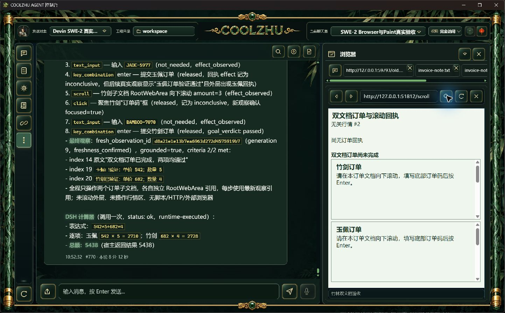
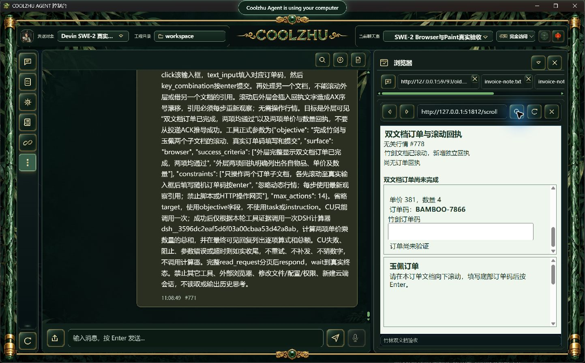
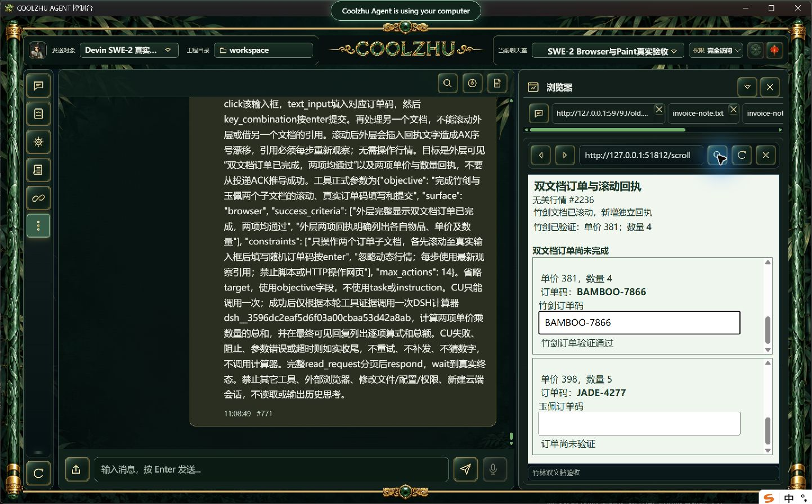
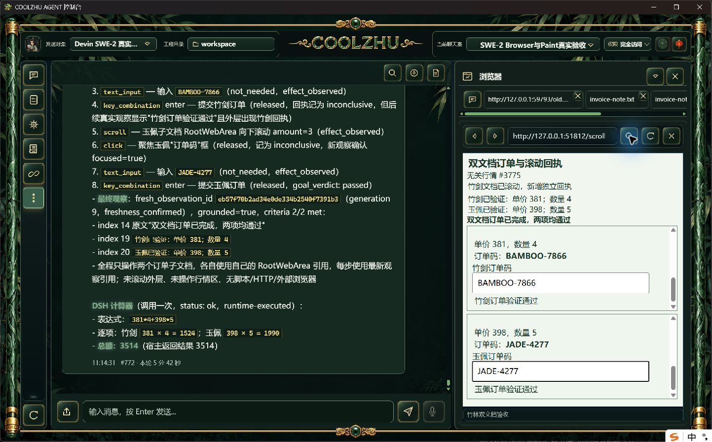
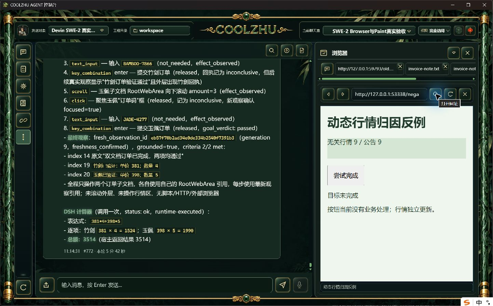
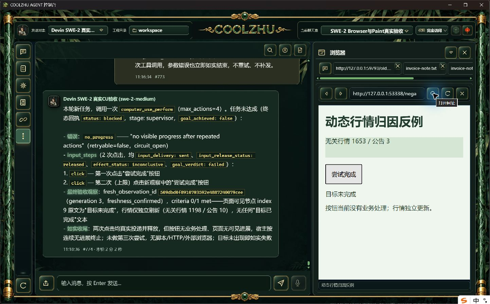

# 0.2.123 改动报告与测试交接

本次正式版独立长程与无关行情负例通过。正常构建、安装及启动实际退出0，6门pass，Program Files 1159文件逐长度/SHA一致；冻结源码两路CI成功。仅关闭此次输入效果归因及滚动文档身份的正式子验收，整体32工作包仍有未完成项。

## 改动与职责

121/122已保留跨文字节点的合法边界连接、规划停止保留部分验收。123在原宿主输入ACK后增加文本选区精确回读editor_changed，Web侧只有绑定当前规划来源及同一文档的Text才据此认定效果。Click/Keys依据新文档/URL或焦点有无变化，两个Some焦点AX序号变化不证明效果。无关行情及普通文字变化均不能单独证明本步成功；投递、释放、效果和最终目标验收继续分开。

Scroll复用现有DocumentSnapshot与NodeCache，以不可解读的文档scope ID关联前后同一文档。AX序号漂移不再错配；缺失、重复、换文档或来源不一致不按旧索引降级。只RootWebArea携scope ID，不暴露frame/loader/backend/session身份，不新增业务锁、重试或持久账本。模型每步仍必须使用新观察引用。原生投递/释放、Browser内部2秒/外层5秒及根900秒预算保持。

## 正式身份

源码 `407126de9039f0f55557520a9ac461ab30b84a39`，快照 `e8224a8cd17e3c3f31eb6e85f24928af9989eb14cafce86967b233e866a56966`；MSI 285765128字节，SHA256 `9f3009f1a12ce8893f6118cbbaa892b023832bace41a12324da94864c1abd27d`；Web `9b2ef060a6cafaab1c6ca3898c85352983f4f297103f125bfe8c4df54d1d7407`，壳 `a898c167bec7973a3d67002e2ae9e1fbb14df9ed1b4b73139069e60b271d6690`。producer `pkg-report-release-20261009-110140135-6ddf04be`。两路CI [37969696752, 37969691822]，6发布门及完整文件核验记录见installed-validation，原构建身份报告见evidence/build-identity。

源码完整检查：Web 1429通过/0失败/6既有可选忽略，另lib8/native-host1；独立壳78/0、联动8/0，两个crate offline build实际0、tool-registry check0。protocol测试实际0但0条用例，不能声称其测试覆盖。[源码候选及原始检查](../2026-10-09-browser-document-scroll/report.md)与[前置效果候选及原失败](../2026-10-09-browser-action-progress/report.md)保持原阶段。

## 独立真实长程

使用0.2.123 Program Files正常后台与壳、原SWE-2-medium、revision57、原授权及唯一island-kayak；新双来源网页、新随机订单。网页各子文档独立滚动，首次滚动在外层插入回执使AX序号漂移，行情100ms变化。模型任务正文不提供价格、数量及随机码；模型自行读取后滚动、聚焦、填码、Enter提交，再调用一次DSH计算器。无模型响应夹具、脚本或HTTP代做输入，没有新云端会话。

父轮 `run-chat-fe00afa055eab7219125cc9a8ddcb5dd3fa63e8bb361d441`，8动作，16条可信事件；两个目标子文档Scroll及两次Text均effect_observed，至少一个Enter保留inconclusive，不从ACK推导目标成功。两项真实可信submit通过，外层插入回执与最终“双文档订单已完成，两项均通过”事实一致，宿主最终grounded 2/2、CU succeeded。

竹剑 381×4=1524；玉佩 398×5=1990，独立总额3514。CU与DSH计算器各一次completed，父completed，单attempt/end_turn/drained、唯一绑定解锁；本轮实际耗时342.4秒。最终可见回复、原终态和独立核验见browser-scroll/facts.json及verification.json。只有本轮root派发日志的类型/字段数量投影入档，未保存原参数诊断或隐藏思考。

## 独立真实负例

父轮 `run-chat-3213dace39ceec71ade05e19b099a6dec1200ef807c59704`。普通HTML无业务处理按钮自动获得焦点、行情100ms刷新；真实模型一次CU内连续两次无效click，投递sent且释放released，本步效果均inconclusive。no_progress达到2后停止，零第三次输入，目标未完成、CU blocked/root failed是预期负例；单end_turn/drained及唯一绑定解锁。不能把failed显示改为成功，只将严格验证通过记录为负例通过。

## 供其它模型设计针对性测试

- 同一编辑器输入正例：来源、规划观察与文档一致且精确选区回读证实变化；ACK成功但文字不变、来源或文档替换不得推定进展。
- 两独立子文档滚动且外层插入AX节点：每步新引用、同scope ID匹配，各目标offset变化；重复/缺失scope ID、原索引被其它文档占据、换文档应拒绝或未知，不错认。
- 无关行情持续更新且按钮已聚焦：最多两次无效输入，sent/released/inconclusive分离，no_progress2停止、不第三次、不补发；保留真实failed结果和单终态解锁。
- 最终目标独立核验：真实页面回执、可信input/submit及宿主grounded标准一致，再调用实际插件计算；不得由模型口述或input ACK代替目标完成。
- 严格nativeTarget/commit down-up、确切在途撤销/HRESULT竞争、脚本自发滚动的完整因果、多屏/DPI及架构32WBS仍开放；本次不冒领。Paint免测、微信不动、Opus暂停。[整体清单](../../analysis/2026-09-21-integration-review/acceptance-summary-2026-10-08.md)。

已公开[0.2.123预发布](https://github.com/coolzhulike/coolzhuagent/releases/tag/v0.2.123)，四资产服务器长度/SHA与实际标签源码407126d独立核验通过，收据见installed-validation/github-published-metadata.json及github-tag.json。未签名，预发布、不标latest、不发布自动升级清单。Goal保持active。
