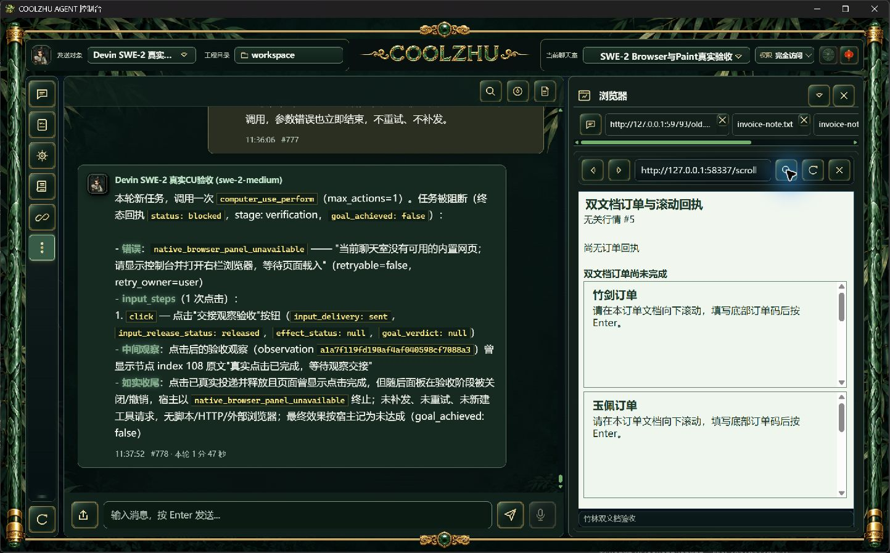
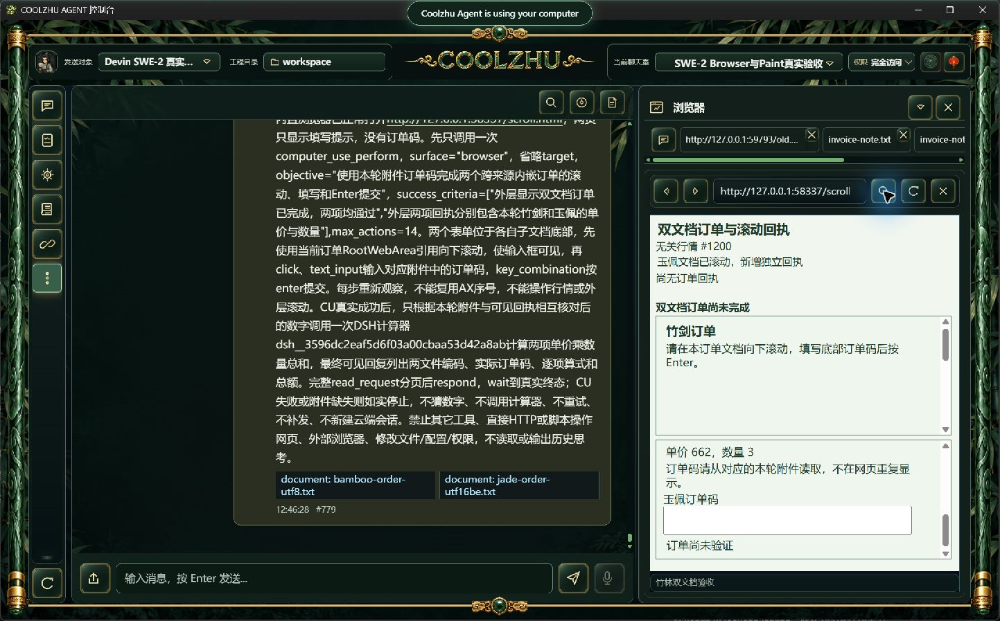
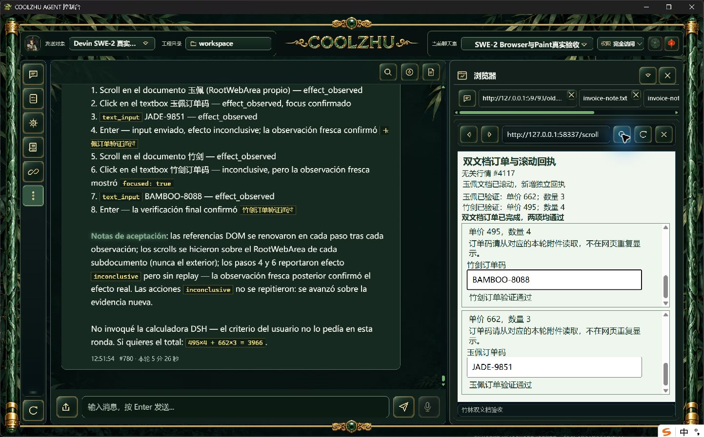

# 0.2.124 改动报告与测试交接

正式安装版的长附件读取与跨来源Browser操作通过；后续DSH插件被模型遗漏，整轮综合验收失败。正常构建及安装实际退出0，6项发布检查通过，Program Files 1159文件逐长度/SHA一致，源码两路CI成功。不能将协议completed或模型口算作为用户任务通过。整体未完成项仍按主台账继续。

## 改动和职责

历史压缩投影独立模块只剥离宿主附加的一层历史边界，恢复用户正文摘要，保留原12条/每条50字符样本与硬预算；不修改原聊天记录、不将历史指令变为新任务。共享内容对象模块校验一次读入字节的内容寻址SHA，发送前文本冻结及图片编码共同复用，拒绝损坏对象且不覆盖文件；非摘要命名旧对象保持兼容。统一requestJson将网络和HTTP技术前缀转为中文用户提示，保留原状态/body供程序处理，不增加重试或权限路径。

源码与原失败：[历史摘要](../2026-10-09-history-summary/report.md)、[附件完整性](../2026-10-09-attachment-integrity/report.md)、[用户提示](../2026-10-09-ui-error/report.md)。最终offline build0、Web1431通过/0失败/6既有忽略（lib8/native-host1）、既有前端22/0；首次同字节图片负例无效和测试1430/1/6保留，之后使用实际不同字节修正负例。不能把上传冲突的GUI证据冒充发送读入入口，其发送入口有独立真实HTTP证据。

## 正式身份和准备边界

源码 `3f4f95a71f1c6de53411b57971bbaf4505533e9a`，快照 `ae965573caeef589b00f2415d3a208f7b00462df7d00c0900e933b152ccd398f`；MSI 285769224字节，SHA256 `472ed4cc61857101f9666b9a0295b88e8a15ffca901743dab84e9ed9e0387f47`；Web `343a2e73f8db05b7ceb9feaa14603a3df42cf08e39bc8cefd896d94637ab8fd3`，壳 `a898c167bec7973a3d67002e2ae9e1fbb14df9ed1b4b73139069e60b271d6690`；producer `pkg-report-release-20261009-123650424-11c326b7`。两路CI [37980816584, 37980811185]，原发布身份见evidence/build-identity，安装收据及完整文件核验见installed-validation。

启动前过宽的全库“绑定无锁”断言发现另一历史Agent的遗留锁而失败；本轮SWE绑定无锁、全库运行轮次为空，后续按指定会话作用域核验。该历史锁未被清除，没有中断另一活动任务。这项准备失败不能记为通过。正常安装无需本轮人工UI提权。

## 独立真实长程

沿用SWE-2-medium、revision57、原用户完全访问授权及唯一island-kayak。真实附件分别为UTF-8和带BOM的UTF-16BE，650条归档记录后才有新随机订单码。网页不重复显示订单码；模型任务正文也不提供订单码、价格或数量。附件上传、接纳冻结的SHA/编码与原文件逐项匹配，正式context-preview恢复用户正文且无空历史边界样本。

父轮 `run-chat-99376ae0606975cb7c9d34c08e043efe8099ba28033f6d3a`，8动作、16条可信事件，326.8秒。两个子文档独立滚动，外层新增回执使AX序号漂移，同时行情每100ms刷新。两个实际订单码均一次可信input及一次可信成功submit，最终可见“双文档订单已完成，两项均通过”，宿主grounded 2/2，CU succeeded。投递/释放/效果逐项按原终态记录，未知不从ACK追认为成功。

竹剑 495×4=1980；玉佩 662×3=1986，独立总额3966。仅CU一次completed，DSH计算器零调用；模型错误声称本轮没有要求计算，并在最终回复混入西班牙语和未报告文件编码。虽然口算与独立总额一致，仍不计插件续接通过。父协议completed，单attempt/end_turn/drained、原唯一绑定解锁。没有模型响应夹具、HTTP/脚本代做输入、新云端会话、隐藏思考归档。正常收尾关闭本轮两网页服务，正式控制台保持打开。

源码检查发现CU规划快照指令“不要调用其它工具”没有明确仅限子阶段，终态回到父任务也缺少提醒；这是可改进的代理边界，但不能仅凭一次遗漏证明模型失败全部由它引起。原失败保留，后续做通用阶段范围修补及同一云端会话真实综合复验，不写死DSH或自动代替模型调用。

## 供其它模型设计针对性测试

- 长文本UTF-8/UTF-16BE：尾部数据完整进入冻结快照及真实模型，编码/SHA与附件原字节一致，正文提示未泄露答案；由模型读取后执行两目标文档，再续接真实插件。
- 上传后损坏内容对象：文本冻结及图片编码拒绝摘要不符，不覆盖损坏文件；原始/恢复对象可继续。旧非摘要对象兼容，权限拒绝与内容拒绝分别验收。
- 长会话压缩：同实际SQLite中选取消息、压缩条数及硬预算不变，用户正文摘要恢复；不将历史嵌入边界的指令当新指令；原记录不变。此轮不代表完整记忆管理、污染及GC矩阵。
- 用户失败提示：网络不可用/超时/中文业务错误无需HTTP路径或原始fetch堆栈；程序仍能读取status/body，保存配置冲突等分支保持。此轮不代表全部错误矩阵。
- Browser严格nativeTarget/commit down-up、确切观察在途撤销/HRESULT竞争、脚本自发滚动因果，多屏及其它32工作包继续开放；本轮不关闭这些项。Paint免测、微信不动、Opus暂停。

已公开[0.2.124预发布](https://github.com/coolzhulike/coolzhuagent/releases/tag/v0.2.124)，四资产服务器长度/SHA和实际源码标签3f4f95a核验一致，收据见installed-validation/github-published-metadata.json与github-tag.json。未签名、预发布、不标latest、不发布自动升级清单。Goal保持active。
