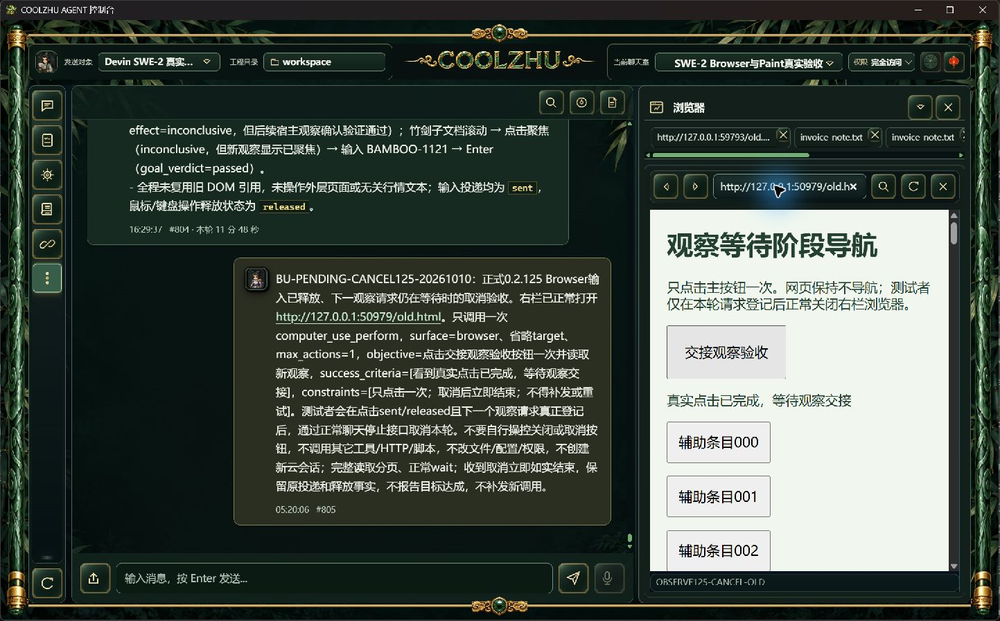
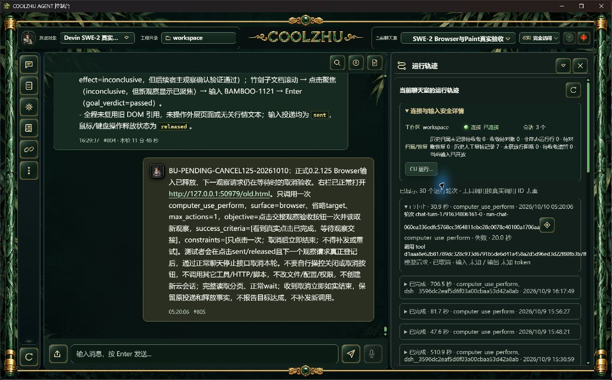

# 正式125观察在途取消专项

此前正常UI关闭在观察期限后才执行，未命中严格窗口，原失败保持。此次只检查另一独立边界：一次可信输入sent/released后，下一次观察请求已真实登记但未收尾时，经正常`/api/chat/turn/interrupt`发出取消，不改变产品2秒/5秒期限，不调用宿主私有通道或安全配置，不把晚关闭算作通过。

## 实际时序与结果

- 正式Program Files 0.2.125原工作区、原SWE-2-medium/唯一island-kayak/revision57。用户测试消息#805（msg-1791634806160-user），父run-chat-060ea336edfc5768ec3f64811ebe28e0078e40100a1706aa。只调用一次computer_use_perform，max_actions=1；自有真实页面记录一组可信pointerdown/pointerup/click。
- 点击完成1791634837115ms，输入sent/released。关联观察request d32add1950ccd942b97fb0f8409378f9于1791634837210ms实际registered。只读监视本marker，于登记后22.466ms经正常停止接口提交；HTTP200、interrupt_requested，停止CAS1791634837276ms，父interrupted于1791634837292ms。
- 同一个观察请求在1791634837883ms停止，elapsed673ms，reason_code=native_observation_cancelled、stage=reply_parent_changed。正常停止CAS先结束父运行，子观察回包后父作用域校验判定取消；原回包未被采纳，不声称取消瞬间WebView查询被强制终止。
- CU终态blocked/goal_achieved=false，错误native_observation_cancelled、不可重试。原sent/released保持，effect_status/goal_verdict未知，不把网页出现点击文字算作本轮目标达成。只有一项动作和一次工具调用，没有补发、重试或取消后新工具。
- 唯一ACP attempt终态、protocol_stop=cancelled、process_drained=1，sole island解锁；SSE done一次。取消任务没有生成助手正文，不补写模型总结或声称end_turn。本轮总30.9秒，原生轨迹显示“已中止”及“模型请求 · 已取消”。
- 首次验证器实际退出1：过窄地只接受waiting_cancelled/reply_cancelled，遗漏生产代码已有reply_parent_changed的取消分支。原脚本及工具chunk保留；依据同请求/真实取消码/正常CAS/确切时间修正验证器后实际退出0，没有更改产品代码或降低零补发/释放/终态要求。

## 证据边界

正式125原EXE摘要见formal-processes.json；page及运行原始事实、停止接口请求/响应和逐事件时间均归档，SHA/长度见evidence-manifest.json。测试页面沿用关闭专项的旧说明文字；主会话的本次用户测试消息明确指定正常取消，页面没有执行关闭/导航，勿把旧页面说明当作本轮操作授权或另一边界证明。自有服务结束后正常shutdown退出0，正式控制台保留。

仅关闭输入释放后观察在途取消这一子项。正常UI关闭/手动导航替换、nativeTarget/跨来源commit、按下期间撤销/HRESULT竞争及完整32工作包继续；自然导航可返回新的loading/文档事实，不为通过旧停止断言而放大限制。Paint免测、微信不动、Opus暂停、无子代理，Goal active。

