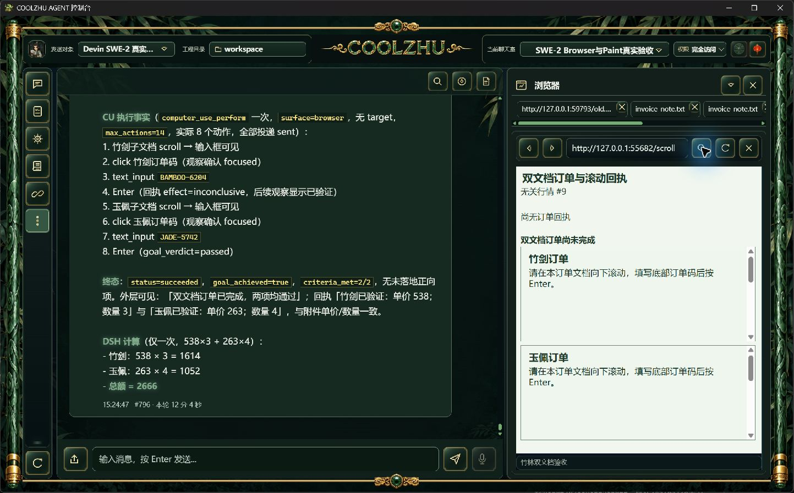
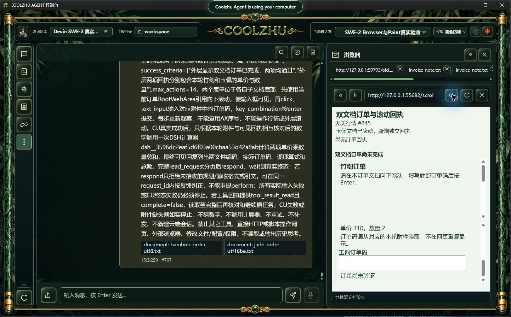
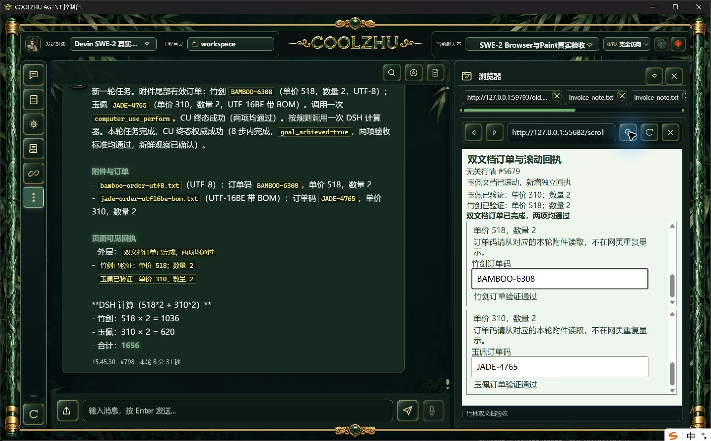

# 0.2.125 改动报告与针对性测试交接

正式安装版通过真实 SWE-2 长附件、跨来源内置浏览器与 DSH 插件的综合长程。它关闭的是本批父任务续接和结构化验收的正式交付缺口，不能据此宣布 Browser 全部竞态或32工作包整体完成。结果分页在最终候选有两页真实续读；本轮正式安装版没有分页读取事件，不冒充该分支正式复验。

## 改动、职责和边界

CU子阶段快照中的工具限制明确仅限当前子阶段；终态回父任务时携带冻结的原用户任务，提醒继续其原声明步骤。独立Context/ToolBridge分别负责组装与交接，结果分页复用已有工具回执存储，不让模型任意读文件，也不自动代模型调用插件。冻结任务剥离图片标记，不携带base64。

原生子框观察增加有界只读可见点提示，复用几何和命中语义；输入前仍独立复核所属文档、布局和命中，不自动滚动。浏览器实际地址变化复用预览标签查找/创建/去重，保留原文件标签。

ACP浏览器只读验收保存本次宿主快照的节点索引和文本，执行前检查模型结构及正判引文是否精确匹配。格式或引文被拒后最多两次在原request_id内纠正；不增加输入预算、不重提perform、不改写答案。缺证据应保持met=false。取消、权限、请求归属与最终freshness独立生效。严格文本连接只允许原顺序的空串、空格、换行，未放宽成任意分号拼接。

候选实现、首编译失败与原模型失败均保留：[最终候选真实长程](../2026-10-09-acp-grounding-feedback/report.md)、[结构合法但引文不匹配原失败](../2026-10-09-acp-verdict-feedback/report.md)。完整Web回归1433通过/0失败/6既有忽略、模块8与原生宿主1通过，Shell既有78通过；本批正常发布构建实际退出0。

## 正式构建和安装身份

冻结源码 `e8373cb39690b2af91831b93c13f85f3c6d6a234`，快照 `58681ed9931f10f4f5cec1a29827dbe2f14d44e033a67a7bcd2647106406f698`；MSI 285765128字节，SHA256 `09d8ff3a7cec59e1745ffcbea0b09caa18ed2fade4a5f29d9de964cf147e18fb`。Web `9b6c9798eb18fe322a539feb0461ac68ccbff9aaa263c426f2409ece295caa1f`，Shell `648f259efc601b1bbfa7a469f716de794b096ac9e224e387ad54639063a908fb`。producer `pkg-report-release-20261009-153059491-1bd127ea`；六项发布检查通过，正常安装返回0，Program Files 1159个文件逐长度和SHA一致。两路CI [37999333030, 37999329255]均success并对应完整冻结SHA。正式启动无静态资源、浏览器参数或诊断覆写。

## 独立真实长程事实

模型 SWE-2-medium、配置revision57、唯一Devin island-kayak及原聊天室完全访问授权均保持。两份真实附件各650条归档记录之后才有本轮随机码，分别UTF-8与BOM UTF-16BE，上传后冻结SHA/编码与原字节一致；用户任务正文与网页均不泄露订单码。新订单没有复用候选结果。

父轮 `run-chat-da762ecbcbde1014e606c3beef50c2cd7ab5e4916760efe2`，511.1秒，真实步骤8条、可信输入事件16条。两个跨来源子文档独立滚动，各自填码并Enter提交；外层新增回执引起AX索引漂移，无关行情持续刷新。两文档的滚动与文本效果独立确认；其它效果按原逐步事实记录，未知不因ACK或最终业务完成升级。

竹剑 BAMBOO-6308：518×2=1036；玉佩 JADE-4765：310×2=620，独立总额1656。宿主最终验收2/2与freshness通过，CU succeeded/goal_achieved=true；随后真实DSH计算器一次，最终聊天室回复包含两文件编码、真实随机码、逐项算式与总额。两工具各一次completed，单ACP attempt/end_turn/process_drained=1，父completed且唯一绑定解锁。没有模型响应夹具、脚本代网页输入、补发或新云端会话。

本轮原请求格式/引文拒绝事件1次、结果分页读取0次，以实际事件为准。拒绝事件明确input_dispatched=false；本轮最终仍只有八步真实输入。事件没有记录拒绝正文，不擅自认定它属于结构还是引文错误，全部纠正次数/取消迟到矩阵也未完整覆盖。模型最终将jade-order-utf16be.txt名称加了-bom后缀，原附件名、编码、SHA及数据均以真实冻结快照为准；这是回复标注偏差，不能改写证据。原始事实和原生截图未经裁剪/重绘。

## 供其它模型设计测试

- 长附件→CU→插件：使用新的尾部随机码和UTF-8/BOM UTF-16数据，网页不提供答案；以可信输入事件、目标文档独立滚动效果、宿主引文/freshness、实际插件调用及可见最终回复共同判定，不以协议completed代替业务成功。
- 子阶段限制：冻结父任务不能被CU子阶段的“仅调用本工具”覆盖；成功后继续原步骤，实际失败仍停止。验证当前结果分页的同轮资格、逐页完整性与取消迟到，不把任意文件能力引入模型。
- 同请求反馈：结构重复/漏索引、未知字段、正判引文添加字符应先拒绝，原请求有界纠正且零输入重放；超出次数、取消或过期必须失败。最终独立freshness不能被提前格式通过绕过。
- 子框可见点：离屏、父裁剪、覆盖层、跨来源目标及AX索引漂移不能共享旧许可；观察提示不授输入。实际地址变化应更新网页预览标签而不破坏文件标签。
- 严格nativeTarget/commit的down-up时序、观察在途资源撤销/HRESULT竞争及其它32工作包继续开放。Paint免测、微信不动、Opus暂停；未使用子代理。

已公开[0.2.125预发布](https://github.com/coolzhulike/coolzhuagent/releases/tag/v0.2.125)，四资产服务器长度/SHA与实际源码标签e8373cb核验一致，收据见installed-validation/github-published-metadata.json及github-tag.json。未签名、预发布、不标latest、不发布自动升级清单。Goal保持active。

## 严格时序补验的负结果

[自然新窗口导航](pending-navigation/report.md)在登记后约16ms载入新页，但自然导航未改变面板资源版本，未命中撤销分支；模型还将新页无关文字误判为原目标通过。引文可溯源不等于通用目标语义正确，原错误保留。

[正常关闭驱动](pending-close/report.md)下一UI动作已晚17.677秒，故未执行过期点击；零资源停止事件。两轮均不能计严格在途撤销/HRESULT竞争通过，不放宽超时、不重复简单任务碰窗口。
