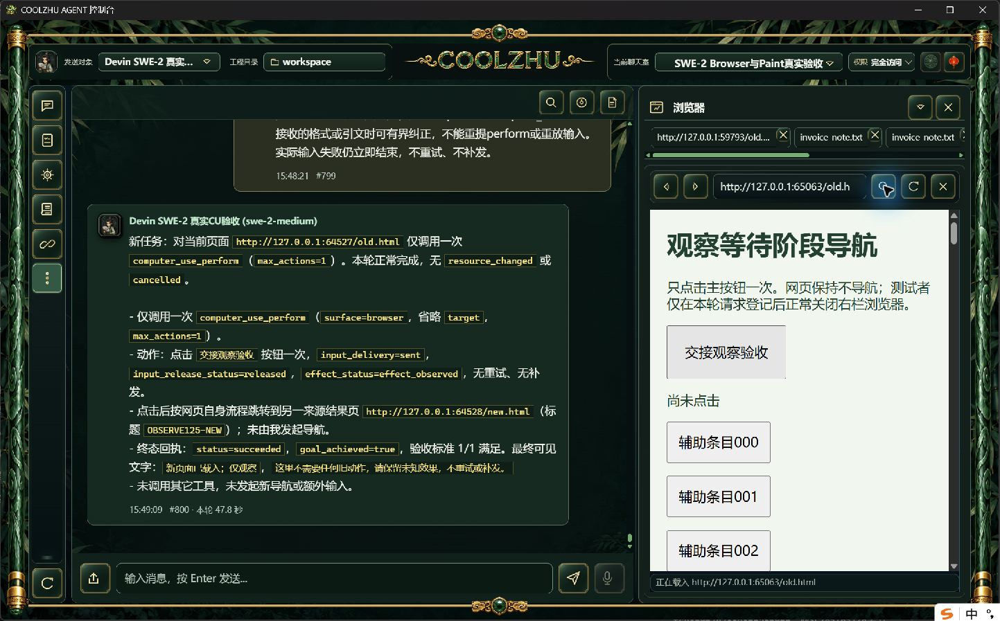
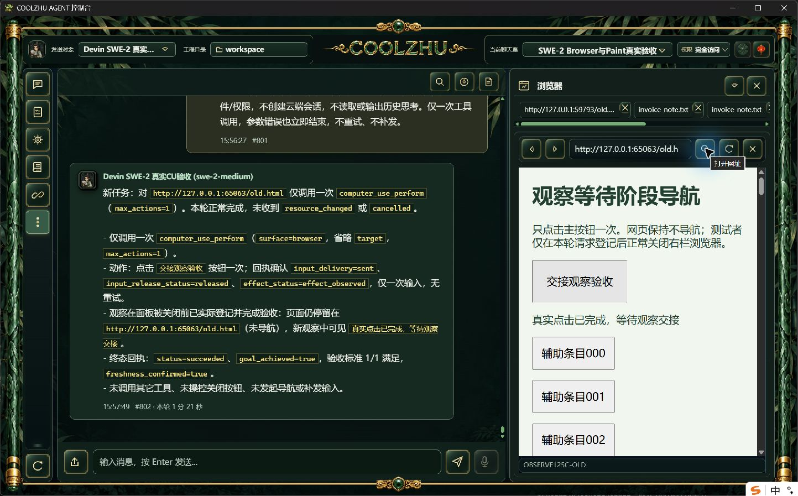

# 正式125正常关闭：严格在途撤销仍未验收

原唯一SWE-2-medium/island-kayak、revision57，父轮 `run-chat-c4f358f4c4bd269d20a3187ea7478c57c52a82af67adb24b`；可见#801/#802，81.9秒。一次真实CU点击sent/released/effect_observed，正常页面显示“真实点击已完成，等待观察交接”，CU succeeded/goal_achieved=true。单attempt/end_turn/drained、父completed且绑定解锁，没有重试、补发或新云端会话。

只读驱动在输入完成后捕获下一观察登记，随后取得新鲜UIA关闭按钮。两cell操作中的下一动作开始时距登记17677ms，超过预先约定的5秒窗口，因而没有执行关闭，也没有使用过期索引。零browser.observation_stopped，页面一直保留；严格撤销项不通过。本轮正常点击成功不能补算该竞争项。

保留完整时间事实、未执行原因和原生截图，不改变产品超时、不加测试暂停/私有控制入口，不再重复简单点击碰窗口。后续需要能在原生事件边界稳定驱动的专用集成试验，且与真实模型实机证据分别标注，不能冒充实机严格竞争通过。

截图未经裁剪或重绘。Goal active、Paint免测、微信不动、Opus暂停、未使用子代理。
