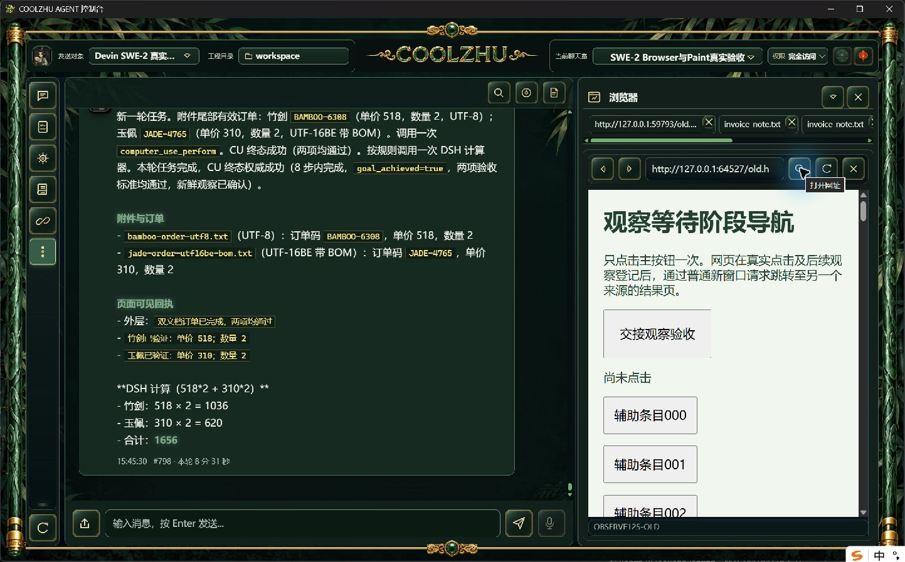
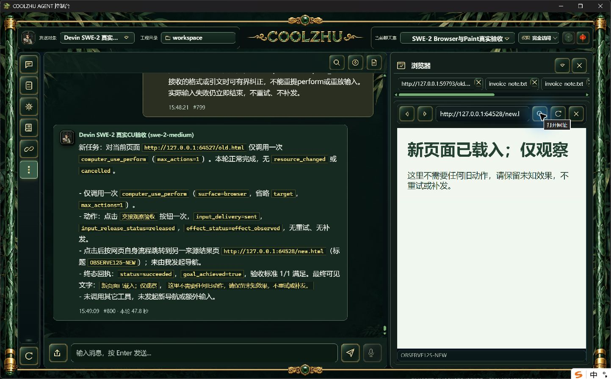

# 正式125在途自然新窗口导航：严格撤销项未通过

模型SWE-2-medium、revision57、原唯一island-kayak，一次真实CU click、max_actions=1。父轮 `run-chat-7b4a9e6fe3b680d5fb72eac7ec3fa7ae255d4c995d7f08b3`，可见消息#799/#800（47.8秒）；单attempt/end_turn/drained并解锁，没有重试、补发或新云端会话。

页面真实click后通过普通HTTP响应等待已完成sent/released步骤及后续底层观察登记，再window.open另一个来源的结果页。登记时间1791586137309，新窗口请求服务器收取1791586137320.320，结果页GET 1791586137324.865，约登记后15.9ms。这些事实证明网页导航发生在本轮登记之后，不证明完整资源版本已经撤销。

严格检查实际exit1：零browser.observation_stopped。CU自身报告succeeded/goal_achieved=true，单click sent/released/effect_observed；宿主最终引用新页StaticText“新页面已载入；仅观察”，并确认新页freshness。模型据此将“真实点击后看到真实点击已完成，等待观察交接”判为met=true，语义不匹配。原模型结论和宿主事实保留，不能用协议completed或可溯源引文冒充原目标通过。

代码复核纠正驱动方案中的推测：browser_panel::handle_new_window对自然新窗口只递增popup_sequence；只有此前有非popup手动导航待处理才递增navigation_revision。这是区分自然跳转与用户手动替换的既有设计，避免正常点击后的网页跳转误撤销已结算输入来源。本轮请求在新页载入后才取得同面板当前文档，旧资源版本仍相同；因此驱动没有真正执行资源撤销，不能算waiting_resource_changed/reply_resource_changed或HRESULT竞争通过。

不为满足这个错误驱动前提而把所有自然网页跳转改成整轮失败。后续严格撤销继续使用真实用户关闭/隐藏等会改变资源可用性的操作，缩小测试驱动输出与两次UI观察之间的开销；若仍未命中则保留未完成。引文来源检查只证明文字真实存在，不能独立证明通用自然语言目标的语义；本轮暴露的语义判断误判单独保留，不据此放宽规则或写死目标答案。

最初驱动复制到嵌套目录时root层级错误，发送前SQLite只读打开失败，exit1且没有提交消息/调用模型；修正路径后才实际发送上述一轮。原正常安装身份沿用125报告。没有模型响应夹具、私有IPC、产品暂停或超时放宽。

截图未经裁剪/重绘。这里只记录失败及驱动边界，严格撤销、HRESULT和32工作包保持开放，Goal active。
