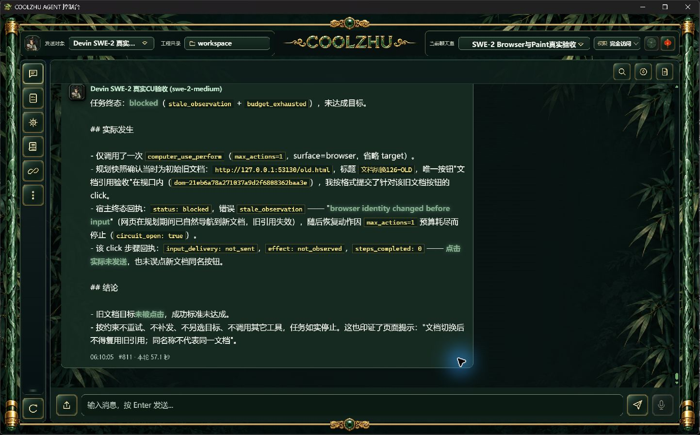

# 0.2.127正式安装复验与针对性测试交接

上传按钮的隐藏“附件”span在字号为0时仍留下6px flex空隙，导致可见箭头左偏约3CSS像素。删除该span并标记纯图标，保留原SVG、玉石外框、title/aria-label和上传处理函数。本次不是重新裁剪图案；纠正之前仅凭SVG对称就判断控件已居中的结论。

正常release构建实际返回0，用时301.68秒；安装实际0；六项发布门通过，Program Files的1159文件逐SHA匹配。正式1443×897完整原生实拍通过，主笔画近似中心从134.5移至137.0，JPEG抗锯齿不用于声称精确零误差。

同批交付浏览器地址草稿保护与CU失败原因保留。正式地址草稿在16451ms、33次真实网页地址更新中保持；正常打开按钮使目标页只收到一次GET，后退恢复网页地址。原生UIA编辑控件输入，不是DOM脚本；Enter本轮未复验，前候选Enter证据仍独立保留。

原SWE-2-medium/revision57、唯一island-kayak的一次真实文档切换调用（可见#812/#813、38.8秒）拒绝旧click，input_delivery=not_sent，终态execution/stale_observation、retry_owner=none，两次观察、无重新规划；父failed为预期负例，end_turn/drained/解锁。**整体负例未通过**：严格零可信输入断言发现新文档BODY一次来源不明keydown；键值未记录，不能确认来源，也不删除或宽松化原断言。两个目标没有指针/点击事件，不能据此宣称所有输入为零。

冻结源码：`a3ec4620c67e0bf2ae8e05811d5b198675b719a3`，快照`9b7ba5ffbaeb565c5b9c50d46e13607dd7425bcdcf9ecef7c909c6deb598c847`。两路源码CI38056523918/38056520650均success。MSI SHA256：`ca50f465394f568ad548d63e957142a330448ffe250f1b7916ba8d49954a58a0`；文件级CycloneDX1.6清单1159文件，completeness=incomplete，不代表完整库依赖或签名。桌面dist复制摘要匹配，未修改自动更新索引。

后续测试重点：上传键盘/鼠标入口与不同窗口宽度；地址编辑遇到同文档与完整导航的清理边界、Enter提交；文档负例增加键值/时间/目标取证以区分外来输入；严格原生nativeTarget/commit/down-up/关闭/HRESULT竞争仍开放。结果分页完整连续读取、超长单行GUI翻页、完整记忆/多模态/GC及其余32WBS仍开放，Goal active，Paint免测、微信不动、Opus暂停、无子代理。

已公开[GitHub 0.2.127预发布](https://github.com/coolzhulike/coolzhuagent/releases/tag/v0.2.127)，五资产服务器digest/size与本地产物逐项一致，实际tag指向冻结a3ec462；不修改旧包、自动更新索引或合并PR。
