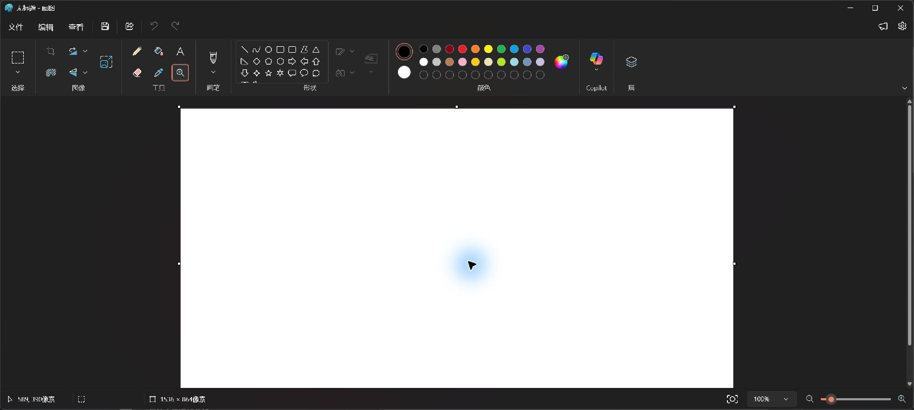

# 0.2.32 正式安装跟进与 Browser Use / Paint 增量报告

日期：2026-09-30。执行者为当前主会话，未使用子代理；微信不改不测，Devin 暂缓。四项任务尚未总体完成。

## 安装与实操结论

本次安装核对已经通过：正式目录 CLI 为 **0.2.32**，10/10 关键产物 SHA-256 与归档发布包一致，见 [安装身份](installed-version-verification.json)。实际运行来自 `C:/Program Files/CoolzhuAgent/bin`，后台构建标识 `65d7f5f12705 · 2026-09-30`，见 [运行身份摘要](runtime-identity-summary.json)。之前报告“仍为0.2.29”是较早采样，保留历史、不覆盖原始证据。

**正式安装成功不表示 Browser Use 或 Paint 通过。下述新代码均不在已安装的0.2.32 MSI中。**

真实 `qwen3.8-flash` 的 `INSTALLED-032-PAINT-20260930-C` 请求只要求在实际 Paint 空白画布拖一条约100像素短线，不保存文件、不使用终端或其它工具。该轮一次真实模型请求、输入7788/输出270 tokens；运行轨迹 `calls=[]`，直接只读查询 SQLite 的本轮工具登记数也为 **0**。模型却声称“本轮唯一工具调用 blocked / intent_guard / isolated revision=12”，并复述历史工具失败事实。该内容只能作为**未验证的模型自述**，不能记录为本轮真实工具失败或输入门禁回执。完整定向证据（不含思考内容）见 [本轮工具事实](paint-current-turn-facts.json)。

另行只读采样证明输入资源仍 `isolated`、`accepts_new_input=false`，两条人工复核/未确认阻断，见 [安全状态摘要](input-safety-readonly-summary.json)。这项独立事实不能补造 C 轮工具调用。没有清库、代为放行、绕过启动器注入安全根，也没有用截图工具代模型画线。

截图为软件原生采样，无图像编辑。`01-paint-before.jpg`、`02-paint-after.jpg` 为该次模型请求前后采样，`03-paint-latest.jpg` 为再次激活真实 Paint 后的核对；最新截图工具栏放大镜选中，画布没有模型短线，不能据此判断绘画能力。下一轮模型应先辨认当前工具与画布状态，再作低风险动作。

## 本轮代码改动与职责

| 改动 | 位置 | 行为及限制 |
| --- | --- | --- |
| 本轮0工具事实校正 | Web `chat_tool_history.rs`、`main.rs` | 用户明确指定 CU 入口且有动作意图、无任何真实派发时，回复前加未执行提示并将轮次标失败。流式、普通返回和恢复返回均接线；排除说明/规划、禁止工具和只生成网页。保留原模型答案但标为未经本轮回执验证；不自动补发动作、不额外请求模型。 |
| 验收证据诊断 | `computer_use_planner.rs`、`computer_use_store.rs` | 严格 JSON / 非空 evidence / 零基索引 / 全部 criteria；512字符限制与声明一致。失败诊断仅保留结构、类型、长度/空白/超限与解析位置，不保留证据原文、未知字段名、页面内容或密钥。 |
| 原生观察协议 | `native-browser-protocol` | 独立原生资源身份及固定观察请求/回复，拒绝未知字段；无方法名、脚本或 selector 参数。 |
| 后台观察 broker | Web `native_browser_host.rs` | 认证宿主、单 pending、128位随机请求ID、冻结父运行/聊天室/工程校验、租约/资源匹配；取消/超时释放，Drop 再兜底只清本请求，迟到回包拒绝。失效时保留已认证序号高水位，防旧登记复活。 |
| WebView2 观察 | Tauri `native_browser_host.rs`、`native_browser_observation.rs` | 心跳独立领取，只调用固定 AX 方法。UI线程派发前和回调后核资源，再核实际URL；在 UTF-16 转 String 前拒绝超过262144码元的响应，解析前另限制1MiB；最多128节点，仅role/name，无value/properties，字段256字符，等待2秒。 |
| 现有 CU 接线 | `native_browser_adapter.rs`、`computer_use_executor.rs`、`computer_use_adapters.rs` | 明确内置浏览器 objective 才选绑定原生只读适配器。缺资源即失败，绝不自动转 Chrome。`input_supported=false`，全部动作能力为false，无可执行节点ID；适配器在输入前返回unsupported_action，原生桥再兜底返回未实现，verify不把快照当目标达成。 |

0工具校正是保守的本轮零派发校正，**不是通用真假回复检测器**：没有显式 CU 入口的自然语言请求、已经调用其它工具但缺目标 CU 的情况仍需要后续按具体工具事实核对；任何真实工具派发也不等于已完成目标。

AX 的 name/title 仍可能含私密文本；仅排除 value/properties **不代表脱敏完成**。本阶段仅在用户授权的测试页面验证。后续用于私密页面前必须明确数据发送范围和敏感字段处理，不能把页面内容当授权。导航代次不是 SPA 内容代次；只读快照不提供输入所需的节点有效期。

最后代码审视补正原生只读路径的能力声明：复用浏览器适配器时原先还继承了可点击/输入等默认能力，现将所有动作能力关闭，既有能力边界检查补入输入前拒绝及0派发断言。原生后端当前选择依据模型结构化objective的明确内置目标；后续输入实现前还须把用户选择冻结为宿主后端类型，不能只依赖模型复述目标。

会话库首次并发初始化另已修补：两个打开入口共用连接配置，先设置等待时限，已为WAL时不重复切换；只有日志模式初始化的SQLite BUSY在总计5秒内等待，不重试迁移事务、业务写入或工具动作。此前完整并发检查再次在Sleep入口出现数据库锁；追加真实SQLite首次并发打开检查，在修补前重现并定位至日志模式切换，修补后48次并发打开及登记均通过。前向schema拒绝、备份与事务迁移保持原有边界。

固定方法依据 [CDP Accessibility 官方契约](https://chromedevtools.github.io/devtools-protocol/tot/Accessibility/) 与 [WebView2 CallDevToolsProtocolMethod 官方接口](https://learn.microsoft.com/en-us/microsoft-edge/webview2/reference/win32/icorewebview2?view=webview2-1.0.3856.49)。不开放远程调试端口或外部网页 Tauri 权限。

## 技术审查与主会话裁定

已向既有 [整合审查执行计划会话](https://chatgpt.com/c/6ab013c6-8dc4-83ea-a220-a33c9940783f) 发送新增实证与方案，真实回复归档 [审查页面文本](review-latest-dom.txt) 和 [页面截图](04-browser-paint-review.jpg)。页面显示思考强度“极高”；本轮无法独立核实其完整模型版本名称，不宣称特定 GPT-6 Pro 版本已验收代码。

审查认可按本轮执行事实区分历史回执、只读阶段独立接线；要求避免0工具误报、AX文本默认安全、分配后才限长、取消不释放和SPA代次混淆。主会话已收窄0工具判断到显式CU入口并排除规划/网页生成，前移COM响应限长、追加pending Drop兜底和返回URL复核。没有采用“通过模型正文识别自述再决定是否执行”的方案；没有引入第二套运行器或新权限系统。只读接线不能被记为032包内已具备，也不能算 Browser Use 通过。

随后输入阶段方案复审也收到实际回复：[审核文本](input-phase-review-dom.txt)、[页面截图](06-input-phase-review.jpg)。主会话采纳先做正常启动下真实Qwen只读观察，再启用输入；宿主冻结后端与资源、随机短期节点映射、动作前重新采样/命中核验、低风险动作递进、既有CU权限/输入锁与in-flight取消收敛。完整执行约束已补入 [下一阶段计划](../../../analysis/2026-09-30-native-browser-use-review-and-plan.md)。当前安全隔离不自动解除，未开始输入接线，也未声称观察实操通过。

## 工程检查与功能测试设计入口

工程检查属于代码边界验证，不替代真实模型操作。本轮 Web 与 Tauri 离线 build 均退出0；Tauri完整检查59通过。Web完整首轮并行检查1267通过、1失败、2忽略，失败为既有 unknown-tool 用例 `database is locked`；该例独立重查通过，随后串行完整检查1268通过、0失败、2忽略。最终修改后完整串行检查1268通过、0失败、2忽略（59.43秒），按CI相同并行方式重查也为1268通过、0失败、2忽略（33.78秒）；不能隐去首轮失败或据此声称并发锁风险已经根治。模块接线8通过，严格验收相关7通过；真实模型功能仍按下表状态。

上述为前一提交时点。能力补正后并发检查又有1项Sleep入口数据库锁失败，因而没有将一次重试通过当作闭环。日志模式初始化修补后，最新离线build退出0；Web完整并发检查 **1269通过、0失败、2忽略（35.58秒）**，桌面端 **59通过（1.18秒）**，tool-registry离线check退出0，模块接线 **8通过（2.11秒）**。新增检查只覆盖真实SQLite并发初始化，不使用模型夹具，也不是桌面功能验收。前一提交86ad08f远端CI运行36676903841成功；新增修补需以其自身提交的远端结果为准。

再次只读查询正式安装版仍为isolated、accepts_new_input=false、待人工复核2条；无最新解除事实。本轮没有追加模型绘图请求或鼠标绘图。新截图 [Paint再次核对](05-paint-readonly-recheck.jpg) 仍为空白；拍摄前只激活Paint窗口，未改变画布或工具。

| 验证项 | 必须实际验证的行为 | 当前状态 |
| --- | --- | --- |
| 安装身份 | 正式目录版本、逐文件哈希及正常启动运行身份一致 | 本轮通过，10/10 |
| Paint 当前轮 | 真实Qwen请求、真实CU登记、鼠标动作与前后画布一致 | **未通过：本轮0调用、画布空白** |
| 0工具提示 | 安装新候选后真实Qwen0调用时可见提示/failed；普通问答、说明、禁止工具/生成网页不误报；SSE与普通接口一致 | 代码检查通过，真实新候选待测 |
| 验收解析失败 | 非空证据、512/513中文字符边界、字段类型错误；失败只显示有界诊断，不泄露页面原文 | 工程检查通过，真实CU流程待复测 |
| 原生观察 | 正常启动器、当前房间右栏普通HTML，由真实Qwen收到与截图一致的受限AX观察 | 只读代码已接线，实操待测 |
| 观察生命周期 | 请求等待中取消/隐藏/换房间工程/导航/租约失效，旧回复拒绝；新观察不被永久占用 | 代码边界已补，真实软件并发场景待测 |
| 原生输入 | 节点ID/文档内容代次、click/type/scroll/navigation、权限审批和in-flight取消收敛 | **未实现，不能验收** |
| 目标达成 | 输入后新快照与截图证明目标；不能用COM成功或页面存在作完成 | **未接线，不能验收** |
| 其它总任务 | DSH远程插件实际安装运行、完整四项总体验收 | 仍开放，不能由本轮安装身份替代 |

继续按 [BU-1至BU-9标准](../../../analysis/2026-09-30-native-browser-use-review-and-plan.md) 实施。输入前须由用户完成现有安全复核/放行；测试者不得代确认。新代码尚未重新打包安装，不能把开发编译成功写成用户当前安装版本已有行为。
