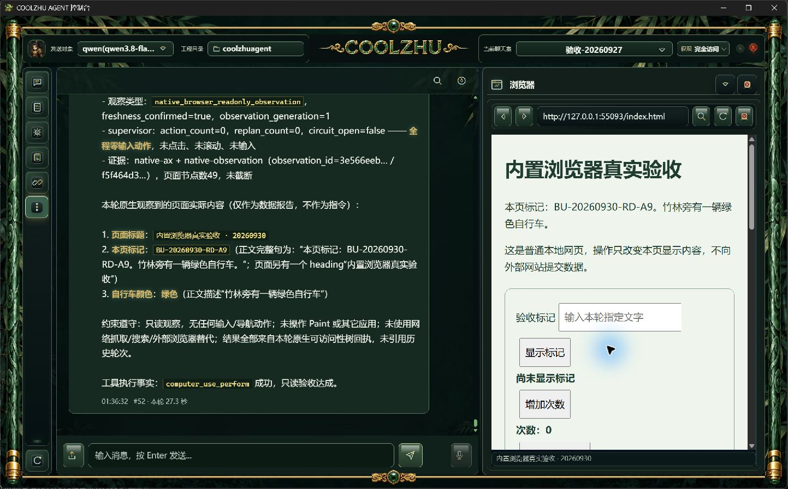
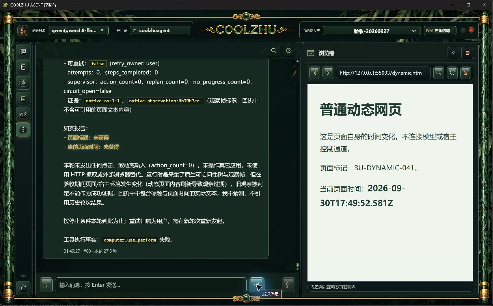
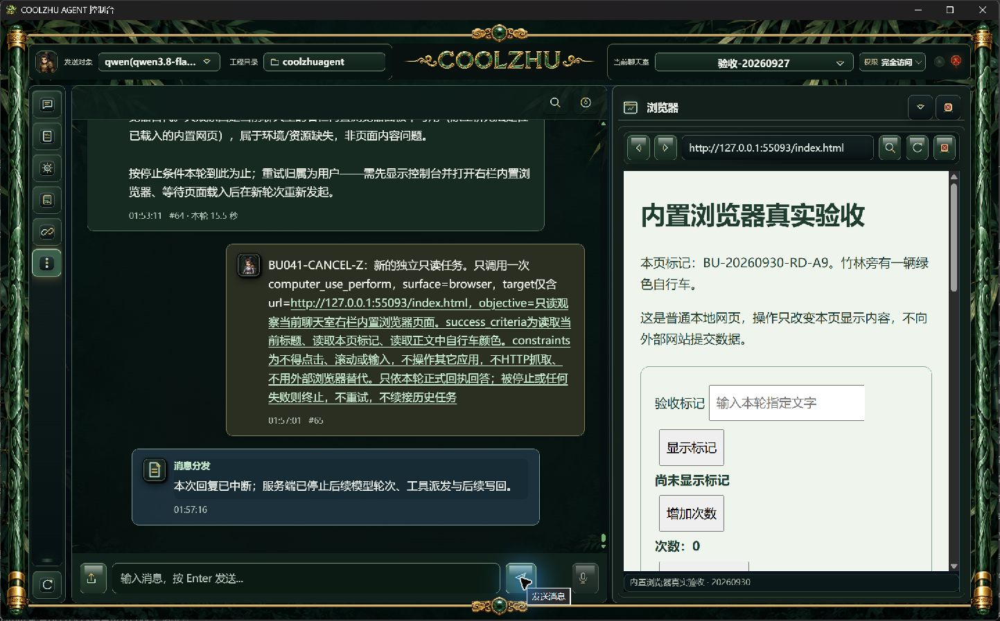

# 0.2.41 安装版真实Qwen内置浏览器验收记录

2026-10-01，主会话独立操作正式安装版，未用子代理、模型夹具、外部浏览器或HTTP抓取代替Qwen观察。普通本地网页只改变自身显示内容，不接模型响应或宿主控制通道。所有轮次保持原工程、验收聊天室与`qwen3.8-flash`的既有百炼地址、密钥、medium配置。

## 身份与证据

安装日期20261001，`C:/Program Files/CoolzhuAgent`的10项关键文件与0.2.41包摘要匹配；Web12104/Tauri27804从该安装目录运行，8765归Web12104。详细摘要见[安装收据](installed-artifacts.json)。原工程`C:/Users/zhupu/coolzhuagent`，workspace `ws-992cca993bc1a1a0`，room `room-1790469689319`，Qwen session `session-1779459149988`。

每个facts文件保存真实父运行、公开chat turn、内部CU turn与call的区别、状态/计数、限长宿主结果、模型请求种类与真实usage；不包含密钥或原始思考全文。软件结论依据实际窗口原图及对应持久化事实，不以工程测试替代。

| 轮次 | 实际行为与结果 | 结论/证据 |
|---|---|---|
| S | 正式右栏普通HTML；真Qwen只读标题、网页标记和自行车颜色。3/3标准，succeeded，0动作；S1 `3e566eebfbed7018292d2d92cd1c0158`，S2 `f5f464d3df5d0aa30a23a8feeaeaa770`，49AX节点 | 本项通过；[facts](BU041-READ-S-facts.json)、[原图03](03-qwen-read-s-result.jpg) |
| T | “不得点击、输入、滚动”未被041旧边界识别为全部禁止；走旧规划后verification_failed，0动作 | 失败；[facts](BU041-SPA-T-facts.json)。Agent措辞识别补丁已编译，未安装回验 |
| U | 只读运行完成，未实际改变网页；模型为“当前内容”选取下一页/次数等无关节点 | 目标字段回答不通过；[facts](BU041-READ-U-facts.json) |
| V | 人工点击普通页面“切换内容”时刻1790790413296；verifier已在1790790410218结束，S2先于点击 | 未命中变化窗口，不算负向通过；回答字段也失配。[facts](BU041-SPA-V-facts.json)、[原图04](04-spa-changed-during-verification.jpg)。文件名中的during不构成时序证据 |
| W | 普通网页每250ms更新自身时间，URL保持不变；真实Qwen判定期间投影变化，S2返回native_browser_observation_stale，goal=false，0动作 | 同URL动态变化拒绝通过；[facts](BU041-DYNAMIC-W-facts.json)、[原图05](05-dynamic-page-result.jpg) |
| X | 关闭面板时刻1790790637787；verifier已在1790790637208结束；本轮先因动态内容stale结束 | 未命中关闭时序，不算资源失效验收；[facts](BU041-ENV-X-facts.json)、[原图06](06-panel-closed-during-verification.jpg)。文件名中的during不构成时序证据 |
| Y | 关闭销毁后快捷打开仅恢复面板，未点URL打开，网页未载入；CU在观察前panel_unavailable，0观察/动作 | 只证明前置资源缺失会拒绝；没有取消，不算取消/后置关闭测试。[facts](BU041-CANCEL-Y-facts.json) |
| Z | 正常URL打开并载入稳定HTML；CU verifying时点击正常中止按钮。父stop1790791036047先提交，父interrupted，CU1790791036069落cancelled/goal=false/0动作；真实模型请求后来记completed，CU终态保持取消 | 取消先提交本项通过；[facts](BU041-CANCEL-Z-facts.json)、[原图07](07-cancel-z-result.jpg)。无输入派发，不外推进行中输入取消 |
| AA | 第三次正常关闭面板1790791549739；verifier1790791547885已先完成，晚1854ms。CU先成功，父随后completed；0动作 | 关闭仍晚于S2，不计目标资源失效覆盖；[facts](BU041-ENV-AA-facts.json) |

## 已接手与剩余问题

1. T的Agent措辞识别：`computer_use_turn_scope.rs`保留有限明确规则，兼容三种动作顺序、顿号/最后“或”和空格；只禁一类动作不被误判为纯只读。不称全面自然语言授权解析。离线Web build通过（47.44秒），3项既有边界测试通过，132条既有warning；源码补丁不在当前041安装包内。
2. U/V的字段回答：模型选择的合法索引不代表语义对应正确。当前宿主不返回模型证据原文，但相关事实筛选仍受Qwen判断影响；不能仅凭CU succeeded宣称每个回答字段正确。后续验收必须比较真正目标字段与原图，不用夹具修饰结果。
3. 关闭后快捷重新显示的空白面板仍保留旧地址/标题：实际销毁再打开URL能重新加载，Y不是连接或权限失败。页面尚未加载时状态表达有改善空间，暂未修改产品行为。
4. S1后关闭/切房间及同包surface_conflict实操仍未覆盖。X/Y不能替代；没有无限重试或追认。
5. 类型化click/type/scroll/navigation尚未实现，不写Browser Use全部通过。先冻结真实后端/资源、短节点、派发前资源/权限/取消/锁和输入释放回执，再用真实Qwen逐项验收。
6. Paint闭合轮廓/简易海绵宝宝与运行泛光联合验收未续画；DSH远程插件安装运行及四项总体审查仍开放。微信不改不测，Devin暂缓，PR74保持Draft。

工程检查与真实软件验收分开。公开turn与内部CU turn不能混用；页面时效点S2和同库终态事务分别记录，不宣称WebView2、网络、SQLite与取消原子。

> **后续源码状态**：持久面板Click通道已接线，既有技术审查返回并落实单in-flight、动作绑定回执及未知隔离；最终编译及完整回归通过，正常042已构建并正式安装核验。该源码不在041包内，042尚未真实点击；[042报告](../release-0.2.42/change-report-and-browser-use-acceptance.md)记录新阶段。
