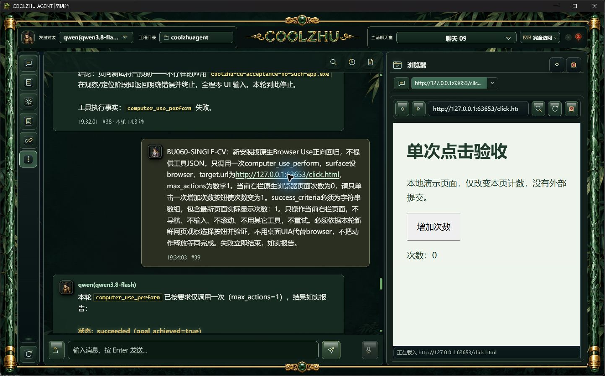
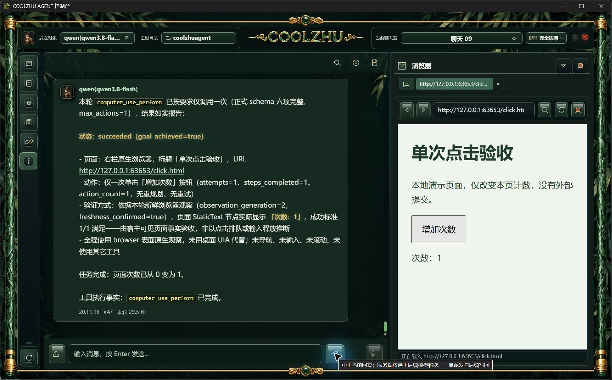

# 0.2.61 改动、真实验收与针对性测试设计依据

2026-10-01。主会话独立实现和实操，真实qwen3.8-flash/medium、既有百炼Base URL和保存密钥不变。没有模型夹具或人工代点目标按钮。微信不改不测、Devin搁置；GPT-6 Pro补审按用户决定暂停。本文按实际版本记录，不能用后续修复回填本版通过。

## 改动及原因

060真实聊天消息的裸网址紧邻中文逗号，前端正则把逗号后的说明一起变成href。061在裸网址富文本和附件URL提取两处统一中文句读边界，保留说明文字、中文域名/路径及百分号编码；明确Markdown链接仍走原分支。未改模型上下文、Provider、保存消息或原生浏览器输入接口。[窄审](../../analysis/2026-10-01-chat-url-boundary-review.md)说明边界与限制。

源码feb4c55ca72984b80e64c1c89cb7cf89fff71409；node语法、diff检查和offline build通过。对应GitHub运行36858635333、36858627999均completed/success，原始jobs回执在evidence/ci；这些结果不能证明后续提交。真实工程日志按原字节归档，不为消除EOF空行警告改写历史日志。

## 包和正式运行身份

MSI247025021字节，SHA256为360b7a691fcd87dc3ebf8b14100a8e84328a80149ea8a9cf88cf0c7b5c5f1014；报告pkg-report-release-20261001-200040689-24d0b2bf。859载荷文件/324548070字节、六项发布门、安全扫描0、载荷与10关键摘要核验通过。源码快照411fc5501b3722f179cdb6492c593d3fe8d4eb4e90c6566f809405094a1e72ee；载荷快照45e9da39be49902c0bf14637626a15f654e582a46837cbaba590526f9586baac。

第一次msiexec调用使用正斜杠Windows路径，返回1619/2343无效目录；改为原生反斜杠后正常交互安装exit0。两份原始日志保留，不当成policy或权限拒绝。正常关闭060再安装，未覆盖运行中的二进制、未绕过UAC。注册表唯一0.2.61；正式WebPID976、ShellPID27864，8765唯一监听者为该Web，10关键安装文件摘要匹配。身份见[installed-artifacts.json](installed-native/installed-artifacts.json)。启动器约13秒后报告本入口无可定位窗口，但子控制台已启动并核验，未重复启动；本轮未捕获启动动画，不能据此追认动画验收。

## 软件实操结果

| 测项 | 原始事实 | 判定 |
|---|---|---|
| 历史消息搜索与索引 | 真实聊天室聊天09搜索BU060-SINGLE-CV，唯一#39；点击后原消息定位、高亮。fresh截图确认，未将第一拍缓存状态误认失败 | 通过 |
| 中文逗号裸URL与右栏 | #39实际href精确为http://127.0.0.1:63653/click.html，后续说明独立文字；点击后右栏原生网页显示“单次点击验收/次数：0” | 通过 |
| BU061-CY | 父run-chat-d6a6c9d2bbbc52d1c4f67a521face6a853ea747916cfa656，23.126秒；Qwen漏objective，invalid_tool_input，0规划/0步骤/0输入。没有重试或人工补点 | 失败，模型漏参 |
| BU061-CZ新独立完整请求 | 父run-chat-7a4a7a813298bdaca9e17e9b6c78d2c506868d27b56ff6c7，29.484秒；真实Qwen一次browser click，次数0→1。1action/1step、sent/released/verified、generation2、新鲜页面节点证据1/1、0重规划 | 通过 |
| 浏览器加载提示收尾 | 页面已可用，真实输入资源有效，但底部仍“正在载入”。本版定向WebView事件与Any监听不匹配 | Agent缺陷，062修复后须重新实操 |
| Paint、动画、泛光边界、DSH安装 | 本版未增加这些实操；060Paint原始失败、DSH P1首包通过和剩余项保持历史状态 | 不追认通过 |

BU061-CY/CZ原始请求时间、运行、工具请求、planner/verification与输入回执均在installed-native；失败不删、不补填工具参数。截图身份与SHA256见original-images-index.json，正式页面状态是主要验收依据；工具成功不能代替软件画面。

## 后续模型的针对性测试设计

1. 中文句读：历史原消息和新消息分别点击裸URL，核验地址准确、其后的中文说明仍可见；带中文路径和百分号编码的真实服务页面、明确Markdown目标分别覆盖。不根据字符串断言代替原生页面实拍。
2. 062加载状态：首次打开、同址再次打开、刷新、前进/后退、连续异址导航完成后显示真实标题/地址；慢页等待时显示载入、完成后收尾。关闭/重开及调整窗口后页面和资源资格同步。旧导航回执不得覆盖新目标，事件不得广播至外部网页。
3. 真实Qwen回归：仅一次单击0→1；分别核对本轮页面、输入投递/释放和目标达成，不继承上一轮截图。模型漏字段应零输入明确失败，不能放宽schema或模型夹具伪造成功。
4. 未覆盖边界仍开放：按下至释放期间关闭竞争、多屏/输入期间取消、到期笔画、启动动画首次/恢复/减少动画/资源失败；整体海绵宝宝目前未通过，模型选点/误验及漏参按用户要求暂不做能力改造。DSH仍须正式事务安装、真实Qwen工具调用、市场按键与停用/取消/跨工程实拍，不能由P1临时探针追认。

四项整合总体和Draft PR74仍开放，已有软件通过范围不能扩展为全部验收完成。
